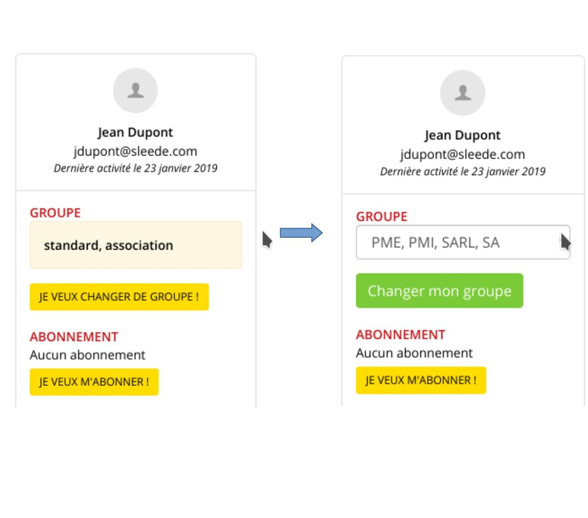
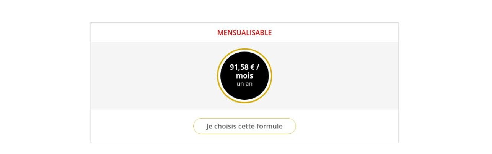
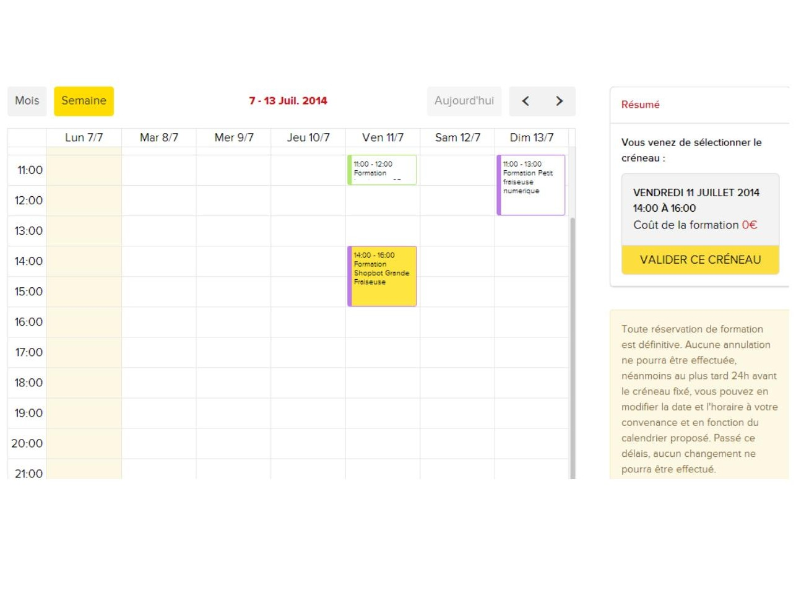
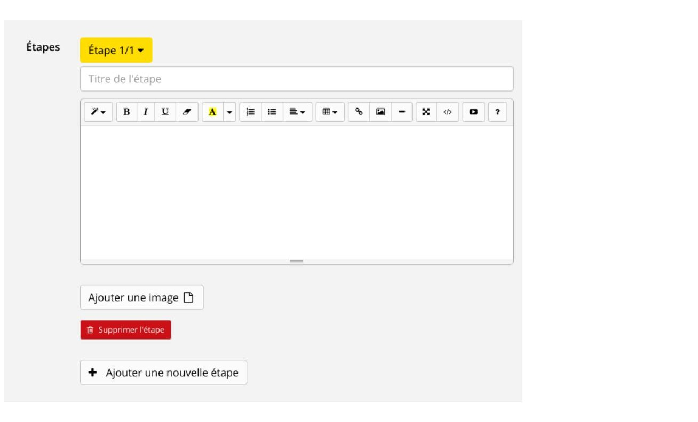
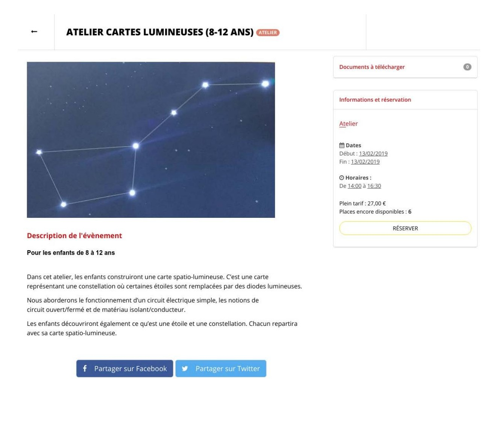
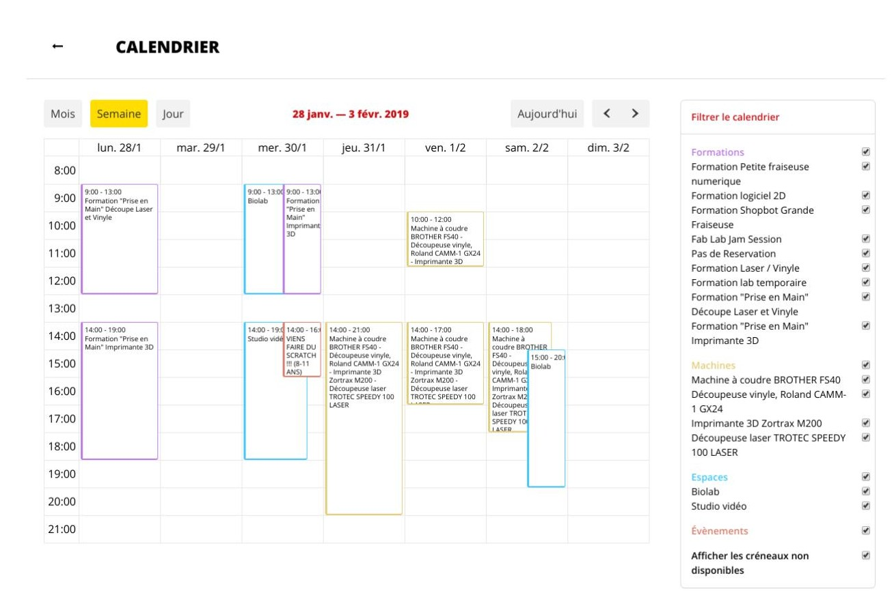

## L'interfaccia utente

Senza aver effettuato il login, il visitatore del sito ha la possibilità di :

* Visualizza la homepage del sito
* Visualizza la galleria del progetto
* Visualizza la galleria di macchine
* Visualizza i workshop e i corsi offerti
* Visualizza le diverse opzioni di abbonamento disponibili
* Pagine di consultazione (sul Fab Lab, carta degli utenti...)

Tutte le altre funzioni sono accessibili, almeno in modalità di sola lettura, se l'utente crea un account.

### Creazione dell'account

La creazione di un account avviene tramite la funzione "Registrati". Facendo clic su di essa, l'utente accede alla seguente interfaccia, eventualmente arricchita da un captcha per la protezione dai robot:

*Figura 1 - Modulo per la creazione di un account pubblico*

È in questa schermata che l'utente definisce il proprio gruppo, ad esempio:

* Standard, associazione
* Insegnante, under 25, in cerca di lavoro, studente
* Artigiano, lavoratore autonomo, commerciante, ricercatore
* PMI, LLC

Questi gruppi segmentano le offerte di prezzo del Fab Lab. L'amministratore può personalizzarli, `vedere Gruppi`.
La data di nascita è richiesta in quanto ci permette di stabilire statistiche sulle fasce di età che utilizzano il Fab Lab. Il numero di telefono viene utilizzato anche per contattare rapidamente gli utenti che devono cancellare o modificare una prenotazione all'ultimo minuto.

**Nota:** Un utente ha la possibilità di cambiare gruppo: una persona in cerca di lavoro può diventare un lavoratore autonomo, uno studente può diventare uno standard, ecc. Questa modifica viene effettuata dalla vista "Le mie impostazioni":

*Figura 2 - Modifica dei gruppi dalle loro impostazioni*

### Dashboard

 Una volta inviato il modulo, l'utente riceverà un'e-mail di conferma per indicare che il suo account è stato creato.
Come di consueto, l'utente è invitato a cliccare su un link per attivare definitivamente il suo account. L'attivazione può essere obbligatoria o facoltativa, a seconda delle impostazioni del sistema `(vedere Personalizzazione dell'applicazione / Generale)`.

Una volta effettuato l'accesso, l'utente dispone di un cruscotto in cui può trovare le principali informazioni che lo riguardano:

*Figura 3 - Menu utente*

* **Il mio profilo**: visualizza un riepilogo del profilo dell'utente.
* **Le mie impostazioni**: consente di modificare/completare i dati del profilo. Questa sezione consente inoltre di modificare i gruppi, gestire le preferenze dei cookie e cancellare gli account utente.
* **Le mie credenziali**: a seconda del gruppo dichiarato dal membro, le credenziali possono essere richieste. Il membro deve quindi accedere a questa scheda per fornirle.
* **I miei progetti**: visualizza i progetti pubblicati o in fase di documentazione (modalità bozza).
* **I miei corsi di formazione**: riepiloga i corsi passati / prossimi / attualmente convalidati / convalidato.
* **Le mie prenotazioni**: riepiloga le prenotazioni passate / future di macchine e spazi, nonché i crediti rimanenti, legati a un abbonamento corrente.
  crediti residui, legati a un abbonamento corrente.
* **I miei eventi**: riepiloga le prenotazioni per workshop e corsi passati e futuri
* **Le mie fatture**: riepiloga le fatture ricevute. Ogni fattura può essere scaricata in
  FORMATO PDF.
* **I miei piani**: riepiloga i piani di pagamento sottoscritti. Ogni piano di pagamento può essere scaricato in formato PDF. Se un pagamento è in difetto, l'utente può aggiornare la propria carta o inserire il proprio codice di autorizzazione da questa sezione.
* **Il mio portafoglio**: se il modulo portafoglio è attivato, visualizza il saldo del portafoglio virtuale e lo storico delle transazioni.

### Abbonamenti online

L'utente ha la possibilità di abbonarsi e pagare online con carta di credito.
Le formule di abbonamento vengono visualizzate in base al gruppo dell'utente collegato:

*Figura 4 - Visualizzazione dell'abbonamento per un utente standard o associativo*

Da questa schermata, l'utente può visualizzare il suo livello di abbonamento, se è già abbonato, o le offerte disponibili, se non lo è.

Il cliente può quindi scegliere la durata dell'abbonamento, selezionare la tariffa corrispondente e pagare online.

Al cliente viene inviata un'e-mail di riepilogo dell'ordine e una fattura in formato PDF.

In questa schermata può anche cambiare il suo gruppo (studente, lavoratore autonomo, standard, ecc.).

#### Abbonamento mensile

Alcuni pacchetti di abbonamento possono essere configurati in modo da offrire ai membri l'opzione di pagamento a rate. Questi pacchetti si distinguono dagli altri per la chiara indicazione del prezzo al mese, anziché del prezzo totale dell'abbonamento.

*Figura 5 - Un abbonamento che l'utente può pagare a rate*

Dopo aver selezionato un pacchetto di abbonamento con pagamenti mensili, l'utente può scegliere se pagare in un'unica soluzione o tramite un piano di pagamento mensile. Quest'ultima è l'opzione predefinita.

L'utente ha inoltre la possibilità di visualizzare l'intero piano di pagamento prima di assumere un impegno.

*Figura 6 - Riepilogo, prima di sottoscrivere un abbonamento mensile*

### Rinnovo degli abbonamenti

Gli abbonamenti non si rinnovano automaticamente e richiedono un'azione da parte dell'utente. Ogni utente deve attendere la scadenza del proprio abbonamento prima di sottoscriverne uno nuovo.

**Nota:**
Non è possibile rinnovare un abbonamento **annuale** su un abbonamento **mensile**: è necessario attendere la scadenza dell'abbonamento e passare a un pacchetto diverso.

Un abbonato riceve avvisi che gli permettono di conoscere lo stato del suo abbonamento:
* 1 email viene inviata 7 giorni prima della scadenza dell'abbonamento
* 1 e-mail viene inviata il giorno della scadenza dell'abbonamento.

Naturalmente, al momento della sottoscrizione dell'abbonamento, i clienti ricevono anche una fattura in formato PDF con le date di validità dell'abbonamento.

### Iscrizioni alla formazione

Dalla scheda **"iscrizioni alla formazione"**, l'utente può iscriversi ai corsi di formazione online da un calendario che elenca i corsi disponibili nelle prossime settimane.

*Figura 7 - Vista del calendario di allenamento. L'utente seleziona uno slot. A seconda del livello di abbonamento, il costo del corso varia. In questo caso, il corso selezionato è gratuito, in quanto incluso nell'abbonamento (costo = 0€). Se il costo è superiore a 0€, l'utente paga la transazione online.*

**Nota:** in alcuni Fab Lab, è indispensabile che un utente segua una formazione su una macchina e che un membro del team del Fab Lab la convalidi prima di poter prenotare le macchine.
Un altro Fab Lab può impostare la regola che la formazione non è necessaria per prenotare una macchina. (Vista amministratore "Formazione" - Semplicemente non associare le macchine a un corso di formazione).

### Prenotazione di ore macchina

Una volta convalidati i corsi di formazione, l'utente ha la possibilità di riservare le macchine del Fab Lab direttamente da un calendario dedicato che elenca gli slot disponibili per le prossime settimane. Questo calendario viene compilato dal team del Fab Lab `(vedere Gestione del calendario del Fab Lab - modalità admin)`.

*Figura 8 - L'utente effettua una prenotazione per la stampante 3D per uno slot di un'ora. Il sistema calcola il prezzo dell'ora di macchina in base al livello di abbonamento dell'utente e alla durata della fascia oraria scelta. L'utente può prenotare tutti gli slot che desidera. Un utente non abbonato ma allenato può prenotare le ore macchina senza abbonamento.*

Se l'amministratore ha effettuato la configurazione appropriata in precedenza, è possibile che l'utente non possa prenotare uno slot, se ha già un'altra prenotazione per lo stesso slot (ad esempio da un'altra macchina).

### Prenotazione degli orari degli spazi

Senza alcuna formazione preliminare, un utente può prenotare una o più ore di spazio.

Il processo di prenotazione è identico a quello delle macchine, tranne per il fatto che più utenti possono potenzialmente riservare lo stesso spazio allo stesso tempo.

*Figura 9 - L'utente prenota due ore di studio video. Il sistema calcola il prezzo di ogni ora in base al livello di abbonamento e al gruppo dell'utente. L'utente può prenotare tutti gli slot che desidera.*

### Nota sulla possibilità di spostare/cancellare le prenotazioni

A seconda delle impostazioni di Fab Manager, un utente può o meno essere in grado di spostare o annullare le prenotazioni `(vedere Personalizzazione > Prenotazioni)`.

#### Spostamento della prenotazione

Se lo spostamento è consentito `(vedere Personalizzazione > Prenotazioni)`, l'utente seleziona una fascia oraria già prenotata e la posiziona su una nuova fascia oraria.

*Figura 10 - Processo di spostamento di una prenotazione da parte di un utente*

L'utente convalida la modifica dello slot per renderla effettiva.

L'utente riceve una notifica di modifica dello slot di prenotazione. Anche gli amministratori ricevono una notifica che indica la data iniziale e la data mantenuta dopo la modifica.

#### Eliminazione della prenotazione

Se la cancellazione è consentita `(vedere Personalizzazione > Prenotazioni)`, l'utente seleziona uno slot che ha già prenotato. Viene visualizzata la seguente finestra:

*Figura 11 - Finestra per spostare o cancellare una prenotazione*

L'utente clicca su "cancella questa prenotazione" e la cancellazione diventa effettiva.

L'utente riceve una notifica di cancellazione dello slot di prenotazione. Anche gli amministratori ricevono una notifica con le informazioni sulla prenotazione cancellata.

### Documentazione del progetto

L'utente ha la possibilità di documentare i propri progetti.
Per accedere a questa funzione, l'utente deve aver effettuato il login e cliccare sul menu "Galleria progetti" e poi su "Aggiungi progetto".

Quindi accede a questa interfaccia:

*Figura 12 - Modulo per la creazione della documentazione di progetto*

La parte inferiore del modulo consente di dettagliare il progetto in più fasi:

*Figura 13 - Nuova fase della documentazione di progetto*

Possono anche scegliere di pubblicare direttamente il loro progetto o di salvarlo come bozza. In quest'ultimo caso potranno accedere al progetto in un secondo momento tramite la loro dashboard e arricchirlo nel tempo. Un progetto "in bozza" è visibile solo all'utente e non agli altri membri del sito.

*Figura 14 - Panoramica dei progetti dell'utente*

L'utente può anche scegliere di aprire una collaborazione intorno al suo progetto, invitando altri utenti del Fab Lab a unirsi al suo progetto. In questo caso, l'utente invitato riceve un messaggio di posta elettronica che gli chiede di confermare se desidera unirsi al progetto. Se l'utente conferma la propria collaborazione facendo clic sul link ricevuto via e-mail, acquisisce il diritto di modificare il progetto.

### Registrazione ad un evento

Un utente può registrarsi online per un evento e pagare direttamente la prenotazione.

Per accedere a questa funzione, è necessario effettuare il login e cliccare sul pulsante
  "Registrazione agli eventi".

Quindi accede alla seguente interfaccia:

*Figura 15 - Calendario pubblico dei prossimi eventi nel Fab Lab*

Da questa pagina possono consultare tutti gli eventi in programma al Fab Lab e le loro informazioni. Nella parte superiore della pagina, un sistema di filtri permette di visualizzare solo alcuni eventi. I filtri disponibili dipendono dalla configurazione effettuata da un amministratore `(vedere Gestione degli eventi)`.

Cliccando su un evento, l'utente verrà automaticamente reindirizzato alla descrizione dell'evento stesso:

*Figura 16 - Pagina di presentazione dell'evento, che consente di effettuare le prenotazioni*

La parte inferiore offre una descrizione dell'evento e informazioni aggiuntive. La possibilità di condividere questa pagina descrittiva sui social network è offerta anche attraverso i pulsanti ad ad hoc. Orari, date e prezzi sono indicati nella parte destra della schermata "Informazioni e prenotazioni".

L'utente può quindi scegliere di prenotare uno o più posti all'evento, in base alla disponibilità.

Sceglie quindi la tariffa corrispondente per ogni posto, a prezzo pieno o a un'altra tariffa eventualmente disponibile, quindi convalida il pagamento online.

Il team del Fab Lab può configurare diverse categorie di tariffe `(vedere Gestione degli eventi)`.

**Nota:** una volta effettuata la prenotazione, l'utente riceve anche un'e-mail contenente un riepilogo dell'ordine e la fattura in formato PDF.

*Figura 17 - Prenotazione di posti per un evento da parte di un utente*

### Fatture

Accedendo alla propria dashboard e cliccando sulla scheda "fatture", gli utenti possono accedere a tutte le fatture degli acquisti o dei rimborsi precedenti ("Note di credito") e scaricarle in formato PDF.

*Figura 18 - Elenco delle fatture e delle note di credito dell'utente*

### Portafoglio

La scheda "portafoglio" della dashboard consente all'utente di consultare il saldo del proprio portafoglio virtuale e la cronologia delle transazioni.

Solo un amministratore o un manager può accreditare il portafoglio di un utente `(vedere Accredito del portafoglio virtuale)`.

*Figura 19 - Portafoglio virtuale dell'utente*

### Consulatare l'agenda del Fab Lab

Facendo clic su "Agenda" nel menu principale dell'applicazione, l'utente può consultare a colpo d'occhio tutti gli slot e gli eventi del Fab Lab per un determinato periodo.

*Figura 20 - Calendario pubblico del Fab Lab*

Il lato destro consente di filtrare ciò che si desidera visualizzare nel calendario. Sopra il calendario, i pulsanti consentono di passare alla visualizzazione del mese, della settimana o del giorno o di spostarsi tra le date.

Si noti che la visualizzazione giornaliera mostra i dettagli delle prenotazioni ora per ora per ogni slot.

### Visualizzazione della galleria dei progetti

Fab-manager permette di consultare tutti i progetti pubblicati sulla piattaforma, nonché di filtrare in base a diversi criteri:
* Progetti di cui sono stato autore o a cui ho collaborato, incluse le bozze
* Per macchina utilizzata nel progetto
* Secondo il tema del progetto
* A seconda dei materiali utilizzati nel progetto

È anche possibile, se la funzione OpenLab è stata abilitata sulla propria istanza, visualizzare i progetti di tutte le gallerie di progetti della rete Fab-manager.

In questo caso, non è possibile filtrare i progetti in base ai criteri specificati sopra, ma è possibile eseguire una ricerca a testo libero utilizzando una potente analisi del testo (ElasticSearch).

*Figura 21 - Ricerca della parola chiave "aereo" in tutti i progetti OpenLab*

Facendo clic su un progetto si viene reindirizzati alla pagina che mostra i dettagli della sua documentazione. Se il progetto proviene da un'altra istanza (OpenLab), si verrà reindirizzati in modo trasparente a tale istanza.
La descrizione di un progetto comprende gli elementi indicati nella sua documentazione. È possibile fare clic sulle immagini per ingrandirle.
Sul lato destro della pagina è inoltre presente un link che consente al visitatore, anche se non loggato, di segnalare potenziali abusi di un progetto (ad esempio, l'uso di un linguaggio discriminatorio o offensivo, la proprietà intellettuale). Queste segnalazioni saranno inviate via e-mail a tutti gli amministratori, che dispongono anche di un'interfaccia per la gestione di queste segnalazioni.

### Privacy e riservatezza

Quando un utente visita la piattaforma per la prima volta e se Google Analytics è stato attivato per la generazione di statistiche, viene visualizzata una finestra di dialogo che chiede all'utente di acconsentire all'uso dei dati.
Questa finestra di dialogo non bloccante sarà visualizzata fino a quando l'utente non avrà fatto la sua scelta.

Quando l'utente ha fatto clic su "accetta" o "rifiuta", la finestra di dialogo scompare, ma è possibile farla riapparire accedendo alla dashboard, sezione "le mie impostazioni".

*Figura 22 - Modifica delle scelte relative ai cookie*

Se l'amministratore ha pubblicato un'informativa sulla privacy per la piattaforma, facendo clic su "Per saperne di più" nella finestra di dialogo dei cookie si viene reindirizzati ad essa. In alternativa, l'utente verrà reindirizzato a un sito web generico che spiega cosa sono i cookie e qual è il loro impatto sulla privacy.

L'informativa sulla privacy è accessibile anche dalla pagina "Informazioni".