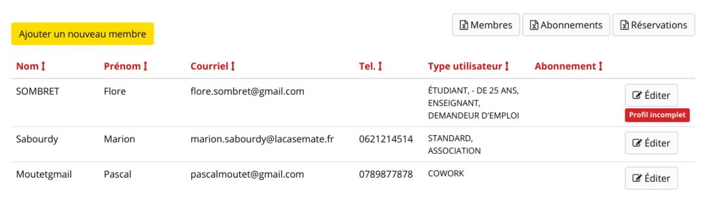
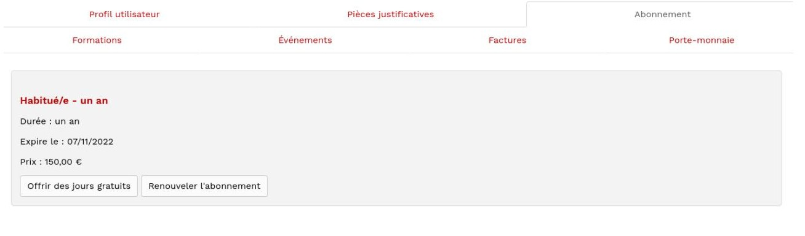
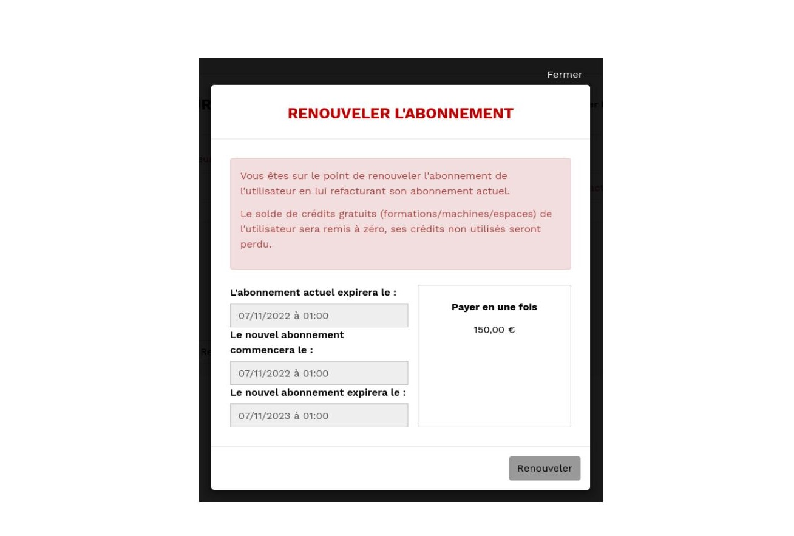
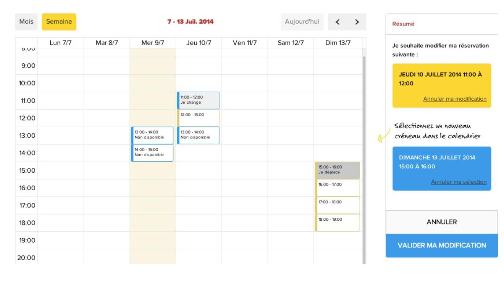
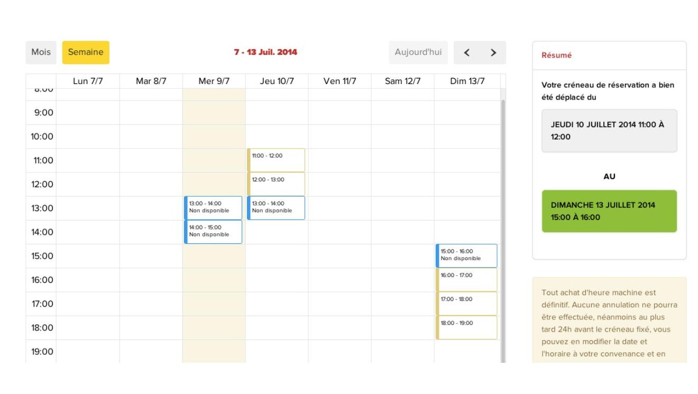
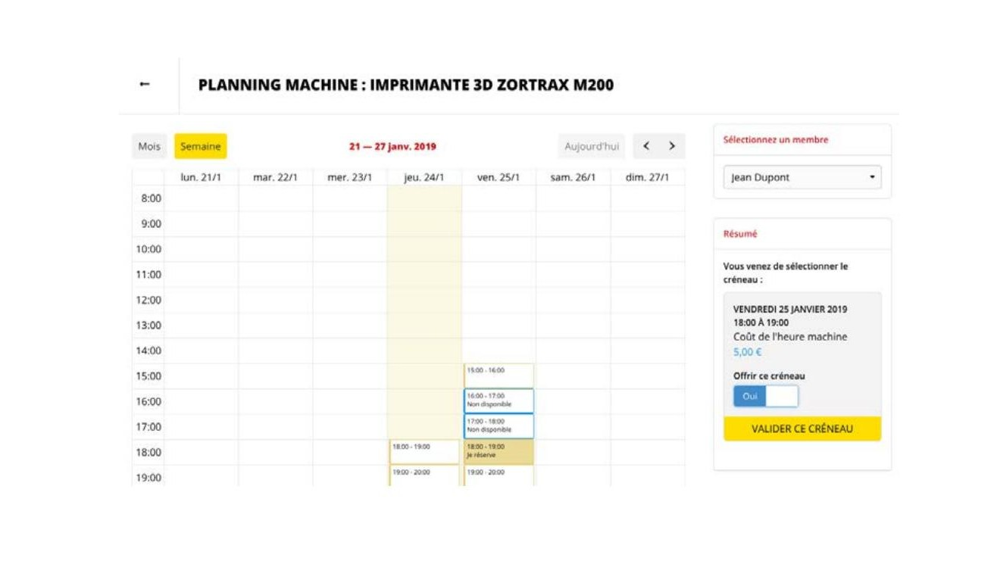
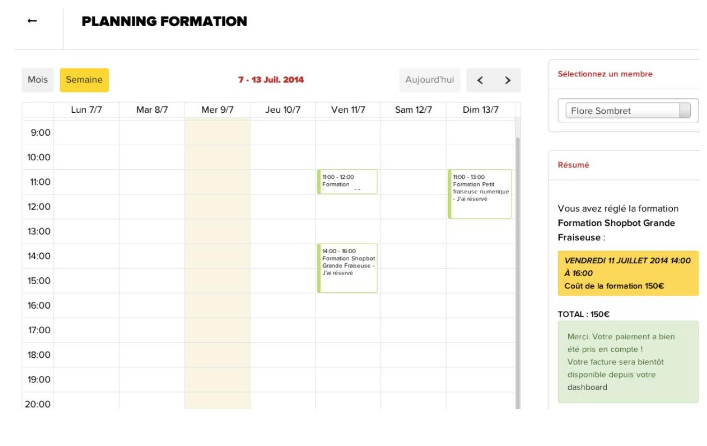
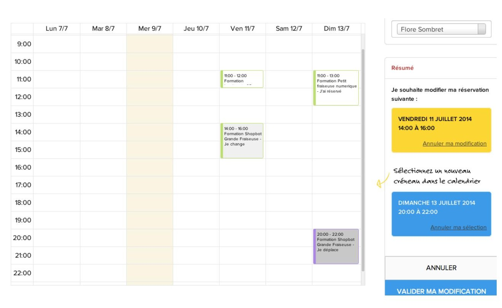

## Fab-manager dal punto di vista degli amministratori (modalità manager)

Fab-manager è stato progettato per gestire le persone che non hanno internet o che non desiderano andare direttamente sul web. In questo caso, la persona deve recarsi alla reception e l'addetto alla reception può eseguire una serie di azioni, al posto dell'utente.

### Creazione del conto - modalità manager

L'addetto alla reception può creare un utente direttamente sul sito. Per farlo, deve andare in "Utenti" nella sezione Manager" (o Admin, a seconda del ruolo) e cliccare sul pulsante "aggiungi un nuovo membro".

*Figura 23 - Elenco del gestore utenti. Se un utente non ha compilato tutti i campi richiesti, viene visualizzata la dicitura "profilo incompleto" sulla destra. Questo può accadere se l'installazione di Fab-manager è vecchia o se gli utenti sono stati importati tramite un server di autenticazione esterno (SSO).*

Il manager compila quindi il seguente modulo. I campi obbligatori sono contrassegnati da un asterisco. È possibile dichiarare una persona giuridica (società, associazione, ecc.) spuntando la casella, i campi "nome" e "indirizzo" della struttura devono poi essere compilati.

In fondo al modulo, è possibile definire i link ai profili dell'utente su diversi social network. Per farlo, cliccare sull'icona del social network che si desidera indicare e apparirà il campo per inserire il link al profilo.

Questo modulo, accessibile solo ai gestori e agli amministratori, permette anche di associare etichette all'utente. Le etichette consentono di limitare l'accesso a determinate fasce di prenotazione`(vedere Gestione del calendario Fab Lab - modalità manager)`.

*Figura 24 - Modulo per la creazione o la modifica di un utente*

Ad esso deve essere assegnato un gruppo.

Il manager può anche dichiarare che l'utente ha già frequentato corsi di formazione presso il Fab Lab (campo "formazione"). Questa azione ha l'effetto di consentire all'utente di effettuare prenotazioni sulle macchine su cui è stato formato.

Per impostazione predefinita, l'utente viene creato senza abbonamento.

La registrazione viene completata facendo clic su "Salva".

### Sottoscrizione di abbonamenti - modalità manager

Una volta che l'utente è stato creato nel sistema, il gestore può procedere alla sua sottoscrizione, se lo desidera, tramite la scheda "Abbonamento" del record di un utente.

*Figura 25 - Interfaccia del gestore delle modifiche utente*

In questa vista, cliccando su "Sottoscrivi un abbonamento", vengono visualizzati i pacchetti di abbonamento associati in base al gruppo dell'utente. Se il piano di abbonamento selezionato consente di effettuare pagamenti mensili, un pulsante permette di sottoscrivere l'abbonamento tramite un piano di pagamento:

*Figura 26 - Facendo clic su Sottoscrivi si ottiene la sottoscrizione dell'abbonamento selezionato. Viene generato un programma corrispondente all'importo dell'abbonamento.*

### Estensione dell'abbonamento - modalità manager

Nel caso di un utente con un abbonamento attivo, la scheda "abbonamento" consente a un amministratore di:
* Rinnovare un abbonamento
* Offrire giorni gratuiti (cioè estendere la durata di un abbonamento gratuitamente, come gesto commerciale)

*Figura 27 - Gestione degli abbonamenti per un utente con un abbonamento corrente*

#### Rinnovo dell'abbonamento

Nel caso di un utente con un abbonamento attivo che desidera rinnovare il proprio abbonamento il gestore clicca su "Rinnova abbonamento". Le date di inizio e fine del nuovo abbonamento vengono inserite automaticamente in base all'abbonamento corrente.

*Figura 28 - Rinnovo e fatturazione dell'abbonamento corrente dell'utente*

Se si seleziona questa opzione, viene generata una fattura per l'importo dell'abbonamento corrente.

**Nota:** non è possibile rinnovare l'abbonamento passando a una formula diversa. Per farlo, è necessario attendere la scadenza dell'abbonamento in corso e poi sottoscriverne uno nuovo.

**Attenzione:** nel caso di un abbonamento sottoscritto tramite un piano di pagamento, anche il nuovo abbonamento sarà sottoscritto tramite un piano, con la prima rata a partire dalla fine dell'abbonamento.

#### Offrire giorni gratuiti

Consente di specificare una nuova data di scadenza dell'abbonamento. Per impostazione predefinita, compare la data di fine dell'abbonamento corrente (questa data può essere modificata manualmente). Se si sceglie questa opzione, il sistema non genererà una fattura.

*Figura 29 - Estensione gratuita dell'abbonamento attuale dell'utente*

### Prenotazione del tempo macchina - modalità manager

Il manager accede alla vista "prenota una macchina" e seleziona la macchina sulla quale l'utente desidera effettuare una prenotazione.

*Figura 30 - Il manager seleziona il membro Mario Rossi dall'elenco degli utenti. Il sistema calcola automaticamente l'importo di 33 euro corrispondente al livello di abbonamento e al gruppo di utenti dell'utente Mario Rossi.*

**Nota:** prima di poter prenotare una macchina, è necessario selezionare un utente ("selezionare un membro").

Il gestore convalida quindi lo slot e accede a una schermata di conferma.

*Figura 31 - Possibili finestre di dialogo per convalidare il pagamento della prenotazione. A seconda del saldo del portafoglio del cliente verrà utilizzato interamente, parzialmente o per niente.*

Il gestore convalida e procede all'incasso tramite il software di gestione del contante implementato nel centro.

**Nota:** Fab-manager non è interfacciato con il software del registratore di cassa.

Lo slot viene quindi bloccato per l'utente:

*Figura 32 - Gli slot già prenotati sono contrassegnati come non disponibili*

### Turno di prenotazione per le ore macchina - modalità manager

Il gestore può modificare uno slot per il quale un utente ha effettuato una prenotazione.

A tal fine, seleziona uno slot contrassegnato come "non disponibile" e appare la seguente finestra:

*Figura 33 - Finestra di dialogo per la modifica della prenotazione*

Il manager sceglie "Voglio cambiare la data" e seleziona un'altra data dal calendario:

*Figura 34 - Scelta di una nuova data per spostare la prenotazione*

Deve ancora convalidare la modifica:

*Figura 35 - Il viaggio è confermato*

La modifica è effettiva.

**Nota:** in alcuni Fab Lab, la regola è che non è possibile spostare uno slot entro 24 ore da un evento. Questa regola può essere impostata dalla vista "Personalizzazione" > Prenotazioni `(vedi Personalizzazione > Prenotazioni)`.

### Offerta ore macchina - modalità manager

È possibile offrire una prenotazione a un utente selezionando "offri questo slot", durante il processo di prenotazione, prima della sua convalida.

*Figura 36 - Offerta di uno slot durante la prenotazione*

In questi casi, il sistema genera una fattura con zero euro per l'utente selezionato.

### Prenotazione dei corsi di formazione - modalità manager

Il principio è lo stesso delle macchine per l'iscrizione ai corsi di formazione.

Per prenotare un corso a nome di un utente, l'amministratore va nella vista "prenotazioni corsi".

Visualizza gli slot di formazione in un calendario dedicato:

*Figura 37 - Il gestore seleziona l'utente Flore Sombret e fa clic su uno slot. Il programma calcola il prezzo del corso in base al gruppo e al livello di abbonamento dell'utente.*

Il gestore convalida e procede al pagamento attraverso questa schermata:

*Figura 38 - Finestra di dialogo per il pagamento della prenotazione*

Il gestore convalida e procede all'incasso tramite il software di gestione del contante implementato nel centro.
**Nota:** Fab-manager non è interfacciato con il software del registratore di cassa.

Lo slot viene quindi bloccato per l'utente:

*Figura 39 - Gli slot già prenotati dall'utente selezionato sono contrassegnati come tali*

### Dislocazione degli slot per i corsi - modalità manager

L'amministratore può modificare uno slot per il quale un utente ha effettuato una registrazione:
A tal fine, seleziona uno slot contrassegnato come "non disponibile" e appare la seguente finestra:

*Figura 40 - Finestra di dialogo per la modifica della prenotazione*

Il manager sceglie di "cambiare la data" e di riposizionare l'utente in un nuovo slot:

*Figura 41 - Selezione di un nuovo slot per spostare la prenotazione*

Quindi convalida la modifica:

*Figura 42 - La modifica è confermata*

La modifica è definitiva.