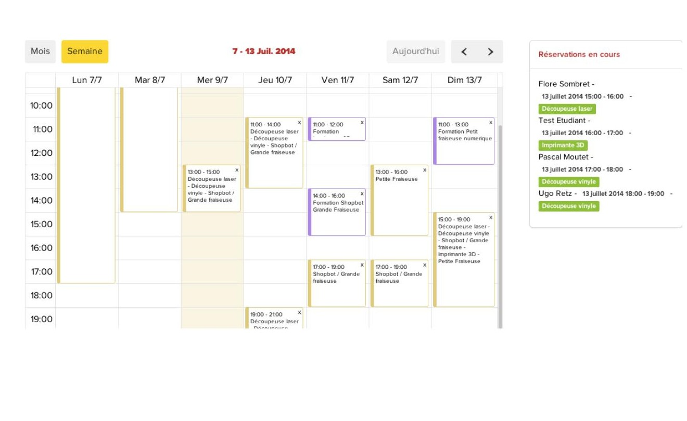
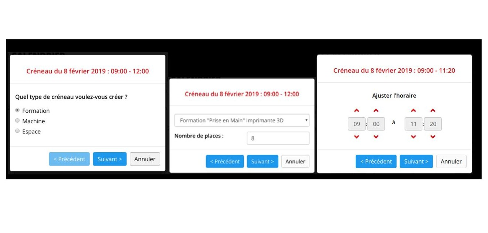
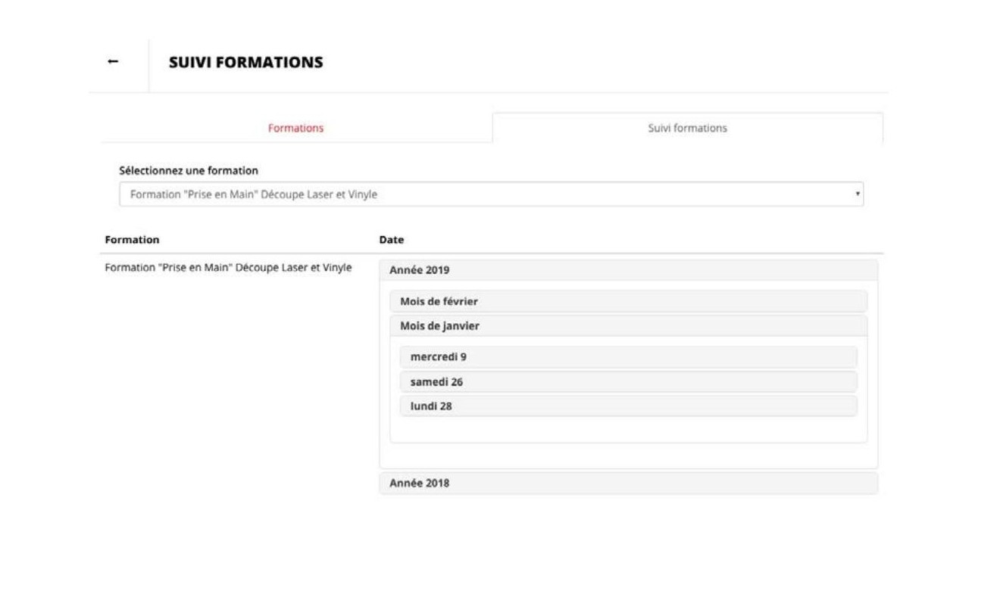
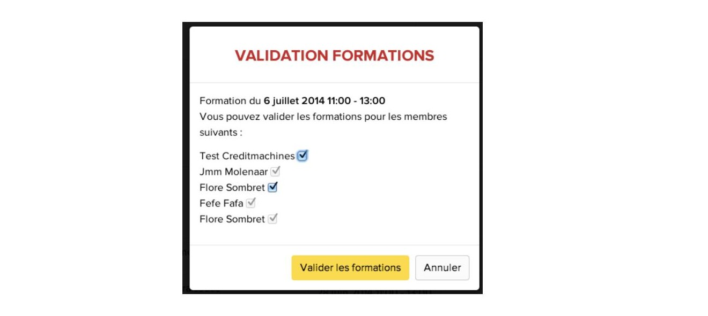
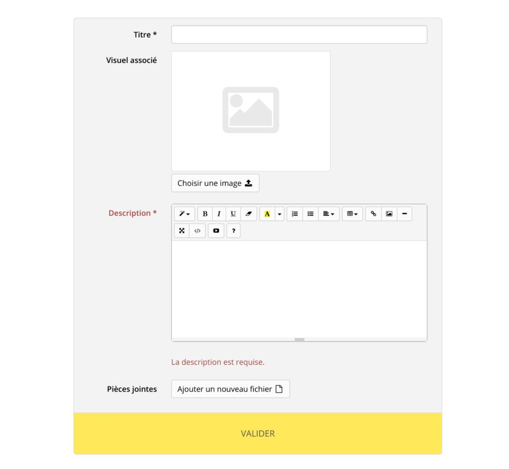
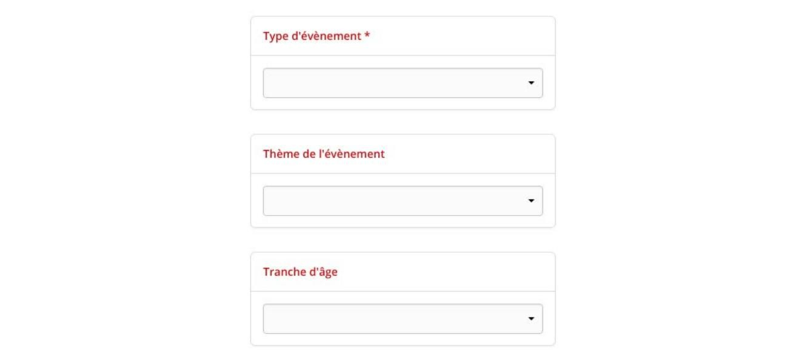
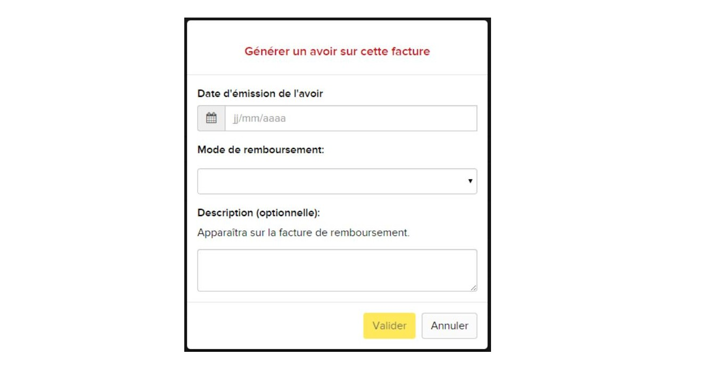
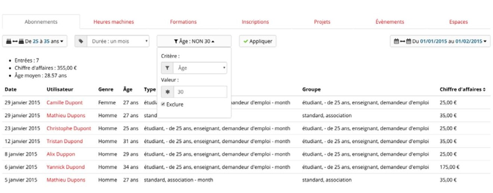

## L'interfaccia dal punto di vista del team del Fab Lab

Alcune funzioni consentono di gestire i calendari della formazione e degli slot machine.

### Gestione del calendario del Fab Lab - modalità manager

Per gestire la formazione e gli slot macchina, il manager accede alla vista: "Gestisci calendario".
Il principio è simile a quello offerto da Google Calendar: l'interfaccia offre la possibilità di rintracciare gli slot:

*Figura 43 - Panoramica del calendario che mostra gli slot di formazione e le macchine per la settimana del 7 luglio. Facendo clic su un particolare slot, vengono visualizzati gli utenti che hanno prenotato quello slot.*

Se si vuole aggiungere uno slot, il gestore posiziona il mouse sul punto desiderato della settimana. L'inizio dello slot deve essere successivo alla data corrente e la durata totale dello slot deve essere un multiplo di un'ora.

Quando si rilascia il mouse, appare una procedura guidata che consente al gestore di definire la natura dello slot: uno slot dedicato alla formazione su una macchina o alla prenotazione di macchine o di uno spazio.

*Figura 44 - In questo esempio, il gestore definisce una disponibilità di 3 ore in cui le macchine saranno disponibili per la prenotazione agli utenti, su 3 fasce orarie di un'ora.*

*Figura 45 - In questo esempio, il manager definisce uno slot di 1h20 in cui la formazione sulla stampante 3D viene messa a disposizione degli utenti al momento della registrazione. È possibile definire un numero massimo di posti nel caso di un corso. Se si raggiunge il numero massimo di posti, le registrazioni vengono interrotte.*

**Nota:**
* Le macchine e gli spazi avranno la loro disponibilità suddivisa in slot. Per impostazione predefinita, questi slot hanno una durata predefinita di 1 ora, ma è possibile regolarne il numero e la durata.
* I corsi non sono suddivisi in slot, ma è possibile regolare la loro durata nella terza fase.

*Figura 46 - In questo esempio, lo slot che si sta creando può essere prenotato solo dagli abbonati annuali con l'etichetta abbonati annuali, con l'etichetta Esportazione. Questo slot verrà rinnovato automaticamente ogni quindici giorni, fino alla fine dell'anno.*

Qualunque sia il tipo di slot creato, è possibile limitare la prenotazione solo a determinati membri (abbonati e/o titolari di tag). Solo gli utenti che si sono abbonati al giusto pacchetto e/o con l'etichetta corrispondente potranno effettuare una prenotazione `(vedere Creazione di un account - modalità manager)`.

La funzione di ricorrenza consente inoltre di pianificare regolarmente gli slot di disponibilità per le macchine o i corsi di formazione.

Nell'ultimo passaggio viene visualizzato un riepilogo degli slot da creare. Se tutto corrisponde, un clic conferma la creazione, consentendo ai membri di effettuare prenotazioni su questi slot.

### Cancellazione di una prenotazione - modalità manager

Un manager può cancellare in qualsiasi momento una prenotazione effettuata da un utente, sia che si tratti di ore macchina o di corsi di formazione.

*Figura 47 - Facendo clic sulla croce accanto a un utente registrato in uno slot, si annulla la sua prenotazione.*

*Figura 48 - La cancellazione dello slot deve essere poi confermata*

È anche possibile eliminare l'intero slot. Ciò avviene tramite la croce o il pulsante di azione dedicato. Tuttavia, ciò è possibile solo se non ci sono prenotazioni in corso nello slot. In caso contrario, la cancellazione non è possibile.  Si suggerisce quindi di spostare gli utenti che hanno già prenotato uno slot in un altro. È utile contattarli per informarli di questo cambio di orario. Una volta che non ci sono più utenti nello slot, il gestore potrà cancellarlo.

Infine, se non vengono effettuate prenotazioni per uno slot, il gestore può "bloccare le prenotazioni" tramite il pulsante dedicato: lo slot diventerà così invisibile agli utenti. Questo permette ad esempio, se tutte le prenotazioni sono state cancellate su uno slot, di impedire a nuovi utenti di prenotare, mantenendo lo slot invisibile. Questo permette, ad esempio, se tutte le prenotazioni sono state cancellate in uno slot, di impedire ai nuovi utenti di prenotare tenendo traccia delle prenotazioni cancellate.

*Figura 49 - In questo esempio, la prenotazione di Mario Rossi nello spazio Biolab è stata annullata e lo slot è stato bloccato per impedire altre prenotazioni.*

### Convalida del corso - modalità manager

Un membro del team del Fab Lab può anche convalidare la formazione degli utenti.
 A tal fine, si accede al menu di gestione "Formazione" e poi alla scheda "Seguito della formazione".

*Figura 50 - Interfaccia di monitoraggio dei corsi*

Questa schermata elenca le diverse sessioni di formazione pianificate nel sistema. Cliccando su una delle date dei corsi fa apparire i partecipanti al corso. L'amministratore clicca sui partecipanti che hanno completato e convalidato la loro formazione. Una volta fatto questo, gli utenti possono effettuare prenotazioni sulle macchine per le quali la loro formazione è stata convalidata:

*Figura 51 - Convalida degli utenti che hanno effettivamente partecipato alla formazione*

### Creazione di eventi - modalità manager

Un membro del team Fab Lab può creare o modificare un evento.

A tal fine, si accede alla scheda di gestione "Eventi" e si sceglie di creare un nuovo evento o di selezionare un evento esistente da modificare.

Quando si crea o si modifica un evento, il collaboratore arriva a una pagina, composta da due parti principali.

Una sezione dedicata all'evento e alla sua descrizione:

*Figura 52 - Creazione/modifica dei dettagli dell'evento*

Lo scopo di questa parte è di fornire dettagli sul contenuto dell'evento, sul suo scopo, sulle potenziali restrizioni, come ad esempio le istruzioni di sicurezza.

La seconda parte da completare è dedicata agli orari e ai prezzi dell'evento:

*Figura 53 - Filtri degli eventi. Solo il tipo è obbligatorio. "Tema" e "Fascia d'età" appaiono solo se sono stati creati dei valori.* `(vedere Gestione eventi)`

*Figura 54 - Date e prezzi di un evento.*

**Nota:** una volta scelto e registrato il numero di posti disponibili, non è più possibile modificarlo.

Il tipo di evento permette di definire se si tratta di un corso, di un workshop o di altro (i tipi possibili sono personalizzabili, `vedere Gestione degli eventi`), e la ricorrenza permette di creare un evento ricorrente. Per gli utenti, lo spostamento di una prenotazione su un evento può essere fatto solo verso un evento gemello, creato quindi dall'opzione "ricorrenza".

Una volta inserito, il manager convalida il suo evento, e un altro membro del manager o lui stesso può venire a modificarlo in qualsiasi momento.

#### Prenotazione di un evento per un utente - modalità manager

Il team degli amministratori potrà inoltre effettuare prenotazioni per corsi e workshop a nome degli utenti registrati sul sito.

Per farlo, il manager dovrà accedere tramite il menu alla scheda "Registrazione evento", che porta alla seguente sezione:

*Figura 55 - Elenco degli eventi visti da un manager; gli eventi sono presentati dal più lontano al più prossimo. L'ordine di visualizzazione per gli utenti è inverso, poiché i manager possono vedere anche gli eventi completati.*

Selezionando l'evento desiderato, l'utente viene indirizzato alla pagina di descrizione dell'evento:

*Figura 56 - Pagina di prenotazione dell'evento da parte di un manager*

Per effettuare una prenotazione a nome di un utente, è sufficiente selezionare il nome dell'utente dall'elenco a discesa dei soci registrati, selezionare il numero di posti e la tariffa da applicare e confermare.

Il sistema genererà una fattura per l'importo dell'ordine effettuato per l'utente.

### Fatture

#### Accesso alle fatture dalla vista "Fatture" - modalità manager

Questa vista raccoglie, in ordine cronologico, tutte le fatture e le note di credito emesse da quando il servizio è attivo.

*Figura 57 - Elenco dei gestori di fatture e note di credito*

Da questa vista è possibile scaricare ogni fattura in formato PDF o emettere una nota di credito su una fattura.

È anche possibile filtrare le fatture, su :
* Un numero
* Una data
* Un nome utente (client)

Passando con il mouse sul logo dell'utente a sinistra, viene visualizzato il nome dell'operatore che ha attivato la generazione della fattura sulla riga evidenziata.

#### Note sulla nomenclatura delle fatture

Per impostazione predefinita, il numero di fattura è formato dai seguenti dati:
* Anno (2 cifre)
* Mese (2 cifre)
* Ordine di generazione della fattura per il mese (3 cifre, ad esempio 001 per la prima fattura generata nel mese)

Per conoscere la natura della fattura, si usa un suffisso:
* VL per le vendite online
* A per avere
* Nulla se la fattura è stata emessa alla reception

Ex:
* 1504102/VL: fattura generata a seguito di una transazione online nell'aprile 2015. Questa è la 102a fattura generata per il mese di aprile 2015.
* 1503045: Fattura generata dopo una vendita alla reception nel marzo 2015. Questa è la 45a fattura generata per il mese di marzo 2015

Questa nomenclatura è personalizzabile `(vedere Personalizzazione delle fatture - modalità amministratore)`.

### Schede di pagamento - modalità manager

La visualizzazione dei piani di pagamento consente di visualizzare un elenco di tutti i piani di pagamento emessi dal sistema per gli abbonamenti che sono stati precedentemente autorizzati a questo tipo di pagamento.

È possibile filtrare l'elenco per riferimento, per nome del cliente o per data.

Quest'ultimo filtro si applica alla data di emissione della pianificazione e alla data di scadenza all'interno di una pianificazione.

Per impostazione predefinita, i programmi vengono visualizzati in modalità compatta: un programma per riga della tabella.

Tuttavia, facendo clic sul "+" all'inizio della riga, è possibile passare alla modalità di visualizzazione estesa per avere i dettagli di tutte le scadenze per un determinato programma.

In modalità estesa, prima di ogni scadenza è possibile scaricare la fattura associata, quando il pagamento è stato convalidato.

Nel caso in cui la scadenza sia posticipata ma il pagamento non sia ancora stato effettuato,  possono essere proposte diverse azioni:
* Confermare che l'assegno è stato incassato, il che convaliderà la data di scadenza e genererà la fattura. Solo i manager e i dirigenti e amministratori possono eseguire questa azione
* Annullare l'abbonamento, nel caso in cui il pagamento sia errato e non sia possibile
  riavviare la procedura di pagamento. Solo i manager e gli amministratori possono eseguire questa azione
* Aggiornare la carta di credito, nel caso in cui sia scaduta o rifiutata. Il membro
  può eseguire questa azione da solo dal suo cruscotto.
* Confermare la carta di credito, nel caso in cui venga inviato all'utente un SMS di convalida. Il membro può eseguire questa azione da solo dal suo cruscotto.

*Figura 58 - Visualizzazione estesa degli orari. In questo caso, al gestore viene chiesto di confermare con un clic l'incasso dell'assegno.*

### Attività - modalità manager

Dalla vista della fattura, un manager può anche emettere una nota di credito. Questo è utile quando è necessario un rimborso

*Figura 59 - Elenco del gestore delle fatture*

Il responsabile fa clic sul pulsante "Nota di credito", di fronte a una fattura, e accede alla finestra seguente in cui stabilisce una data e un metodo di rimborso.

*Figura 60 - Finestra di dialogo per la generazione di note di credito*

La nota di credito viene quindi generata in formato PDF e accessibile dalla vista "Fatture". Viene aggiunta all'elenco delle fatture.

**Nota:** se la nota di credito riguarda un abbonamento attivo, il sistema chiede al gestore se desidera sospendere l'abbonamento o lasciarlo attivo:

*Figura 61 - Finestra di dialogo per la generazione di note di credito con abbonamento attivo*

#### Dettagli di una nota di credito - formato PDF

*Figura 62 - La nota di credito riporta il numero della fattura rimborsata e il nome del cliente interessato.*

#### Generazione parziale di crediti - modalità manager

In alcuni casi, quando una fattura è suddivisa in più righe, il sistema consente di rimborsarne solo una parte. Questo è il caso, in particolare, di un utente che ha pagato per la prenotazione di diverse ore macchina:

*Figura 63 - Generazione di una nota di credito parziale*

Il gestore seleziona le voci che desidera rimborsare (sono tutte spuntate per impostazione predefinita). La nota di credito include solo le righe selezionate.

**Nota:** non è possibile generare una nota di credito parziale su una fattura con un abbonamento e una o più prenotazioni, poiché queste ultime possono essere collegate all'abbonamento.

### Statistiche - modalità admin

Il modulo delle statistiche, accessibile tramite un'icona nel menu di sinistra, consente di seguire l'evoluzione delle attività del Fab Lab sulla base delle seguenti voci:

* Abbonamenti
* Ore macchina
* Formazione
* Eventi
* Spazi (se il modulo spaziale è attivato)
* Registrazioni (creazione di un account sulla piattaforma)
* Progetti

Il modulo consente di definire una serie di filtri su ciascuna di queste voci per affinare le query.

Ad esempio, per gli abbonamenti, è possibile distinguere tra le durate o isolare una categoria di età.
L'amministratore può anche definire un intervallo di date per visualizzare i dati di un determinato periodo.

*Figura 64 - Visualizzazione degli abbonamenti mensili sottoscritti a gennaio 2015.*

L'opzione "filtro personalizzato" consente di filtrare i dati in base a criteri più complessi. È necessario cliccare sul pulsante "Convalida" per tenere conto dei criteri del filtro personalizzato.

*Figura 65 - Visualizzazione degli abbonamenti mensili sottoscritti a gennaio 2015 da utenti di età compresa tra 25 e 35 anni, esclusi quelli di 30 anni. L'età dell'utente è quella in cui è stato sottoscritto l'abbonamento.*

Facendo clic su "Evoluzione" in alto a destra del modulo, l'amministratore può visualizzare le seguenti statistiche su un grafico:

* Abbonamenti
* Ore macchina
* Formazione
* Spazi (se il modulo spaziale è attivato)
* Registrazioni (creazione di un account sulla piattaforma)
* Eventi

*Figura 66 - Visualizzazione dell'andamento degli abbonamenti mensili a gennaio 2015. Le diverse opzioni di visualizzazione comprendono opzioni "Impilato", che visualizza il numero di abbonamenti sottoscritti, e "Espanso", che visualizza il rapporto percentuale tra i diversi pacchetti di abbonamenti mensili. È possibile filtrare i dati cliccando sui loro nomi in alto a destra del grafico.*