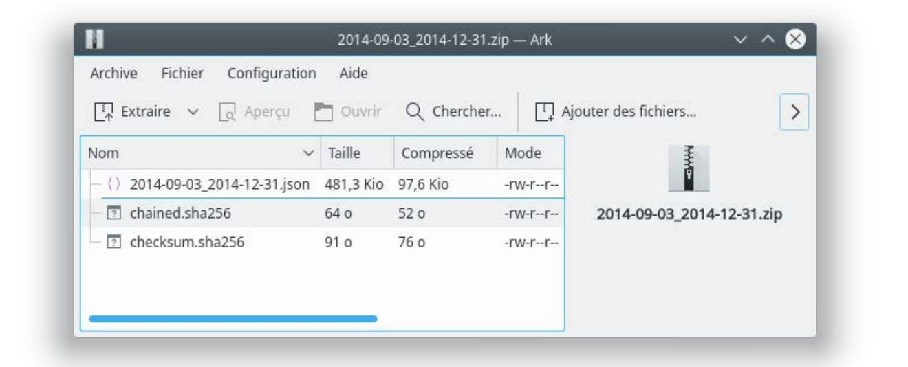

## Contabilità

A partire dalla versione 3.0.0, Fab-manager permette la gestione dei periodi contabili e fornisce un controllo di autenticità delle informazioni contabili, dalla vista "fatture" (modalità amministratore).

Le fatture e i loro sottoelementi sono protetti da un checksum SHA-3 a 256 bit e da un concatenamento crittografico per garantire che le informazioni originali non siano state alterate o corrotte.

Fab-manager controlla l'integrità degli elementi di fatturazione durante ogni accesso ai dati e  visualizza, in base al risultato del test, un indicatore :
* (catena integra verde) se l'integrità è garantita
* (catena rotta rossa) se l'elemento è corrotto o il concatenamento con il record precedente è interrotto

Se i record sono in errore, è necessario ripristinare un backup precedente del database prima che i dati siano danneggiati. A tal fine, contattare l'amministratore del sistema il prima possibile (se possibile prima di qualsiasi nuova operazione di fatturazione).

### Chiusura dei periodi

In alto a destra di questa vista, è presente un pulsante che permette di gestire i periodi contabili e degli archivi.


*Figura 67 - Finestra di gestione dei periodi contabili*

Da questa vista è possibile chiudere un periodo contabile, visualizzare i periodi contabili già chiusi e i loro dettagli (compresi i totali) e scaricare gli archivi dei periodi chiusi.

La chiusura di un periodo contabile consente di bloccare i dati del periodo definito e di generare un archivio sicuro che può essere memorizzato su un supporto esterno.

Questi archivi devono essere messi a disposizione delle autorità fiscali.

È possibile chiudere un periodo contabile in un arco di tempo che va da un giorno a un anno. È vostra responsabilità effettuare le chiusure regolarmente, almeno ogni anno, o per anno finanziario se l'anno finanziario non è basato sull'anno solare. Se non chiudete per più di un anno, vi verrà inviato un promemoria agli amministratori della piattaforma.

Quando si convalida la chiusura di un periodo contabile, il sistema verifica l'autenticità di tutte le registrazioni del periodo in questione.
Se uno di essi è danneggiato, la chiusura viene rifiutata e si dovrà contattare rapidamente l'amministratore di sistema per ripristinare il database. Potrebbe esservi chiesto di fornire una prova di ciò.

Una volta completata, una chiusura appare nell'elenco delle "chiusure precedenti". È quindi possibile visualizzare, facendo clic sul pulsante, le seguenti informazioni:
* La data di chiusura
* Il nome dell'utente che ha eseguito la chiusura
* Il totale del periodo, cioè la somma di tutte le fatture meno la somma di tutte le note di credito, nel periodo in questione.
* Il totale perpetuo, cioè il totale di tutte le fatture meno il totale di tutte le note di credito da quando fab-manager è stato messo in funzione.
* Verificare l'integrità del periodo contabile nel database, attraverso la presenza dell'icona della catena verde (link) o rossa (link spezzato).

### Archivi

L'interfaccia offre anche la possibilità di scaricare un archivio sicuro del periodo contabile appena chiuso.

Questo archivio è in formato ZIP. La maggior parte dei sistemi operativi recenti consente di aprire questo file in modo nativo.
Se il vostro sistema operativo non lo consente, potete utilizzare il software gratuito come 7-Zip (https://www.7-zip.org) per visualizzare il contenuto dell'archivio ed estrarre i dati.


*Figura 68 - Contenuto di un archivio*

L'archivio contiene tre file:

* **data inizio - data fine.json** Questi sono i dati dell'archivio. Tutti gli elementi di fatturazione per il periodo in questione sono inclusi in questo file, in formato JavaScript Object Notation (JSON). Il formato JSON è leggibile da qualsiasi editor di testo, ma per una migliore leggibilità è preferibile utilizzarne uno che supporti la formattazione JSON. Ad esempio, è possibile utilizzare [questa l'estensione jsonview per il browser Firefox](https://addons.mozilla.org/fr/firefox/addon/jsonview/) o [json-formatter per il browser Chrome](https://chrome.google.com/webstore/detail/json-formatter/bcjindcccaagfpapjjmafapmmgkkhgoa?hl=en).
* **checksum.sha256** Questo file contiene una tabella di hash SHA-3 a 256 bit del file di dati precedente. Viene utilizzato per verificare l'integrità dei dati nell'archivio confrontando l'impronta crittografica scritta in questo file e quella calcolata sul file JSON. È possibile utilizzare un'utilità come [sha3sum](https://github.com/maandree/sha3sum) per eseguire questa operazione. Ad esempio :

```
sha3-256sum -l 2015-01-01_2015-12-31.json`
cat checksum.sha256
```
* **chained.sha256** Questo file contiene un'impronta crittografica SHA-3 (256 bit) del file dati dell'archivio corrente, seguita dall'impronta del file ZIP dell'archivio, seguito dalla data di generazione dell'archivio in formato ISO-8601. Questo garantisce l'integrità dell'archivio precedente, che può essere verificata con un metodo simile a quello descritto nel paragrafo precedente.
```
CURRENT=`cat checksum.sha256 | awk '{print $1}'`
PREVIOUS=`sha3-256sum -l ../2014-01-01_2014-12-31.zip`
DATE=`cat chained.sha256 | awk '{print $2}'`
echo "$CURRENT$PREVIOUS$DATE" | sha3-256sum -l
cat chained.sha256
```
È vostra responsabilità conservare questi documenti su un supporto sicuro e metterli a disposizione delle autorità fiscali in caso di controllo.

### Personalizzazione delle fatture - modalità amministratore

Fab-manager consente di personalizzare la forma grafica e i campi di una fattura.
Questa personalizzazione può essere effettuata dalla vista "Fatture > Impostazioni della fattura"


*Figura 69 - Interfaccia di personalizzazione della fattura*

La personalizzazione grafica consente di modificare il logo associato alla fattura:


*Figura 70 - Passando il mouse sul logo, appare il pulsante per scegliere un altro logo.*

Gli altri campi che possono essere modificati direttamente dall'interfaccia sono :

* Riferimento della fattura
* Codice (può essere disabilitato)
* Numeri d'ordine
* Attivazione/disattivazione dell'IVA e dell'aliquota applicabile
* Nota di testo personalizzata
* Indirizzo e contatti

I campi non modificabili che vengono visualizzati automaticamente sono :

* Il nome e l'indirizzo e-mail del cliente, nonché l'indirizzo se si tratta di una struttura.
* Oggetto
* Sintesi dell'ordine
* Metodo di pagamento + data + importo

Si noti che qualsiasi modifica di questi parametri viene registrata nel database con la data e l'autore della modifica.

### Esportazione contabile

Fab-Manager consente di esportare i dati contabili in software compatibili. Attualmente solo [ACD](https://www.acd-groupe.fr/) è compatibile con l'esportazione generata da Fab-Manager.

L'esportazione deve avvenire in due fasi.

In primo luogo, una persona competente deve impostare i codici contabili e le etichette di conto associate nella scheda "Codici contabili". In seguito, un amministratore può regolarmente i dati contabili accedendo all'interfaccia corrispondente.


*Figura 71 - Configurazione dei codici contabili per l'esportazione*

L'interfaccia di esportazione è accessibile cliccando sul pulsante in alto a destra della sezione "Gestione fatture".

Facendo clic su questo pulsante si apre una finestra di dialogo che consente di selezionare il periodo da esportare (di default: dalla prima fattura registrata alla data corrente) e il software di destinazione.

La scelta del software di destinazione visualizza un promemoria dei parametri associati. Facendo clic su convalida avvia la generazione dell'esportazione desiderata.

A seconda del numero di fatture del periodo selezionato, l'esportazione può richiedere più o meno tempo. Una notifica e un'e-mail saranno inviate al termine dell'esportazione.


*Figura 72 - Esempio di esportazione della contabilità per il software ACD*