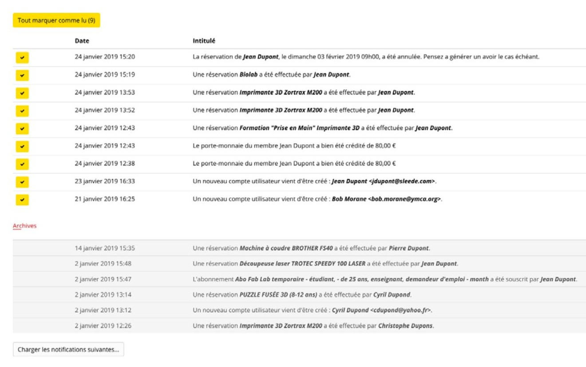

## Gestione delle notifiche

### Visualizzazione delle notifiche nella piattaforma

Il modulo dispone di un centro di notifiche. Accedendo (come utente o amministratore), è possibile accedere alle notifiche facendo clic sul pulsante della campanella.

Il sistema visualizza lo storico delle notifiche ricevute. È possibile tornare indietro nel tempo fino a alla messa in produzione del sistema:

*Figura 73 - Vista del centro notifiche, dal punto di vista dell'amministratore*

### Notifiche inviate via e-mail

Le notifiche riguardano i due ruoli della piattaforma:

* Gli utenti
* Gli amministratori

#### Riepilogo delle notifiche degli utenti

* Dopo la creazione di un account: promemoria del login e della password
* A seguito della creazione di un account: richiesta di convalida dell'indirizzo e-mail
* A seguito della richiesta di reimpostazione della password
* A seguito di un abbonamento - con fattura allegata
* A seguito di una prenotazione (macchine, evento, formazione, spazio) - con fattura allegata
* A seguito di una modifica/eliminazione di uno slot di prenotazione
* A seguito di un cambiamento di gruppo (ad esempio, studente che diventa lavoratore autonomo)
* A seguito dell'estensione dell'abbonamento da parte di un amministratore (gratuito o meno)
* A seguito dell'emissione di una fattura a suo nome
* A seguito dell'emissione di un titolo di credito a suo nome
* In caso di annullamento della sottoscrizione (con emissione di una nota di credito)
* Quando il suo abbonamento scade tra 7 giorni
* Quando l'abbonamento scade
* Quando una persona si è unita al progetto nel corso della documentazione
* Quando l'utente è invitato a partecipare a un progetto creato da un'altra persona
* Quando un amministratore gli invia un codice promozionale
* Quando un direttore convalida la propria partecipazione a un corso di formazione
* Quando un amministratore accredita il suo portafoglio
* 24 ore prima del verificarsi di una prenotazione, se il promemoria è attivato (il ritardo è configurabile da un amministratore)
* Quando la piattaforma migra il proprio sistema di autenticazione (implementazione di un SSO)
* Dopo aver completato correttamente il suo profilo (a seguito della migrazione del suo account a un SSO)
* Quando si aggiorna l'informativa sulla privacy
* Quando si viene promossi a un ruolo diverso (manager o amministratore)

#### Riepilogo delle notifiche del gestore - modalità gestore

* Quando il ruolo di un utente è stato modificato (ad esempio, un membro è diventato un manager).
* A seguito dell'emissione di una nota di credito
* Quando un progetto viene pubblicato
* A seguito di una prenotazione (macchine, evento, formazione, spazio)
* A seguito di una modifica/eliminazione di uno slot di prenotazione
* In seguito all'annullamento di una sottoscrizione (con emissione di una nota di credito)
* A seguito dell'estensione di un abbonamento (gratuito o meno)
* Dopo la creazione di un nuovo account utente
* Quando un utente cambia gruppo
* A seguito dell'accredito di un portafoglio
* 7 giorni prima della scadenza dell'abbonamento
* Quando un abbonamento scade

#### Riepilogo delle notifiche dell'amministratore - modalità admin

* Dopo la creazione di un account: promemoria del login e della password
* A seguito della creazione di un account: richiesta di convalida dell'indirizzo e-mail
* A seguito della richiesta di reimpostazione della password
* Dopo la creazione di un nuovo account utente
* A seguito di una prenotazione (macchine, evento, formazione, spazio)
* A seguito di una modifica/eliminazione di uno slot di prenotazione
* A seguito dell'accredito di un portafoglio
* A seguito di una sottoscrizione
* In seguito all'annullamento di una sottoscrizione (con emissione di una nota di credito)
* A seguito dell'estensione di un abbonamento (gratuito o meno)
* A seguito dell'emissione di una nota di credito
* 7 giorni prima della scadenza dell'abbonamento
* Quando un abbonamento scade
* Quando un progetto viene pubblicato
* Quando un visitatore segnala un abuso su un progetto
* Al termine dell'esportazione di dati in Excel
* Quando un utente cambia gruppo
* Quando un account utente viene importato da un SSO
* Quando un utente completa il proprio profilo (a seguito della migrazione del proprio account a un SSO)
* Quando un account utente importato tramite SSO viene unito a un account esistente
* Quando tutti gli utenti sono stati sincronizzati con Stripe, dopo l'aggiornamento della chiave.
* Quando il ruolo di un utente è stato modificato (ad esempio, un membro è diventato un manager).
* Al termine di un'importazione
* Quando si aggiorna l'informativa sulla privacy
* Al termine della generazione di un archivio contabile
* Ogni lunedì a mezzogiorno, se i conti non sono stati chiusi per più di un anno
* Quando lo spazio su disco è ridotto