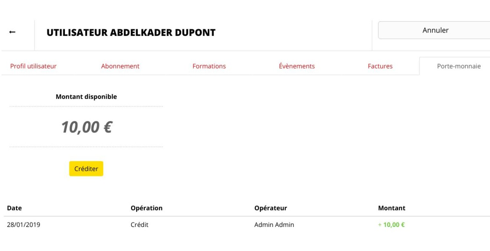

## Impostazione e implementazione di Fab-manager

Questo capitolo è destinato principalmente ai team responsabili dell'implementazione di Fab-manager all'interno della loro struttura. Illustra i diversi input e le regole da impostare per garantire la corretta implementazione di Fab-manager.

### Gestione dei prezzi

Il sistema consente agli amministratori di impostare tutte le tariffe per le ore macchina, la formazione, lo spazio, gli abbonamenti e l'assegnazione dei crediti (ad esempio 10 ore di stampante 3D per gli utenti con abbonamento annuale). Tutti questi dati possono essere configurati nella sezione "Abbonamenti e tariffe".
Tutti questi dati possono essere configurati tramite la vista "Abbonamenti e tariffe".

Questa vista può contenere fino a 6 schede:

*Figura 74 - Schede di gestione dei prezzi*

#### Abbonamenti

Questa scheda consente di creare / modificare / eliminare le formule di abbonamento in vigore in un Fab Lab.

*Figura 75 - Modulo di creazione dell'abbonamento*

**Il tipo di abbonamento** può assumere 2 valori:

- **Standard:** per i pacchetti di abbonamento specifici per il Fab Lab

- **Partner:** nel contesto di abbonamenti incrociati tra un Fab Lab e un'altra struttura. Ad esempio, un Fab Lab offre una formula di abbonamento in partnership con uno spazio di coworking.

**Gruppo:** consente di assegnare un abbonamento a una particolare popolazione:

*Figura 76 - Selezione di un gruppo. L'opzione "trasversale" crea tante formule quanti sono i gruppi, ognuno dei quali può essere configurato in modo indipendente.*

**Categoria:** le categorie sono utilizzate per organizzare la visualizzazione delle iscrizioni nella pagina pubblica presentando le diverse formule ai membri e ai visitatori. L'uso delle categorie non è obbligatorio. Per configurarli, fare clic sul pulsante in alto a destra della pagina "Gestione dei prezzi".

**Periodi e numero di periodi:** consente di definire i periodi di tempo in cui si applica l'abbonamento.

*Ad esempio, per creare un abbonamento trimestrale, scegliere un numero di periodi pari a "3" e il periodo "mese".*
*Per creare un abbonamento annuale, scegliere un numero di periodi pari a "1" e il periodo "anno".*

**Costo dell'abbonamento:** è il prezzo che un utente dovrà pagare per sottoscrivere questo abbonamento.
**Importanza visiva dell'abbonamento:** questa impostazione consente di scegliere l'ordine di presentazione degli abbonamenti al pubblico. La pagina pubblica che presenta gli abbonamenti mostrerà solo le sottoscrizioni accessibili al membro che le sta consultando, in base al suo gruppo. Se il visitatore non ha effettuato il login, le sottoscrizioni appariranno tutte, ma organizzate per gruppo.

Questa impostazione consente di scegliere l'ordine di visualizzazione all'interno del gruppo per dare priorità agli abbonamenti che si desidera mettere in evidenza.

**Abbonamento continuo:** consente di stabilire quando l'abbonamento diventa attivo: non appena l'utente paga ("No") o dopo la sua prima formazione convalidata da un manager ("Sì").

**Pagamento mensile:** se questa impostazione è attivata, date ai vostri utenti la possibilità di pagare l'importo totale dell'abbonamento in un'unica soluzione, oppure in più rate, ogni mese, per tutta la durata dell'abbonamento `(vedere Abbonamenti online)`. Si noti che i pagamenti mensili non è disponibile per gli abbonamenti la cui durata è definita in settimane.

**Scheda descrittiva:** è possibile allegare un PDF (ad esempio una brochure commerciale) che descriva l'abbonamento.

Dopo la registrazione, è possibile modificare le tariffe che verranno applicate alle ore macchina e allo spazio nell'ambito di questa formula di abbonamento.

Queste tariffe possono essere modificate anche in seguito, cliccando sul pulsante nell'elenco dei pacchetti di abbonamento.

*Figura 77 - Modifica delle tariffe di un pacchetto di abbonamento. È possibile riutilizzare i prezzi già definiti in un'altra formula utilizzando l'elenco a discesa "Copia prezzi da". Attenzione: questa operazione sovrascrive i prezzi attualmente definiti nel modulo.*

#### Formazione

*Figura 78 - Output delle tariffe dei corsi*

Questa scheda consente di assegnare le tariffe di formazione in base ai gruppi di utenti (standard, studente, artigiano...). Questi valori possono essere modificati in qualsiasi momento.

#### Ore macchina

*Figura 79 - Output della tariffazione delle ore macchina senza abbonamento*
Quando viene creata una macchina, tutte le tariffe sono impostate a zero. Esse corrispondono alle tariffe che si applicano ai diversi gruppi di utenti (standard, studenti, artigiani...) che non hanno un abbonamento.

##### Pacchetti temporali

Per ogni macchina e per ogni gruppo di utenti è possibile definire uno o più pacchetti di ore che i membri possono acquistare in anticipo e utilizzare man mano.

Per definire questi pacchetti di ore, fare clic sul pulsante di cartone adiacente al prezzo. Si apre una finestra che consente di aggiungere, eliminare o modificare un pacchetto di ore.

L'aggiunta di un pacchetto temporale si effettua definendo i seguenti parametri:

**Ore:** il numero di ore incluse nel pacchetto.

**Prezzo:** il prezzo di vendita dell'intero pacchetto, al quale i membri potranno iscriversi per ottenere un credito di ore corrispondente al numero precedentemente definito.

**Validità massima:** opzionalmente, è possibile definire la durata dopo la quale le ore acquistate non sono più valide.  Ad esempio, per una validità massima di 1 mese, le ore acquistate in un pacchetto il 1° gennaio non saranno più utilizzabili per una nuova prenotazione di macchine effettuata il 2 febbraio.

**Disattivato:** infine, è possibile attivare o disattivare un pacchetto. Si può usare per evitare la riscrizione di un pacchetto esistente o per preparare la configurazione di pacchetti che non saranno subito in vendita.
In **Personalizzazione > Prenotazioni > Impostazioni di prenotazione** è possibile impostare un'opzione facoltativa che consente di rendere obbligatorio il possesso di un abbonamento valido per l'acquisto o la vendita di un prodotto.

#### Spazi

Questa scheda è disponibile solo se il modulo "spazi" è abilitato nel Fab-manager.

*Figura 80 - Modifica della tariffazione degli spazi senza abbonamento*

Quando viene creato uno spazio, tutte le tariffe sono impostate a zero. Corrispondono alle tariffe che si applicano ai diversi gruppi di utenti (standard, studenti, artigiani...) che non hanno un abbonamento.

##### Prezzi estesi

Per ogni spazio e per ogni gruppo di utenti è possibile definire uno o più prezzi estesi. Questi prezzi estesi consentono di modulare il prezzo orario dello spazio in base alla durata totale della prenotazione.

Ad esempio, per un prezzo orario di base di 10 €, è possibile offrire le due ore a 15 € e le 4 ore a 20 €.

In **Personalizzazione > Prenotazioni > Impostazioni di prenotazione**, è presente un'impostazione che consente di scegliere se questi prezzi estesi si applicano solo alle prenotazioni di slot nell'arco della giornata o a tutte le prenotazioni, indipendentemente dalla data.

#### Crediti

Fab Manager consente di definire "crediti", ossia elementi (ore macchina, ore spazio, formazione) che vengono integrati in un abbonamento.
Ad esempio, presso il Casemate Fab Lab, un utente, indipendentemente dal gruppo di appartenenza, che sottoscrive un abbonamento annuale beneficia di 5 sessioni di formazione gratuite e di 10 ore di stampa 3D gratuite, come indicato di seguito.

*Figura 81 - Impostazione dei crediti*

È possibile cancellare / modificare / aggiungere tutti i valori in questa vista.
**Nota:** i crediti non utilizzati alla fine del periodo di abbonamento vengono persi.

#### Codici promozionali

Fab Manager consente la creazione di codici promozionali in valuta o in percentuale.

Per i codici promozionali in valuta (di tipo "Importo"), l'importo non utilizzato durante il pagamento viene perso.

Ad esempio, se un utente ha un codice promozionale di 50€ e lo usa per pagare una prenotazione di 30€, i 20€ rimanenti andranno persi e quindi non potranno essere utilizzati per un pagamento successivo.

Il pulsante (aeroplanino) invia una notifica (nel centro notifiche e via e-mail) a un utente con un account sulla piattaforma, contenente il codice promozionale in questione e il relativo sconto.

### Gestione degli utenti

La vista amministratore "Utenti" è suddivisa in 4 schede, la prima delle quali ("Utenti") è a sua volta suddivisa in 4 schede:

*Figura 82 - Schede di gestione degli utenti*

#### Membri

Permette di creare/modificare gli utenti di Fab Lab. È possibile esportare i dati di questa visualizzazione in Excel: l'elenco dei membri, le sottoscrizioni e l'elenco delle prenotazioni.

*Figura 83 - Elenco dei membri, ordinati per Nome*

##### Credito del portafoglio virtuale

Cliccando l'icona per l'edit, è possibile accreditare il portafoglio di un utente.

*Figura 84 - Accredito di un portafoglio virtuale*

L'accredito di un portafoglio consente all'utente di destinare una certa somma di denaro da spendere sulla piattaforma come meglio crede. Al momento dell'accredito, è possibile richiedere la generazione di una fattura che verrà inviata all'utente.
**Nota:** l'utente non può accreditare da solo il proprio portafoglio online, solo un amministratore o un manager possono farlo. Spetta quindi all'amministratore o al gestore recuperare i fondi, se necessario.

*Figura 85 - Riassunto delle borse*

Una volta accreditato il portafoglio, la riga corrispondente alla transazione si trova nella scheda del portafoglio dell'utente.

##### Importazione di utenti tramite un file CSV

È possibile eseguire un'importazione raggruppata di utenti utilizzando un file CSV come origine dati. L'interfaccia per questa importazione è accessibile facendo clic sul pulsante di importazione, situato in alto a destra nell'interfaccia di gestione dei membri.

*Figura 86 - Pulsante di accesso all'interfaccia di importazione CSV*

Questa interfaccia fornisce gli elementi importanti per la creazione del file CSV di origine.
A tal fine, è possibile scaricare da questa schermata un file di esempio che corrisponde allo scenario di aggiunta di un nuovo utente e dell'aggiornamento di un utente esistente.

La prima riga di questo file rappresenta un nuovo utente (Mario Rossi) che verrà aggiunto al database. La sua password sarà generata automaticamente da Fab Manager e gli sarà inviata via e-mail.

La seconda riga di questo file rappresenta un utente esistente, identificato dal suo ID (n°43), la cui sola password sarà aggiornata con il valore "newpassword", gli altri parametri rimarranno invariati

Quando si scrive il file CSV, bisogna fare attenzione a utilizzare gli identificatori forniti nell'interfaccia per il gruppo, i corsi e le etichette che si vogliono associare all'utente. I campi a valore multiplo sono separati da virgole.

Quando si desidera aggiornare gli utenti in questo modo, è necessario che siano tutti identificati allo stesso modo, cioè che abbiano tutti le informazioni di posta elettronica nella colonna appropriata. Dopo l'importazione, un'interfaccia di monitoraggio consente di visualizzare i risultati dell'importazione. L'interfaccia mostra ogni riga del file CSV e il risultato dell'importazione o dell'aggiornamento. Se si è verificato un errore, un messaggio fornirà dettagli sul tipo di errore riscontrato e su come risolverlo.

Se il messaggio di errore non consente di risolvere il problema, contattare l'amministratore di sistema.

L'amministratore di sistema potrà accedere ai registri tecnici dell'applicazione e fornire ulteriori dettagli o segnalare un bug, se necessario.

#### Amministratori

Consente di creare o rimuovere amministratori dal Fab-manager.

*Figura 87 - Elenco degli amministratori*

**Nota:** l'amministratore attualmente connesso non può eliminare il proprio account, quindi c'è sempre almeno un amministratore sulla piattaforma.

#### Manager

Un manager è un amministratore limitato che non può modificare le impostazioni dell'applicazione.
Tuttavia, potrà effettuare prenotazioni per tutti i membri e per tutti i manager, compreso lui stesso, ed elaborare pagamenti e rimborsi.
Tuttavia, potrà effettuare prenotazioni per tutti i membri e per tutti i gestori, compreso lui stesso, ed elaborare pagamenti e rimborsi.
È consigliabile creare account manager per la squadra degli amministratori.

Se il vostro Fab Lab è gestito da volontari, può valere la pena di nominarli come editor per consentire loro di prendere le prenotazioni per gli altri membri, pur potendo prenotare anche per conto proprio.

*Figura 88 - Elenco dei gestori*

#### Partner

I partner sono associati a pacchetti di abbonamento con lo stesso nome `(vedere Abbonamenti)`.

È possibile gestire questi utenti speciali da questa schermata.

*Figura 89 - Gestione dei partner*

#### Gruppi

Permette di definire categorie (gruppi) di utenti. Sarà quindi possibile creare formule di abbonamento e definire tariffe (ore macchina, formazione) applicabili a tutti o solo ad alcuni dei gruppi.

*Figura 90 - Elenco dei gruppi*

I gruppi sono modificabili/eliminabili, ad eccezione del gruppo "Amministratori" che è interno al sistema e non compare in nessun altro punto della piattaforma.

È anche possibile disattivare temporaneamente un gruppo che non contiene utenti, per impedire l'ingresso di nuovi utenti. Per impostazione predefinita, vengono visualizzati solo i gruppi attivi.
**Nota:** non è possibile eliminare un gruppo se almeno un utente vi appartiene.

#### Etichette

Questa funzione consente di gestire i tag che possono essere assegnati a un utente.

*Figura 91 - Elenco delle etichette*

In qualità di amministratore o manager, posso quindi indicare nella scheda del profilo di un utente che è un "esperto":

*Figura 92 - Assegnazione dell'etichetta "Esperti" a un membro*

L'utilità di questa funzione risiede nel fatto che è poi possibile creare, nell'agenda slot che saranno riservati solo agli esperti, ad esempio.

*Figura 93 - Creazione di uno slot per esperti*

Gli utenti che non hanno questa etichetta non potranno effettuare una prenotazione in uno slot riservato ai soli "esperti".

#### Autenticazione

Fab Manager può essere collegato a un server di autenticazione centralizzato che fornisce un servizio di Single Sign-On.

Servizio di Single Sign-On (SSO) conforme al protocollo oAuth 2.0 o OpenID Connect.

Per impostazione predefinita, gli utenti della piattaforma provengono dal database di Fab Manager (tipo "Database locale"). Non è possibile creare altri provider di questo tipo.

L'impostazione di un servizio SSO è un processo complesso che dovrebbe essere affidato a un esperto. In particolare, per abilitare l'SSO e migrare gli utenti è necessario un accesso da terminale al server.

Per un aiuto nella configurazione, è possibile consultare la [guida tecnica disponibile su GitHub](https://github.com/sleede/fab-manager/blob/master/doc/sso_with_github.md) che illustra l'implementazione di tale servizio attraverso un esempio concreto che utilizza il prototipo oAuth 2.0.

È disponibile anche un altro [documento dedicato a OpenID Connect](https://github.com/sleede/fab-manager/blob/master/doc/sso_open_id_connect.md).

#### Documenti di supporto

Fab Manager offre la possibilità di chiedere agli iscritti di fornire documenti di supporto al fine di convalidare la loro registrazione alla piattaforma.

A tal fine, l'amministratore deve prima andare su **Personalizza > Account > Aggiungi credenziali**. Da questa schermata, ha la possibilità di impostare le richieste di ricezione per ciascuno dei gruppi.

Se definisce richieste di prova, queste saranno indicate ai nuovi membri che creano  account sulla piattaforma. Spetta poi all'amministratore o ai gestori verificare i documenti presentati e quindi invalidarli se necessario.
È consigliabile, ma non obbligatorio, utilizzare questo modulo in parallelo con la funzionalità di convalida dei conti.

Si può attivare da **Personalizzazione > Conti > Creazione di conti**. È inoltre possibile definire le restrizioni precise applicabili ai conti non convalidati.

Se la convalida dell'account è abilitata, una volta verificate le credenziali, l'amministratore convaliderà l'account del socio per sbloccare le funzioni di prenotazione.

Se la funzione di convalida dell'account non è attivata, il mancato invio dei documenti richiesti o l'invio di documenti non validi non pregiudica le possibilità di accesso dell'utente al sistema, tuttavia l'amministratore potrà decidere di cancellare l'account o di prendere provvedimenti nei confronti dell'utente.

*Figura 94 - Pannello di gestione delle richieste di credenziali*

*Figura 95 - Quando un nuovo membro viene iscritto a un gruppo che richiede le credenziali, il membro viene avvisato*

### Gestione della macchina

È possibile modificare la descrizione di ogni macchina, eliminare o aggiungere nuove macchine tramite il menu "Gestione macchine".  Ogni macchina creata diventa potenzialmente disponibile per la prenotazione tramite l'agenda del Fab Lab.

*Figura 96 - Creazione di una nuova macchina*

Come indicato nella vista, l'amministratore deve assicurarsi che le tariffe di prenotazione della macchina siano inserite nella sezione "Abbonamenti e tariffe".
**Nota:** non è possibile eliminare una macchina se è in corso o è già stata effettuata una prenotazione. Tuttavia, è possibile disattivarla.

### Gestione dei progetti

È possibile aggiungere nuovi materiali e temi da utilizzare nei progetti documentati attraverso il menu dell'amministratore "Progetti". Questa vista consente anche di definire licenze relative ai diritti legati a un determinato progetto. È possibile aggiungerle, modificarle o eliminarle.

#### Parametri dei progetti

Dal menu dell'amministratore "Progetti" è inoltre possibile definire se consentire ai visitatori di commentare i progetti, i diversi tipi di file CAD che possono essere allegati ai progetti e se consentire l'uso del progetto come strumento per lo sviluppo del progetto stesso, nonché l'uso della galleria di progetti condivisi "OpenLab".

#### Gestione delle segnalazioni

Un pulsante in alto a destra di questa schermata consente di passare all'interfaccia di gestione delle segnalazioni di abuso.

*Figura 97 - Interfaccia per la gestione degli avvisi sui progetti*

Questa interfaccia consente agli amministratori di rimuovere gli avvisi dal sistema una volta elaborati. Questo in particolare per rispettare il Regolamento generale sulla protezione dei dati (GDPR).

### Gestione degli eventi

*Figura 98 - Gestione degli eventi*

Dalla scheda "Eventi" dell'amministratore o del gestore, è possibile consultare l'elenco degli eventi esistenti, modificarli e visualizzare i dettagli delle prenotazioni collegate a ciascuno di essi.
Gli amministratori hanno accesso alla scheda "Gestione filtri" per gestire gli elementi di categorizzazione degli eventi. Ci sono tre criteri: una categoria (per impostazione predefinita, "corso" o "workshop"), un tema e un gruppo di età.
I visitatori potranno quindi filtrare gli eventi proposti loro in base a questi criteri per trovare più facilmente quelli che li interessano.
Infine, la scheda dell'amministratore "Gestione delle categorie tariffarie" consente di definire tariffe aggiuntive alla "tariffa piena" per gli eventi. Per impostazione predefinita, è presente una "tariffa ridotta", ma è possibile eliminarla e/o crearne altre.

È possibile, ad esempio, offrire tariffe speciali per i bambini di età inferiore ai 10 anni, per le famiglie numerose, per gli studenti, ecc.

### Personalizzazione dell'applicazione

La vista Personalizzazione consente di modificare i testi informativi che appaiono sulla piattaforma. Questa è suddivisa in 5 schede:

*Figura 99 - Schede della sezione "personalizzazione*

#### Generalità

Questa scheda consente di personalizzare i messaggi informativi che si desidera mostrare all'utente  quando :
* Prenotare una macchina
* Prenota un corso
* Prenota uno spazio
* Sottoscrizione di un abbonamento
* Registrarsi ad un evento
* Può beneficiare di una tariffa ridotta per un workshop o un corso

È anche in questa parte che si dà un titolo al Fab Lab che sarà usato nel titolo della pagina HTML e nella firma delle e-mail di notifica.

*Figura 100 - Messaggi*

La scheda generale consente inoltre di definire i documenti legali (PDF) che si desidera visualizzare sulla piattaforma (Condizioni generali di vendita + Condizioni d'uso).

*Figura 101 - Messaggi*

È quindi possibile personalizzare graficamente la piattaforma. In questo modo, un amministratore può definire un logo, una favicon, nonché la scelta di un colore principale e di un colore secondario. Questa scelta viene effettuata da una tavolozza.

*Figura 102 - Tema*

**Nota:** i codici colore definiti vengono utilizzati nelle notifiche e-mail inviate agli utenti e agli amministratori, nonché in Excel.

L'immagine di sfondo del banner del profilo si trova nella pagina "Il mio profilo":

*Figura 103 - Banner di sfondo della pagina "Il mio profilo*

La scheda "generale" consente inoltre di definire l'ordine di visualizzazione delle macchine nella pagina "riserva una macchina", il modo in cui l'aiuto a bordo viene visualizzato dagli amministratori e dai manager, l'indirizzo a cui inviare le notifiche via e-mail, i parametri di creazione dell'account e i vari moduli opzionali.

*Figura 104 - Impostazioni per la creazione dell'account*

#### Account

Diversi parametri, disponibili qui, influenzano le informazioni necessarie per poter creare o modificare un account sulla piattaforma.

In particolare, è possibile :

* Limitare la creazione di nuovi account, in modo che solo gli amministratori e i manager esistenti possano crearne di nuovi.
* Inviare un'e-mail di conferma contenente un link da cliccare prima di accedere alla piattaforma.
* Consentire ai membri di cambiare gruppo da soli, dopo la loro dichiarazione iniziale di creazione dell'account.
* La prenotazione di macchine/spazi/ecc. è soggetta alla convalida preventiva degli account da parte di un amministratore o di un manager.
* Impostare un captcha per impedire la creazione di account da parte di robot.
* Definire se il numero di telefono o l'indirizzo sono informazioni obbligatorie o facoltative per la creazione di un account.
* Chiedere agli utenti che creano un nuovo account di fornire documenti di supporto, come ad esempio la carta dello studente.

#### Pagina iniziale

Questa scheda consente di definire un messaggio da visualizzare nella home page: può essere utile, ad esempio, per indicare la chiusura temporanea di un Fab Lab o per visualizzare un messaggio di servizio.

Questo può essere utile, ad esempio, per indicare la chiusura temporanea di un Fab Lab o per visualizzare un messaggio di servizio.

Questa scheda consente anche di impostare l'utente collegato al feed di Twitter che si desidera visualizzare nella home page.

*Figura 105 - Personalizzazione della pagina iniziale*

È anche possibile andare oltre, personalizzando completamente la homepage. Un editor visuale interattivopermette di modificare il codice HTML e i diversi moduli da visualizzare sulla home page.
In fondo alla pagina, un editor consente di definire un foglio di stile CSS personalizzato (o SASS, entrambe le sintassi sono possibili) per la home page.
Queste funzioni sono da riservare agli utenti avanzati che hanno familiarità con le tecnologie web. In ogni caso, è possibile  ripristinare la pagina iniziale predefinita facendo clic sul pulsante in alto a destra dell'editor HTML.

#### Informazioni su

Questa scheda consente di modificare la pagina di presentazione del Fab Lab, accessibile tramite il link "Informazioni" situato nell'intestazione.

*Figura 106 - Personalizzazione della pagina Informazioni*

#### Privacy

Questa scheda consente di definire e modificare gli elementi dell'informativa sulla privacy.

Sul lato sinistro, per impostazione predefinita, viene visualizzato il criterio corrente. Il contenuto di questa può essere modificato al volo. Facendo clic sul pulsante "Salva" nella parte inferiore della policy, si può scegliere se pubblicare le modifiche, in modo che abbiano effetto immediato, o di salvarle semplicemente come bozza che sarà visibile solo agli amministratori del sito.
Un elenco a discesa nella parte superiore del criterio da modificare consente di selezionare una delle bozze precedentemente salvate per la modifica.

Attenzione: è importante notare che la pubblicazione di una nuova informativa sulla privacy omporterà una notifica via e-mail a tutti gli utenti della piattaforma.

In fondo alla pagina sono presenti anche altre opzioni per la privacy:
* Partecipazione a Fab Analytics, che raccoglie in forma anonima i dati del vostro Fab M  manager, per aiutare il team di sviluppo
* La configurazione di Google Analytics, per ottenere statistiche sulle visite
* Tracciamento delle condivisioni sui social network Facebook e Twitter

#### Prenotazioni

Questa scheda consente di definire una serie di regole da impostare per le prenotazioni:

*Figura 107 - Regole di prenotazione*

È possibile :
* Definire gli orari di apertura e chiusura del Fab Lab.
* Definire l'intervallo massimo di visibilità degli slot di prenotazione
* Definire se l'utente ha il diritto di spostare i suoi slot di prenotazione. Se ne ha il diritto, definire un limite di tempo a partire dal quale non è più possibile spostare lo slot (ad esempio, 24 ore prima della prenotazione).
* Definire se l'utente ha il diritto di cancellare una prenotazione. Se ne ha il diritto, definire un limite di tempo a partire dal quale non è più possibile ancellare lo slot (ad esempio, 24 ore prima della prenotazione).
* Definire se gli utenti possono prenotare più slot contemporaneamente e di quali tipi.
* Imposta la durata predefinita degli slot macchina e spazio.

*Figura 108 - Richiamo delle prenotazioni*

Se questa impostazione è attivata, all'utente che ha effettuato una prenotazione verrà inviata un'e-mail di promemoria, 4 ore prima della data prevista per la prenotazione; il ritardo è personalizzabile.

*Figura 109 - Riservatezza delle prenotazioni*

Se è attivata la funzione "mostra nomi", i nomi delle persone che hanno prenotato uno slot della macchina appariranno nel calendario di disponibilità pubblica, come nell'esempio seguente.

*Figura 110 - Calendario con visualizzazione del nome*

È anche possibile configurare la visualizzazione in sola lettura degli eventi (workshop, corsi, ecc.) nell'agenda.

### Funzioni di esportazione

È possibile esportare in Excel dalla vista amministratore "Utenti":
* L'elenco dei membri (utenti)
* L'elenco degli abbonamenti (online e/o alla reception)
* L'elenco delle prenotazioni effettuate

Dalla vista amministratore "Statistiche" è anche possibile esportare la vista corrente o tutte le statistiche del Fab Lab per un determinato periodo.

### Informazioni sul pagamento con carta

Per riscuotere i pagamenti dei soci con carta di credito, Fab-manager offre la possibilità di scegliere tra due   soluzioni di pagamento ("gateway"):

* Stripe, un'azienda americana. È la porta d'accesso storica di Fab-manager, una soluzione potente e facile da usare.
* PayZen, una società francese. In Francia, questo gateway è stato approvato dalla DGFiP per la  per la riscossione da parte di enti pubblici.

Si tratta di soluzioni di terze parti, utilizzate in produzione su molti Fab Manager attualmente in linea.

Ogni transazione è soggetta a una commissione di transazione. I dettagli delle commissioni applicate sono disponibili sul sito web dei gateways:
* https://stripe.com/fr/pricing
* https://www.payzen.eu/tarif-payzen/

#### Configurazione del gateway di pagamento

Una volta decisa la soluzione di pagamento da utilizzare, accedete come amministratore e andate alla scheda **Fatture > Impostazioni di pagamento**.

Un pulsante vi permetterà di attivare i pagamenti online. Quando si fa clic su "Registra", si apre una finestra di dialogo che chiede di scegliere un gateway e di fornire i dettagli della sua configurazione.

*Figura 111 - Configurazione del gateway di pagamento.*

Dopo aver convalidato la configurazione, non dimenticate di configurare la valuta da utilizzare per i pagamenti nella schermata successiva.

Gli utenti potranno ora pagare le loro prenotazioni direttamente con carta di credito sul sito web.

#### Dati di prova per il pagamento online

Per effettuare pagamenti fittizi su istanze di Fab Manager in modalità "staging" o "development", è possibile utilizzare chiavi di prova abbinate a dati di carte di credito fittizie.

Per Stripe, nella dashboard è possibile selezionare una modalità "test". Utilizzando le chiavi API fornite, combinate con i seguenti dati, consentiranno di effettuare pagamenti di prova.

* Carta Visa: 4242424242424242
* HVAC: 123
* Data di validità > data corrente.

La seguente pagina del sito web di Stripe fornisce ulteriori informazioni sul test delle carte: https://stripe.com/docs/testing

Per PayZen, quando nella configurazione vengono utilizzate chiavi API di prova, viene aggiunta automaticamente una barra degli strumenti nella parte inferiore della schermata.

La barra degli strumenti viene aggiunta automaticamente nella parte inferiore della schermata. Questa barra consente, durante un pagamento, di selezionare una carta bancaria fittizia tra tutte quelle proposte da PayZen. La scelta di una carta  compilerà automaticamente i campi del modulo (numero, data e codice di sicurezza).