# GUIDA ALL'USO DELLA SOLUZIONE FAB-MANAGER


Changelogs:

*V.1.0 - Luglio 2014 Pascal Moutet Versione iniziale
V.1.1 - luglio 2014 PM Correzioni minori
V.1.2 - Agosto 2014 PM Aggiunta procedura per la gestione degli eventi
(workshop e corsi)
V.1.3 - Sett. 2014 PM Aggiunta di una procedura per le fatture
V.1.4 - Nov. 2014 PM Aggiunta della procedura per il
rinnovo degli abbonamenti
Aggiunta di informazioni relative alla base tecnica
utilizzato
V.1.5 - Feb. 2015 PM Aggiunta relativa alla possibilità di assegnare un numero massimo di posti a un corso
numero di posti in un corso
Aggiunta la possibilità di generare una nota di credito in caso di rimborso
Aggiunta la descrizione del funzionamento del modulo di analisi statistica
modulo di analisi statistica
V 1.6 - Aprile 2015 PM Aggiunto un capitolo che descrive la gestione delle notifiche
V 1.7 - Aprile 2015 PM Aggiornamento globale del documento a seguito di una
consegna
V 1.8 - Luglio 2015 PM Aggiunte aggiunte riguardanti la creazione di sottoscrizioni in
modalità amministratore
Aggiunte relative alla generazione di note di credito parziali
Aggiunte relative alla possibilità di offrire prenotazioni
macchine
Aggiunte relative alle nuove funzionalità di
personalizzazione dell'interfaccia
Aggiunta relativa al funzionamento delle etichette
associate a un profilo utente
V 1.9 - Luglio 2015 PM Riscrittura del capitolo "Abbonamento - modalità admin
modalità di amministrazione".
V 2.0 - luglio 2015 PM Correzioni minori
Convalida del documento con gli ingegneri Sleede
V 3.0 - Gennaio 2019 Sylvain
Bousseyroux Aggiornamento globale, per Fab Manager v2.
V 3.1 - marzo 2019 SB Fab-manager v3.0.0, certificazione del software del registratore di cassa
V 4.0 - Giugno 2019 SB Fab-manager v4.0.0, compatibilità RGPD
V 4.2 - Ottobre 2019 SB Fab-manager v4.2.0, captcha, esportazione contabilità, importazione soci tramite file CSV, stile e stile di vita.
dei membri tramite file CSV, aggiornamento dello stile
V 4.3 - Mar 2020 SB Fab-manager v4.3.0, ricorrenza, cancellazione membri
importazione iCal, durata slot, homepage
V 4.5 - Giugno 2020 SB Fab-manager v4.5, interfaccia impostazioni,
gestori, interfaccia di amministrazione delle fatture, slot di durata personalizzati
slot di durata personalizzati
V 4.7 - Febbraio 2021 SB Fab-manager v4.7, abbonamenti mensili
V 5.0 - giugno 2021 SB Fab-manager v5, PayZen e categorizzazione degli abbonamenti
abbonamenti
V 5.4 - Agosto 2022 SB Fab-manager v5.4, cruscotto prenotazioni,
abbonamento/rinnovo amministrativo, pacchetti di tempo, prezzi estesi
prezzi estesi, voucher*

## Introduzione

La soluzione Fab-Manager consente agli utenti di un Fab Lab di accedere a diversi servizi online:

* Creare un account utente
* Accesso al cruscotto
* Prenotazione di macchine e spazi
* Registrazione ai corsi di formazione
* Iscriversi agli eventi (corsi, workshop, ecc.)
* Spostare e/o cancellare uno slot per il quale l'utente si è registrato
* Abbonamento online: sottoscrizione e rinnovo degli abbonamenti
* Documentazione dei progetti
* Consultare l'agenda generale del Fab Lab

L'utente ha la possibilità di pagare i suoi "acquisti" online.

La soluzione Fab Manager offre anche una modalità manager che permette di gestire gli utenti che si presentano alla reception del Fab Lab ed eseguire azioni per loro:

* Prenotare macchine / corsi per un utente
* Spostare/eliminare gli slot di prenotazione per un utente
* Prelievo/estensione di abbonamenti per un utente
* Registrazione degli utenti agli eventi
* Offrire prenotazioni agli utenti
* Creare un account per un utente

Per il team che lavora nel Fab Lab, la modalità manager della soluzione consente anche :

* Gestire il calendario della macchina
* Gestire il calendario della formazione
* Convalidare la formazione svolta dagli utenti
* Creare corsi e workshop
* Emissione di note di credito (rimborsi)

Infine, Fab-manager offre una modalità di amministrazione per il team di base che lavora nel FabLab:

* Impostare i diversi moduli
* Statistiche d'uso di Access Fab Manager (ad esempio, per la compilazione di rapporti sulle attività per esempio)
* Effettuare importazioni/esportazioni
* Creare nuove macchine
* Eliminare gli utenti
* Modificare i prezzi
* Gestire l'accesso all'API

A seconda dell'organizzazione delle risorse umane in un Fab Lab, i ruoli di team di accoglienza / team del Fab Lab / amministratori possono sovrapporsi.
Il team del Fab Lab e gli amministratori possono sovrapporsi. A tal fine, il ruolo di amministratore consente di esegue tutte le azioni possibili con il ruolo di manager, tranne l'accettazione di prenotazioni per conto proprio.

Tuttavia, per facilitare la lettura e per arrivare al punto in base alla vostra posizione, abbiamo cercato di suddividere i processi in base a ciò che interessa le diverse parti.
processi in base a ciò che interessa le diverse parti interessate in un progetto Fab Lab
Le parti interessate in un progetto Fab Lab, ovvero: gli utenti, il team ospitante, le persone che lavorano nel Fab Lab, le persone responsabili del Fab Lab, le persone incaricate di allestire e distribuire la piattaforma.

Pertanto, questo documento è composto da 4 parti principali:

* L'interfaccia dal punto di vista dell'utente
* L'interfaccia vista dal lato della squadra di casa
* L'interfaccia vista dal lato del team del Fab Lab (manager e dipendenti del Fab Lab).
* Il capitolo "Impostazione e implementazione di Fab Manager" è destinato in particolare ai reparti "IT" responsabili dell'implementazione di Fab Manager. Descrive i diversi input che devono essere impostati prima della messa in produzione della soluzione.

## L'interfaccia utente

Senza aver effettuato il login, il visitatore del sito ha la possibilità di :

* Visualizza la homepage del sito
* Visualizza la galleria del progetto
* Visualizza la galleria di macchine
* Visualizza i workshop e i corsi offerti
* Visualizza le diverse opzioni di abbonamento disponibili
* Pagine di consultazione (sul Fab Lab, carta degli utenti...)

Tutte le altre funzioni sono accessibili, almeno in modalità di sola lettura, se l'utente crea un account.

### Creazione dell'account

La creazione di un account avviene tramite la funzione "Registrati". Facendo clic su di essa, l'utente accede alla seguente interfaccia, eventualmente arricchita da un captcha per la protezione dai robot:


*Figura 1 - Modulo per la creazione di un account pubblico*

È in questa schermata che l'utente definisce il proprio gruppo, ad esempio:

* Standard, associazione
* Insegnante, under 25, in cerca di lavoro, studente
* Artigiano, lavoratore autonomo, commerciante, ricercatore
* PMI, LLC

Questi gruppi segmentano le offerte di prezzo del Fab Lab. L'amministratore può personalizzarli, `vedere Gruppi`.
La data di nascita è richiesta in quanto ci permette di stabilire statistiche sulle fasce di età che utilizzano il Fab Lab. Il numero di telefono viene utilizzato anche per contattare rapidamente gli utenti che devono cancellare o modificare una prenotazione all'ultimo minuto.

**Nota:** Un utente ha la possibilità di cambiare gruppo: una persona in cerca di lavoro può diventare un lavoratore autonomo, uno studente può diventare uno standard, ecc. Questa modifica viene effettuata dalla vista "Le mie impostazioni":

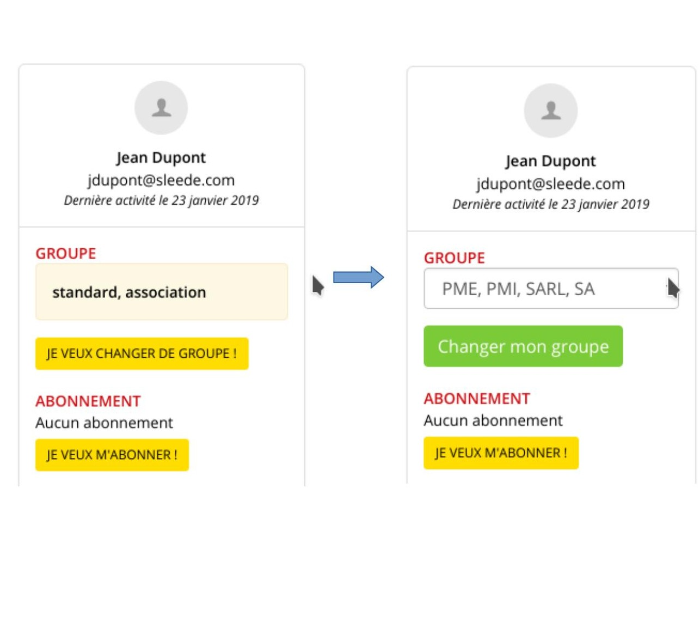
*Figura 2 - Modifica dei gruppi dalle loro impostazioni*

### Dashboard

 Una volta inviato il modulo, l'utente riceverà un'e-mail di conferma per indicare che il suo account è stato creato.
Come di consueto, l'utente è invitato a cliccare su un link per attivare definitivamente il suo account. L'attivazione può essere obbligatoria o facoltativa, a seconda delle impostazioni del sistema `(vedere Personalizzazione dell'applicazione / Generale)`.

Una volta effettuato l'accesso, l'utente dispone di un cruscotto in cui può trovare le principali informazioni che lo riguardano:


*Figura 3 - Menu utente*

* **Il mio profilo**: visualizza un riepilogo del profilo dell'utente.
* **Le mie impostazioni**: consente di modificare/completare i dati del profilo. Questa sezione consente inoltre di modificare i gruppi, gestire le preferenze dei cookie e cancellare gli account utente.
* **Le mie credenziali**: a seconda del gruppo dichiarato dal membro, le credenziali possono essere richieste. Il membro deve quindi accedere a questa scheda per fornirle.
* **I miei progetti**: visualizza i progetti pubblicati o in fase di documentazione (modalità bozza).
* **I miei corsi di formazione**: riepiloga i corsi passati / prossimi / attualmente convalidati / convalidato.
* **Le mie prenotazioni**: riepiloga le prenotazioni passate / future di macchine e spazi, nonché i crediti rimanenti, legati a un abbonamento corrente.
  crediti residui, legati a un abbonamento corrente.
* **I miei eventi**: riepiloga le prenotazioni per workshop e corsi passati e futuri
* **Le mie fatture**: riepiloga le fatture ricevute. Ogni fattura può essere scaricata in
  FORMATO PDF.
* **I miei piani**: riepiloga i piani di pagamento sottoscritti. Ogni piano di pagamento può essere scaricato in formato PDF. Se un pagamento è in difetto, l'utente può aggiornare la propria carta o inserire il proprio codice di autorizzazione da questa sezione.
* **Il mio portafoglio**: se il modulo portafoglio è attivato, visualizza il saldo del portafoglio virtuale e lo storico delle transazioni.

### Abbonamenti online

L'utente ha la possibilità di abbonarsi e pagare online con carta di credito.
Le formule di abbonamento vengono visualizzate in base al gruppo dell'utente collegato:

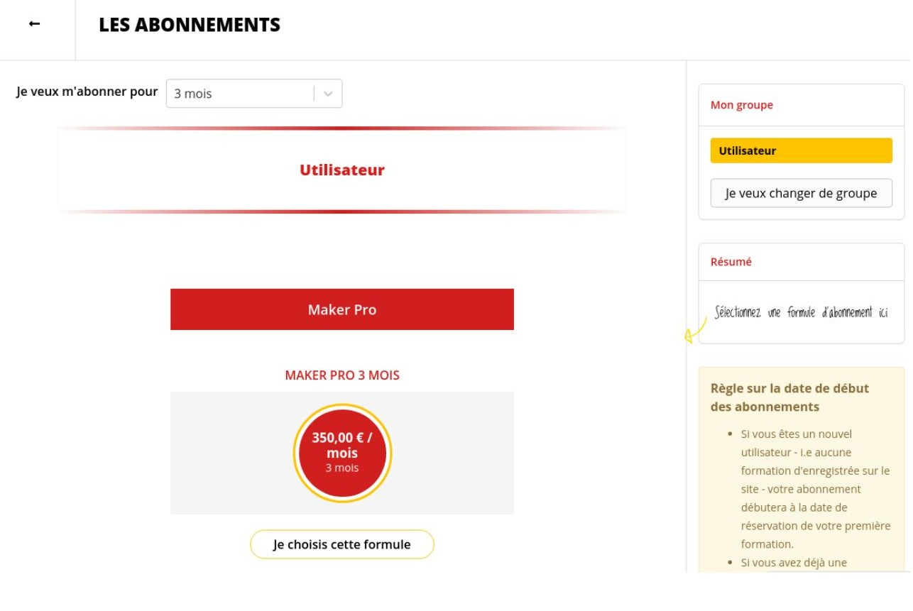
*Figura 4 - Visualizzazione dell'abbonamento per un utente standard o associativo*

Da questa schermata, l'utente può visualizzare il suo livello di abbonamento, se è già abbonato, o le offerte disponibili, se non lo è.

Il cliente può quindi scegliere la durata dell'abbonamento, selezionare la tariffa corrispondente e pagare online.

Al cliente viene inviata un'e-mail di riepilogo dell'ordine e una fattura in formato PDF.

In questa schermata può anche cambiare il suo gruppo (studente, lavoratore autonomo, standard, ecc.).

#### Abbonamento mensile

Alcuni pacchetti di abbonamento possono essere configurati in modo da offrire ai membri l'opzione di pagamento a rate. Questi pacchetti si distinguono dagli altri per la chiara indicazione del prezzo al mese, anziché del prezzo totale dell'abbonamento.

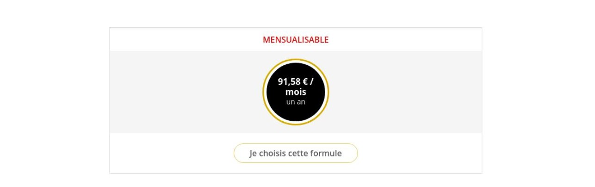
*Figura 5 - Un abbonamento che l'utente può pagare a rate*

Dopo aver selezionato un pacchetto di abbonamento con pagamenti mensili, l'utente può scegliere se pagare in un'unica soluzione o tramite un piano di pagamento mensile. Quest'ultima è l'opzione predefinita.

L'utente ha inoltre la possibilità di visualizzare l'intero piano di pagamento prima di assumere un impegno.


*Figura 6 - Riepilogo, prima di sottoscrivere un abbonamento mensile*

### Rinnovo degli abbonamenti

Gli abbonamenti non si rinnovano automaticamente e richiedono un'azione da parte dell'utente. Ogni utente deve attendere la scadenza del proprio abbonamento prima di sottoscriverne uno nuovo.

**Nota:**
Non è possibile rinnovare un abbonamento **annuale** su un abbonamento **mensile**: è necessario attendere la scadenza dell'abbonamento e passare a un pacchetto diverso.

Un abbonato riceve avvisi che gli permettono di conoscere lo stato del suo abbonamento:
* 1 email viene inviata 7 giorni prima della scadenza dell'abbonamento
* 1 e-mail viene inviata il giorno della scadenza dell'abbonamento.

Naturalmente, al momento della sottoscrizione dell'abbonamento, i clienti ricevono anche una fattura in formato PDF con le date di validità dell'abbonamento.

### Iscrizioni alla formazione

Dalla scheda **"iscrizioni alla formazione"**, l'utente può iscriversi ai corsi di formazione online da un calendario che elenca i corsi disponibili nelle prossime settimane.

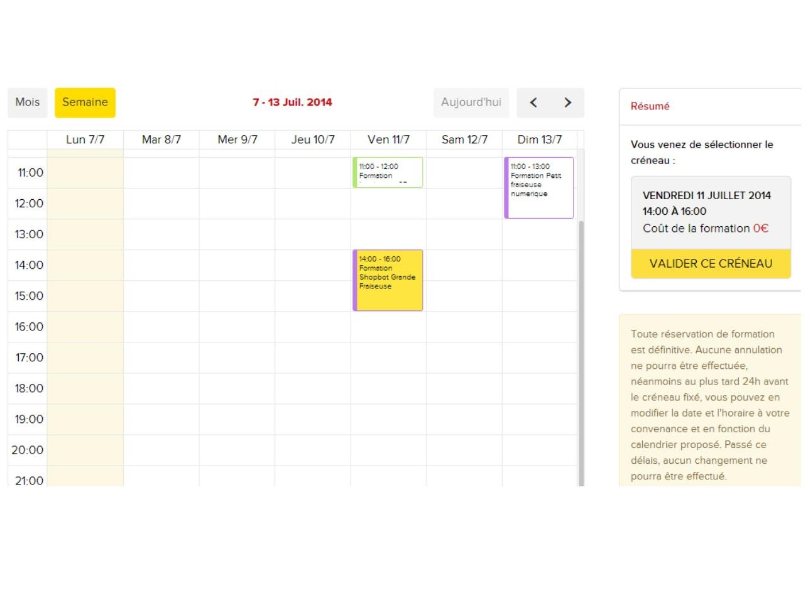
*Figura 7 - Vista del calendario di allenamento. L'utente seleziona uno slot. A seconda del livello di abbonamento, il costo del corso varia. In questo caso, il corso selezionato è gratuito, in quanto incluso nell'abbonamento (costo = 0€). Se il costo è superiore a 0€, l'utente paga la transazione online.*

**Nota:** in alcuni Fab Lab, è indispensabile che un utente segua una formazione su una macchina e che un membro del team del Fab Lab la convalidi prima di poter prenotare le macchine.
Un altro Fab Lab può impostare la regola che la formazione non è necessaria per prenotare una macchina. (Vista amministratore "Formazione" - Semplicemente non associare le macchine a un corso di formazione).

### Prenotazione di ore macchina

Una volta convalidati i corsi di formazione, l'utente ha la possibilità di riservare le macchine del Fab Lab direttamente da un calendario dedicato che elenca gli slot disponibili per le prossime settimane. Questo calendario viene compilato dal team del Fab Lab `(vedere Gestione del calendario del Fab Lab - modalità admin)`.

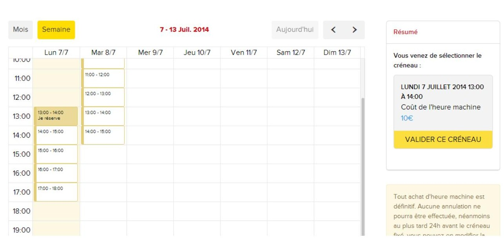
*Figura 8 - L'utente effettua una prenotazione per la stampante 3D per uno slot di un'ora. Il sistema calcola il prezzo dell'ora di macchina in base al livello di abbonamento dell'utente e alla durata della fascia oraria scelta. L'utente può prenotare tutti gli slot che desidera. Un utente non abbonato ma allenato può prenotare le ore macchina senza abbonamento.*

Se l'amministratore ha effettuato la configurazione appropriata in precedenza, è possibile che l'utente non possa prenotare uno slot, se ha già un'altra prenotazione per lo stesso slot (ad esempio da un'altra macchina).

### Prenotazione degli orari degli spazi

Senza alcuna formazione preliminare, un utente può prenotare una o più ore di spazio.

Il processo di prenotazione è identico a quello delle macchine, tranne per il fatto che più utenti possono potenzialmente riservare lo stesso spazio allo stesso tempo.

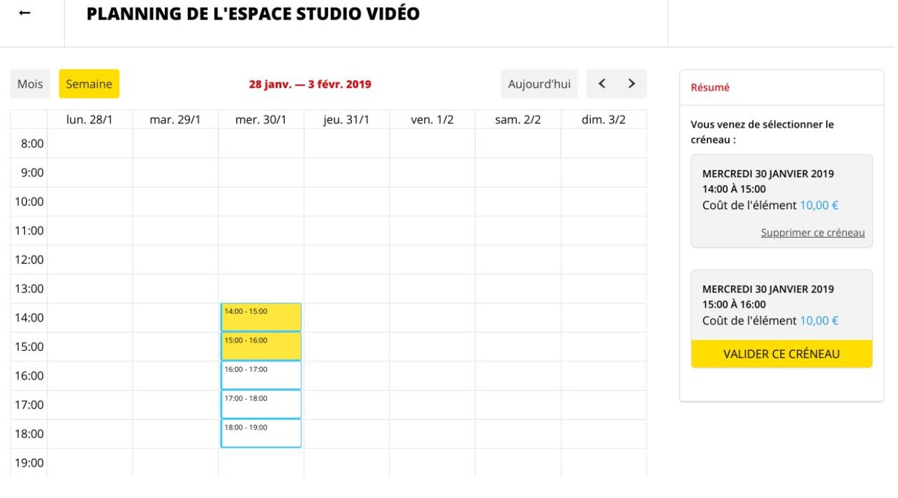
*Figura 9 - L'utente prenota due ore di studio video. Il sistema calcola il prezzo di ogni ora in base al livello di abbonamento e al gruppo dell'utente. L'utente può prenotare tutti gli slot che desidera.*

### Nota sulla possibilità di spostare/cancellare le prenotazioni

A seconda delle impostazioni di Fab Manager, un utente può o meno essere in grado di spostare o annullare le prenotazioni `(vedere Personalizzazione > Prenotazioni)`.

#### Spostamento della prenotazione

Se lo spostamento è consentito `(vedere Personalizzazione > Prenotazioni)`, l'utente seleziona una fascia oraria già prenotata e la posiziona su una nuova fascia oraria.

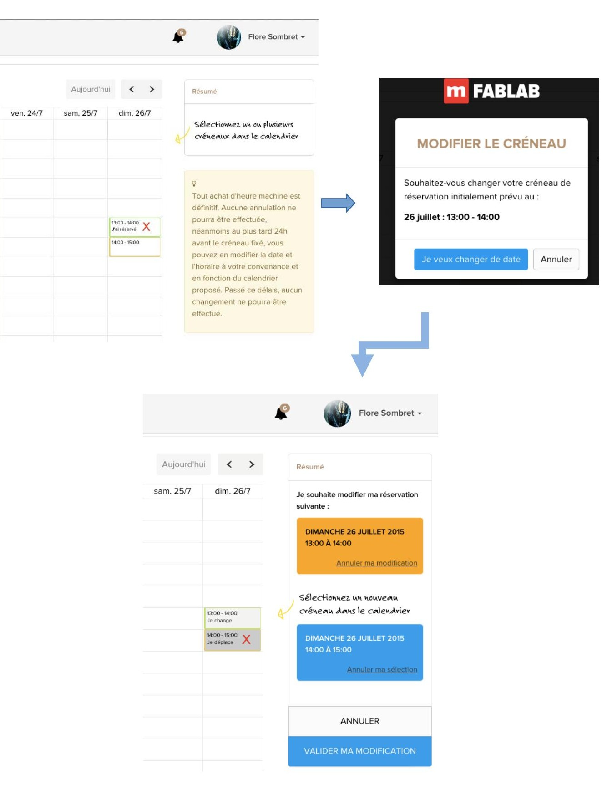
*Figura 10 - Processo di spostamento di una prenotazione da parte di un utente*

L'utente convalida la modifica dello slot per renderla effettiva.

L'utente riceve una notifica di modifica dello slot di prenotazione. Anche gli amministratori ricevono una notifica che indica la data iniziale e la data mantenuta dopo la modifica.

#### Eliminazione della prenotazione

Se la cancellazione è consentita `(vedere Personalizzazione > Prenotazioni)`, l'utente seleziona uno slot che ha già prenotato. Viene visualizzata la seguente finestra:


*Figura 11 - Finestra per spostare o cancellare una prenotazione*

L'utente clicca su "cancella questa prenotazione" e la cancellazione diventa effettiva.

L'utente riceve una notifica di cancellazione dello slot di prenotazione. Anche gli amministratori ricevono una notifica con le informazioni sulla prenotazione cancellata.

### Documentazione del progetto

L'utente ha la possibilità di documentare i propri progetti.
Per accedere a questa funzione, l'utente deve aver effettuato il login e cliccare sul menu "Galleria progetti" e poi su "Aggiungi progetto".

Quindi accede a questa interfaccia:

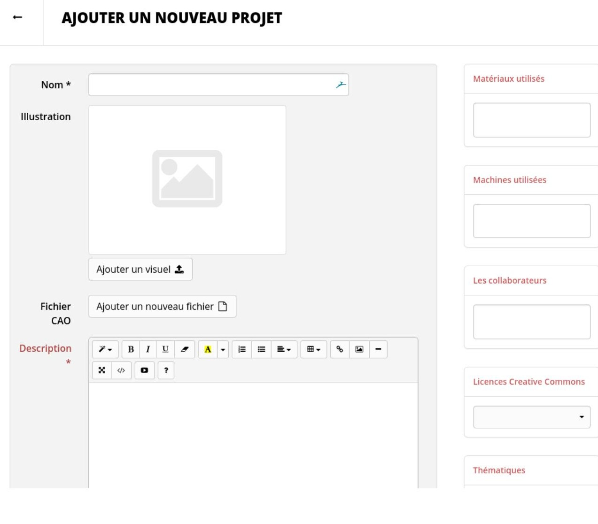
*Figura 12 - Modulo per la creazione della documentazione di progetto*

La parte inferiore del modulo consente di dettagliare il progetto in più fasi:

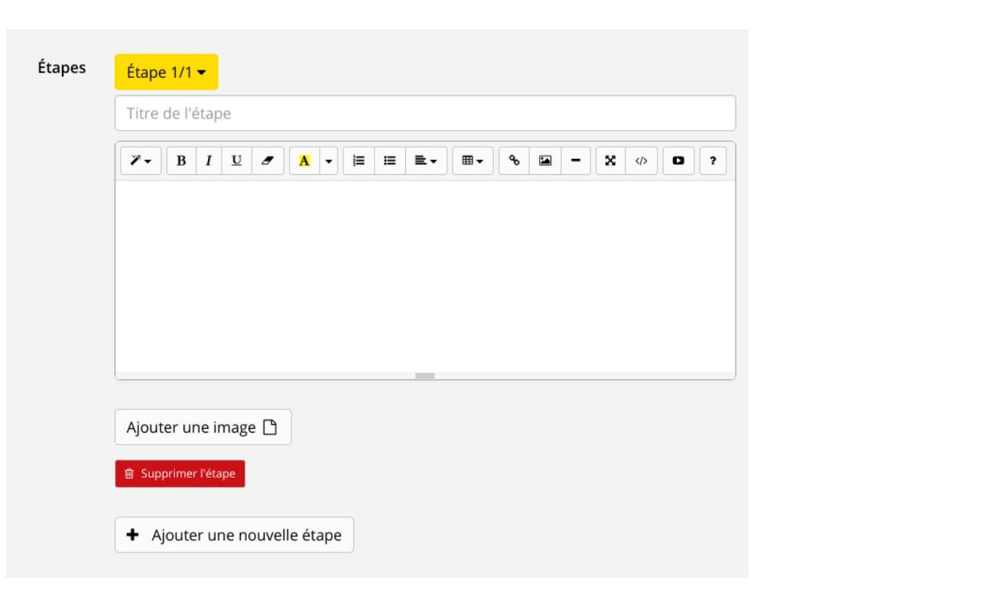
*Figura 13 - Nuova fase della documentazione di progetto*

Possono anche scegliere di pubblicare direttamente il loro progetto o di salvarlo come bozza. In quest'ultimo caso potranno accedere al progetto in un secondo momento tramite la loro dashboard e arricchirlo nel tempo. Un progetto "in bozza" è visibile solo all'utente e non agli altri membri del sito.

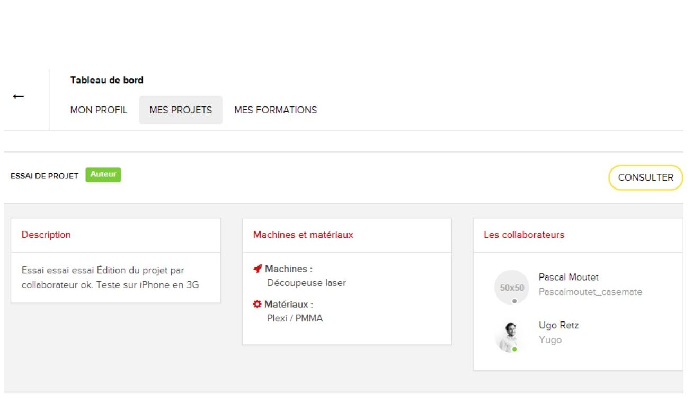
*Figura 14 - Panoramica dei progetti dell'utente*

L'utente può anche scegliere di aprire una collaborazione intorno al suo progetto, invitando altri utenti del Fab Lab a unirsi al suo progetto. In questo caso, l'utente invitato riceve un messaggio di posta elettronica che gli chiede di confermare se desidera unirsi al progetto. Se l'utente conferma la propria collaborazione facendo clic sul link ricevuto via e-mail, acquisisce il diritto di modificare il progetto.

### Registrazione ad un evento

Un utente può registrarsi online per un evento e pagare direttamente la prenotazione.

Per accedere a questa funzione, è necessario effettuare il login e cliccare sul pulsante
  "Registrazione agli eventi".

Quindi accede alla seguente interfaccia:


*Figura 15 - Calendario pubblico dei prossimi eventi nel Fab Lab*

Da questa pagina possono consultare tutti gli eventi in programma al Fab Lab e le loro informazioni. Nella parte superiore della pagina, un sistema di filtri permette di visualizzare solo alcuni eventi. I filtri disponibili dipendono dalla configurazione effettuata da un amministratore `(vedere Gestione degli eventi)`.

Cliccando su un evento, l'utente verrà automaticamente reindirizzato alla descrizione dell'evento stesso:

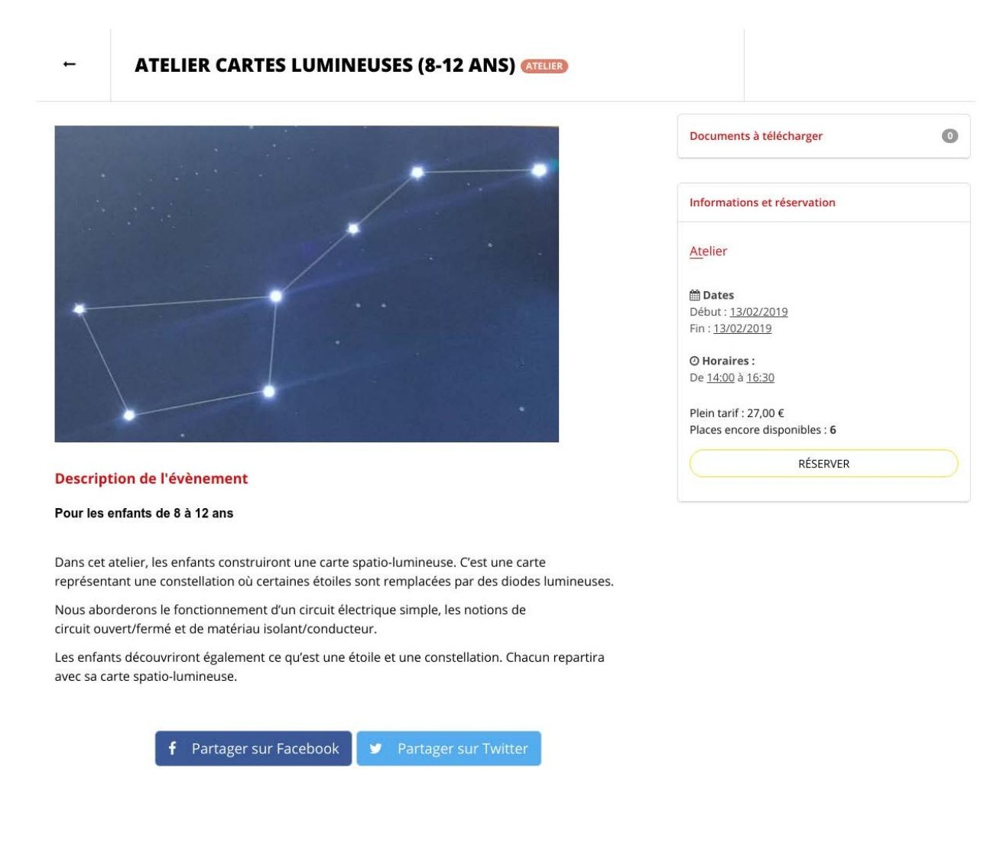
*Figura 16 - Pagina di presentazione dell'evento, che consente di effettuare le prenotazioni*

La parte inferiore offre una descrizione dell'evento e informazioni aggiuntive. La possibilità di condividere questa pagina descrittiva sui social network è offerta anche attraverso i pulsanti ad ad hoc. Orari, date e prezzi sono indicati nella parte destra della schermata "Informazioni e prenotazioni".

L'utente può quindi scegliere di prenotare uno o più posti all'evento, in base alla disponibilità.

Sceglie quindi la tariffa corrispondente per ogni posto, a prezzo pieno o a un'altra tariffa eventualmente disponibile, quindi convalida il pagamento online.

Il team del Fab Lab può configurare diverse categorie di tariffe `(vedere Gestione degli eventi)`.

**Nota:** una volta effettuata la prenotazione, l'utente riceve anche un'e-mail contenente un riepilogo dell'ordine e la fattura in formato PDF.


*Figura 17 - Prenotazione di posti per un evento da parte di un utente*

### Fatture

Accedendo alla propria dashboard e cliccando sulla scheda "fatture", gli utenti possono accedere a tutte le fatture degli acquisti o dei rimborsi precedenti ("Note di credito") e scaricarle in formato PDF.

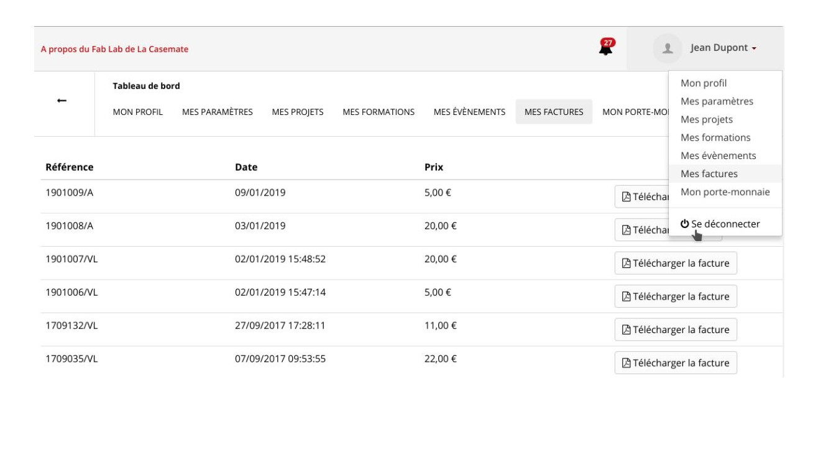
*Figura 18 - Elenco delle fatture e delle note di credito dell'utente*

### Portafoglio

La scheda "portafoglio" della dashboard consente all'utente di consultare il saldo del proprio portafoglio virtuale e la cronologia delle transazioni.

Solo un amministratore o un manager può accreditare il portafoglio di un utente `(vedere Accredito del portafoglio virtuale)`.


*Figura 19 - Portafoglio virtuale dell'utente*

### Consulatare l'agenda del Fab Lab

Facendo clic su "Agenda" nel menu principale dell'applicazione, l'utente può consultare a colpo d'occhio tutti gli slot e gli eventi del Fab Lab per un determinato periodo.

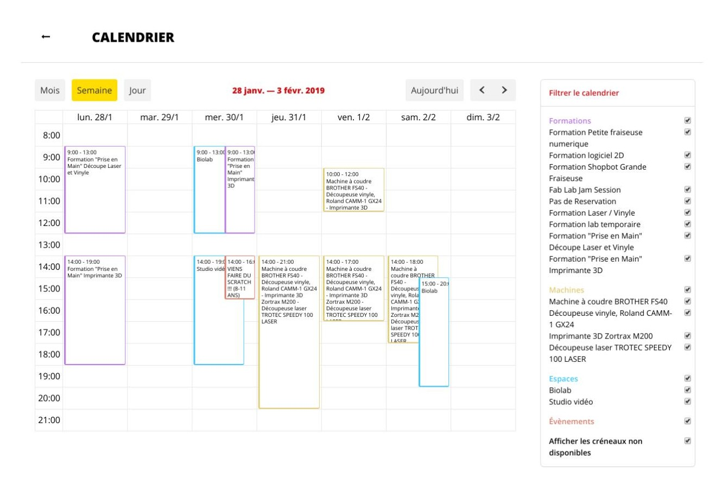
*Figura 20 - Calendario pubblico del Fab Lab*

Il lato destro consente di filtrare ciò che si desidera visualizzare nel calendario. Sopra il calendario, i pulsanti consentono di passare alla visualizzazione del mese, della settimana o del giorno o di spostarsi tra le date.

Si noti che la visualizzazione giornaliera mostra i dettagli delle prenotazioni ora per ora per ogni slot.

### Visualizzazione della galleria dei progetti

Fab-manager permette di consultare tutti i progetti pubblicati sulla piattaforma, nonché di filtrare in base a diversi criteri:
* Progetti di cui sono stato autore o a cui ho collaborato, incluse le bozze
* Per macchina utilizzata nel progetto
* Secondo il tema del progetto
* A seconda dei materiali utilizzati nel progetto

È anche possibile, se la funzione OpenLab è stata abilitata sulla propria istanza, visualizzare i progetti di tutte le gallerie di progetti della rete Fab-manager.

In questo caso, non è possibile filtrare i progetti in base ai criteri specificati sopra, ma è possibile eseguire una ricerca a testo libero utilizzando una potente analisi del testo (ElasticSearch).


*Figura 21 - Ricerca della parola chiave "aereo" in tutti i progetti OpenLab*

Facendo clic su un progetto si viene reindirizzati alla pagina che mostra i dettagli della sua documentazione. Se il progetto proviene da un'altra istanza (OpenLab), si verrà reindirizzati in modo trasparente a tale istanza.
La descrizione di un progetto comprende gli elementi indicati nella sua documentazione. È possibile fare clic sulle immagini per ingrandirle.
Sul lato destro della pagina è inoltre presente un link che consente al visitatore, anche se non loggato, di segnalare potenziali abusi di un progetto (ad esempio, l'uso di un linguaggio discriminatorio o offensivo, la proprietà intellettuale). Queste segnalazioni saranno inviate via e-mail a tutti gli amministratori, che dispongono anche di un'interfaccia per la gestione di queste segnalazioni.

### Privacy e riservatezza

Quando un utente visita la piattaforma per la prima volta e se Google Analytics è stato attivato per la generazione di statistiche, viene visualizzata una finestra di dialogo che chiede all'utente di acconsentire all'uso dei dati.
Questa finestra di dialogo non bloccante sarà visualizzata fino a quando l'utente non avrà fatto la sua scelta.

Quando l'utente ha fatto clic su "accetta" o "rifiuta", la finestra di dialogo scompare, ma è possibile farla riapparire accedendo alla dashboard, sezione "le mie impostazioni".


*Figura 22 - Modifica delle scelte relative ai cookie*

Se l'amministratore ha pubblicato un'informativa sulla privacy per la piattaforma, facendo clic su "Per saperne di più" nella finestra di dialogo dei cookie si viene reindirizzati ad essa. In alternativa, l'utente verrà reindirizzato a un sito web generico che spiega cosa sono i cookie e qual è il loro impatto sulla privacy.

L'informativa sulla privacy è accessibile anche dalla pagina "Informazioni".

## Fab-manager dal punto di vista degli amministratori (modalità manager)

Fab-manager è stato progettato per gestire le persone che non hanno internet o che non desiderano andare direttamente sul web. In questo caso, la persona deve recarsi alla reception e l'addetto alla reception può eseguire una serie di azioni, al posto dell'utente.

### Creazione del conto - modalità manager

L'addetto alla reception può creare un utente direttamente sul sito. Per farlo, deve andare nella "la sezione Manager" (o Admin, a seconda del ruolo) e cliccare sul pulsante "aggiungi un nuovo membro".


*Figura 23 - Elenco del gestore utenti. Se un utente non ha compilato tutti i campi richiesti, viene visualizzata la dicitura "profilo incompleto" sulla destra. Questo può accadere se l'installazione di Fab-manager è vecchia o se gli utenti sono stati importati tramite un server di autenticazione esterno (SSO).*

Il manager compila quindi il seguente modulo. I campi obbligatori sono contrassegnati da un asterisco. È possibile dichiarare una persona giuridica (società, associazione, ecc.) spuntando la casella, i campi "nome" e "indirizzo" della struttura devono poi essere compilati.

In fondo al modulo, è possibile definire i link ai profili dell'utente su diversi social network. Per farlo, cliccare sull'icona del social network che si desidera indicare e apparirà il campo per inserire il link al profilo.

Questo modulo, accessibile solo ai gestori e agli amministratori, permette anche di associare etichette all'utente. Le etichette consentono di limitare l'accesso a determinate fasce di prenotazione`(vedere Gestione del calendario Fab Lab - modalità manager)`.

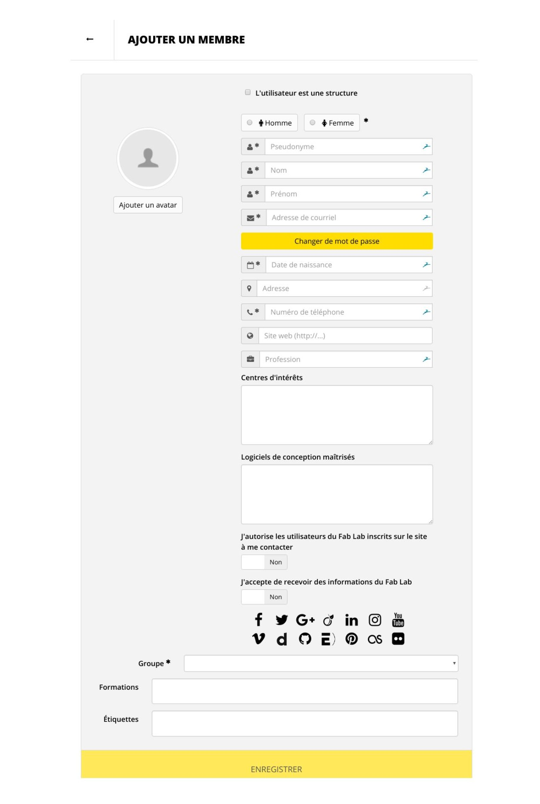
*Figura 24 - Modulo per la creazione o la modifica di un utente*

Ad esso deve essere assegnato un gruppo.

Il manager può anche dichiarare che l'utente ha già frequentato corsi di formazione presso il Fab Lab (campo "formazione"). Questa azione ha l'effetto di consentire all'utente di effettuare prenotazioni sulle macchine su cui è stato formato.

Per impostazione predefinita, l'utente viene creato senza abbonamento.

La registrazione viene completata facendo clic su "Salva".

### Sottoscrizione di abbonamenti - modalità manager

Una volta che l'utente è stato creato nel sistema, il gestore può procedere alla sua sottoscrizione, se lo desidera, tramite la scheda "Abbonamento" del record di un utente.


*Figura 25 - Interfaccia del gestore delle modifiche utente*

In questa vista, cliccando su "Sottoscrivi un abbonamento", vengono visualizzati i pacchetti di abbonamento associati in base al gruppo dell'utente. Se il piano di abbonamento selezionato consente di effettuare pagamenti mensili, un pulsante permette di sottoscrivere l'abbonamento tramite un piano di pagamento:


*Figura 26 - Facendo clic su Sottoscrivi si ottiene la sottoscrizione dell'abbonamento selezionato. Viene generato un programma corrispondente all'importo dell'abbonamento.*

### Estensione dell'abbonamento - modalità manager

Nel caso di un utente con un abbonamento attivo, la scheda "abbonamento" consente a un amministratore di:
* Rinnovare un abbonamento
* Offrire giorni gratuiti (cioè estendere la durata di un abbonamento gratuitamente, come gesto commerciale)


*Figura 27 - Gestione degli abbonamenti per un utente con un abbonamento corrente*

#### Rinnovo dell'abbonamento

Nel caso di un utente con un abbonamento attivo che desidera rinnovare il proprio abbonamento il gestore clicca su "Rinnova abbonamento". Le date di inizio e fine del nuovo abbonamento vengono inserite automaticamente in base all'abbonamento corrente.

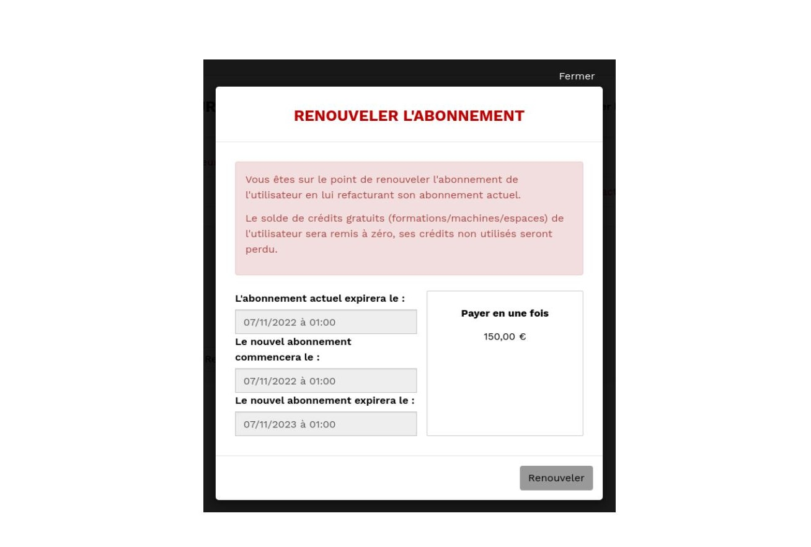
*Figura 28 - Rinnovo e fatturazione dell'abbonamento corrente dell'utente*

Se si seleziona questa opzione, viene generata una fattura per l'importo dell'abbonamento corrente.

**Nota:** non è possibile rinnovare l'abbonamento passando a una formula diversa. Per farlo, è necessario attendere la scadenza dell'abbonamento in corso e poi sottoscriverne uno nuovo.

**Attenzione:** nel caso di un abbonamento sottoscritto tramite un piano di pagamento, anche il nuovo abbonamento sarà sottoscritto tramite un piano, con la prima rata a partire dalla fine dell'abbonamento.

#### Offrire giorni gratuiti

Consente di specificare una nuova data di scadenza dell'abbonamento. Per impostazione predefinita, compare la data di fine dell'abbonamento corrente (questa data può essere modificata manualmente). Se si sceglie questa opzione, il sistema non genererà una fattura.

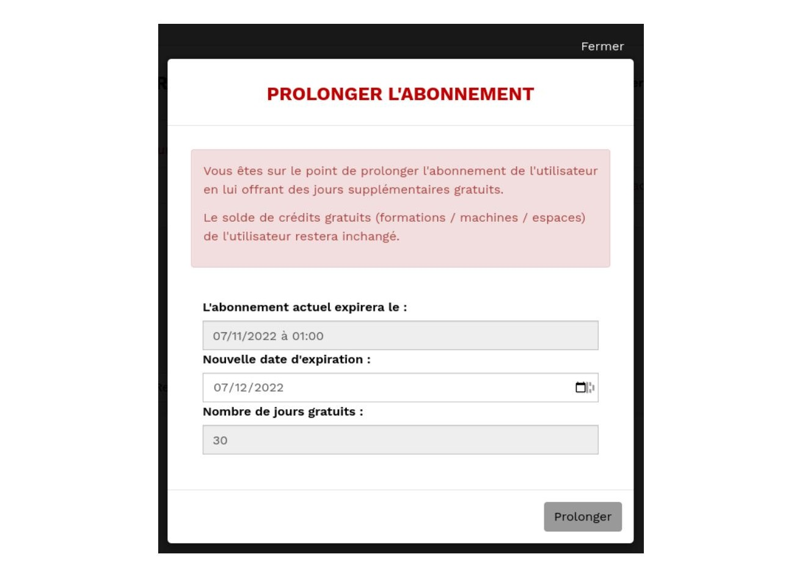
*Figura 29 - Estensione gratuita dell'abbonamento attuale dell'utente*

### Prenotazione del tempo macchina - modalità manager

Il manager accede alla vista "prenota una macchina" e seleziona la macchina sulla quale l'utente desidera effettuare una prenotazione.


*Figura 30 - Il manager seleziona il membro Mario Rossi dall'elenco degli utenti. Il sistema calcola automaticamente l'importo di 33 euro corrispondente al livello di abbonamento e al gruppo di utenti dell'utente Mario Rossi.*

**Nota:** prima di poter prenotare una macchina, è necessario selezionare un utente ("selezionare un membro").

Il gestore convalida quindi lo slot e accede a una schermata di conferma.


*Figura 31 - Possibili finestre di dialogo per convalidare il pagamento della prenotazione. A seconda del saldo del portafoglio del cliente verrà utilizzato interamente, parzialmente o per niente.*

Il gestore convalida e procede all'incasso tramite il software di gestione del contante implementato nel centro.

**Nota:** Fab-manager non è interfacciato con il software del registratore di cassa.

Lo slot viene quindi bloccato per l'utente:


*Figura 32 - Gli slot già prenotati sono contrassegnati come non disponibili*

### Turno di prenotazione per le ore macchina - modalità manager

Il gestore può modificare uno slot per il quale un utente ha effettuato una prenotazione.

A tal fine, seleziona uno slot contrassegnato come "non disponibile" e appare la seguente finestra:

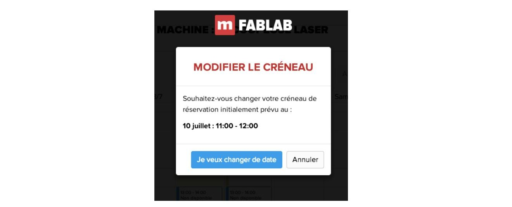
*Figura 33 - Finestra di dialogo per la modifica della prenotazione*

Il manager sceglie "Voglio cambiare la data" e seleziona un'altra data dal calendario:

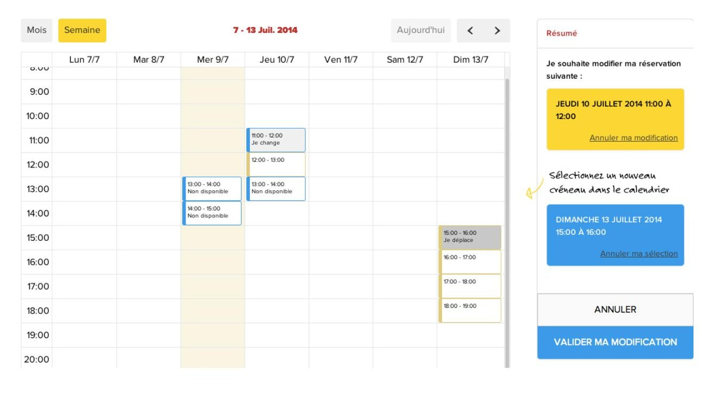
*Figura 34 - Scelta di una nuova data per spostare la prenotazione*

Deve ancora convalidare la modifica:

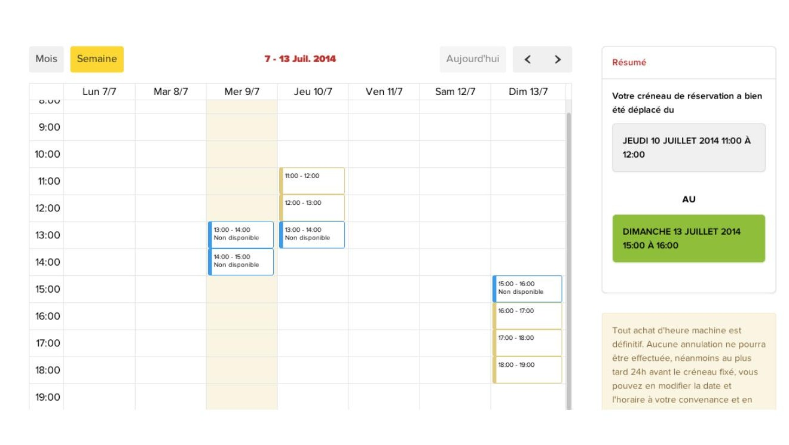
*Figura 35 - Il viaggio è confermato*

La modifica è effettiva.

**Nota:** in alcuni Fab Lab, la regola è che non è possibile spostare uno slot entro 24 ore da un evento. Questa regola può essere impostata dalla vista "Personalizzazione" > Prenotazioni `(vedi Personalizzazione > Prenotazioni)`.

### Offerta ore macchina - modalità manager

È possibile offrire una prenotazione a un utente selezionando "offri questo slot", durante il processo di prenotazione, prima della sua convalida.


*Figura 36 - Offerta di uno slot durante la prenotazione*

In questi casi, il sistema genera una fattura con zero euro per l'utente selezionato.

### Prenotazione dei corsi di formazione - modalità manager

Il principio è lo stesso delle macchine per l'iscrizione ai corsi di formazione.

Per prenotare un corso a nome di un utente, l'amministratore va nella vista "prenotazioni corsi".

Visualizza gli slot di formazione in un calendario dedicato:


*Figura 37 - Il gestore seleziona l'utente Flore Sombret e fa clic su uno slot. Il programma calcola il prezzo del corso in base al gruppo e al livello di abbonamento dell'utente.*

Il gestore convalida e procede al pagamento attraverso questa schermata:


*Figura 38 - Finestra di dialogo per il pagamento della prenotazione*

Il gestore convalida e procede all'incasso tramite il software di gestione del contante implementato nel centro.
**Nota:** Fab-manager non è interfacciato con il software del registratore di cassa.

Lo slot viene quindi bloccato per l'utente:


*Figura 39 - Gli slot già prenotati dall'utente selezionato sono contrassegnati come tali*

### Dislocazione degli slot per i corsi - modalità manager

L'amministratore può modificare uno slot per il quale un utente ha effettuato una registrazione:
A tal fine, seleziona uno slot contrassegnato come "non disponibile" e appare la seguente finestra:

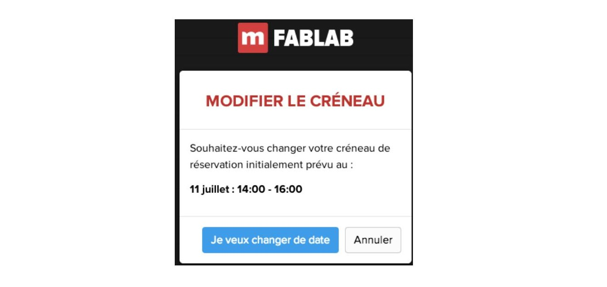
*Figura 40 - Finestra di dialogo per la modifica della prenotazione*

Il manager sceglie di "cambiare la data" e di riposizionare l'utente in un nuovo slot:

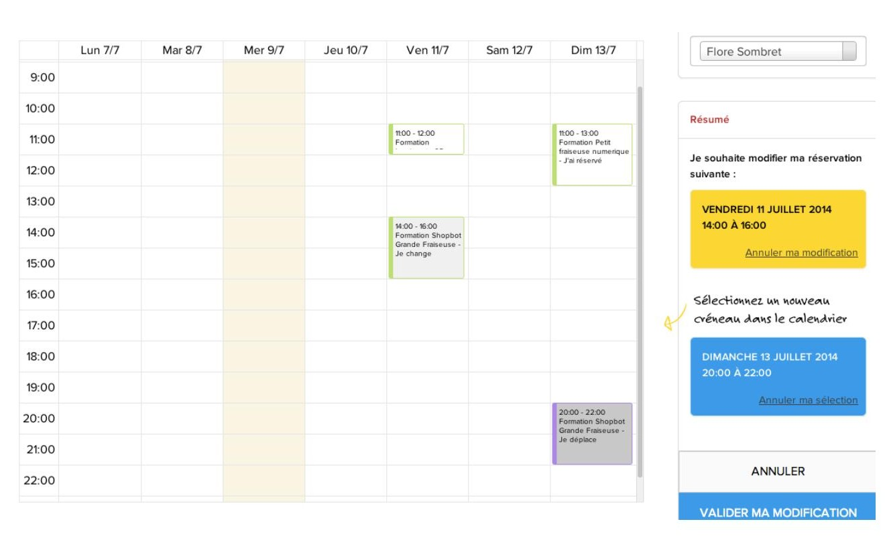
*Figura 41 - Selezione di un nuovo slot per spostare la prenotazione*

Quindi convalida la modifica:

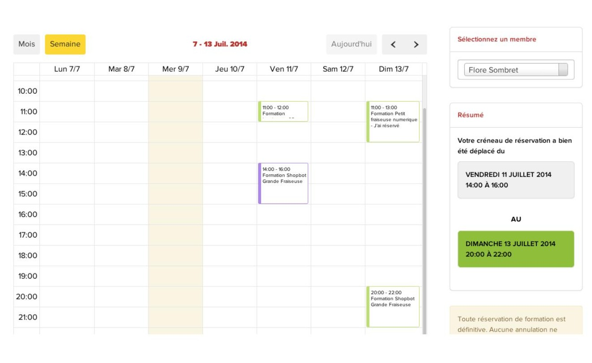
*Figura 42 - La modifica è confermata*

La modifica è definitiva.

## L'interfaccia dal punto di vista del team del Fab Lab

Alcune funzioni consentono di gestire i calendari della formazione e degli slot machine.

### Gestione del calendario del Fab Lab - modalità manager

Per gestire la formazione e gli slot macchina, il manager accede alla vista: "Gestisci calendario".
Il principio è simile a quello offerto da Google Calendar: l'interfaccia offre la possibilità di rintracciare gli slot:

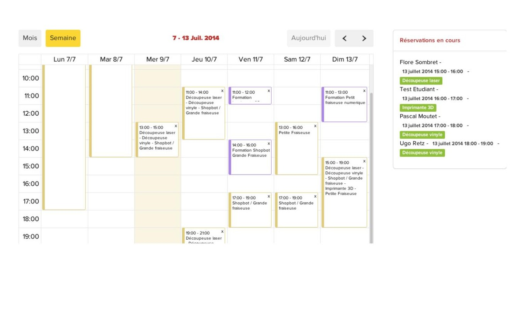
*Figura 43 - Panoramica del calendario che mostra gli slot di formazione e le macchine per la settimana del 7 luglio. Facendo clic su un particolare slot, vengono visualizzati gli utenti che hanno prenotato quello slot.*

Se si vuole aggiungere uno slot, il gestore posiziona il mouse sul punto desiderato della settimana. L'inizio dello slot deve essere successivo alla data corrente e la durata totale dello slot deve essere un multiplo di un'ora.

Quando si rilascia il mouse, appare una procedura guidata che consente al gestore di definire la natura dello slot: uno slot dedicato alla formazione su una macchina o alla prenotazione di macchine o di uno spazio.

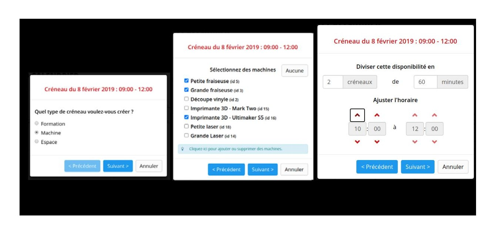
*Figura 44 - In questo esempio, il gestore definisce una disponibilità di 3 ore in cui le macchine saranno disponibili per la prenotazione agli utenti, su 3 fasce orarie di un'ora.*


*Figura 45 - In questo esempio, il manager definisce uno slot di 1h20 in cui la formazione sulla stampante 3D viene messa a disposizione degli utenti al momento della registrazione. È possibile definire un numero massimo di posti nel caso di un corso. Se si raggiunge il numero massimo di posti, le registrazioni vengono interrotte.*

**Nota:**
* Le macchine e gli spazi avranno la loro disponibilità suddivisa in slot. Per impostazione predefinita, questi slot hanno una durata predefinita di 1 ora, ma è possibile regolarne il numero e la durata.
* I corsi non sono suddivisi in slot, ma è possibile regolare la loro durata nella terza fase.

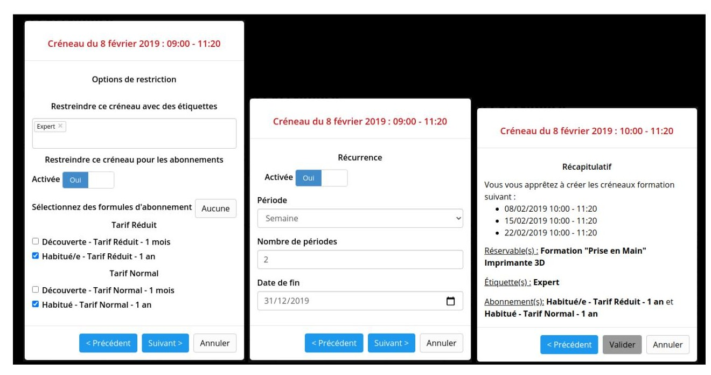
*Figura 46 - In questo esempio, lo slot che si sta creando può essere prenotato solo dagli abbonati annuali con l'etichetta abbonati annuali, con l'etichetta Esportazione. Questo slot verrà rinnovato automaticamente ogni quindici giorni, fino alla fine dell'anno.*

Qualunque sia il tipo di slot creato, è possibile limitare la prenotazione solo a determinati membri (abbonati e/o titolari di tag). Solo gli utenti che si sono abbonati al giusto pacchetto e/o con l'etichetta corrispondente potranno effettuare una prenotazione `(vedere Creazione di un account - modalità manager)`.

La funzione di ricorrenza consente inoltre di pianificare regolarmente gli slot di disponibilità per le macchine o i corsi di formazione.

Nell'ultimo passaggio viene visualizzato un riepilogo degli slot da creare. Se tutto corrisponde, un clic conferma la creazione, consentendo ai membri di effettuare prenotazioni su questi slot.

### Cancellazione di una prenotazione - modalità manager

Un manager può cancellare in qualsiasi momento una prenotazione effettuata da un utente, sia che si tratti di ore macchina o di corsi di formazione.

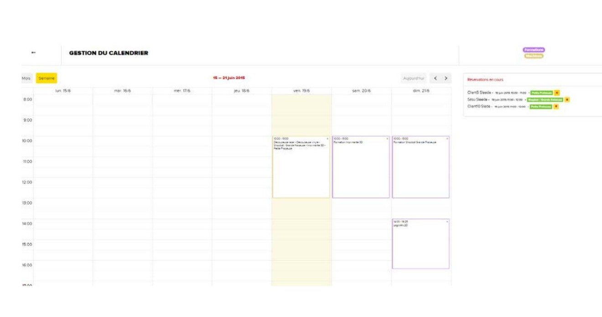
*Figura 47 - Facendo clic sulla croce accanto a un utente registrato in uno slot, si annulla la sua prenotazione.*


*Figura 48 - La cancellazione dello slot deve essere poi confermata*

È anche possibile eliminare l'intero slot. Ciò avviene tramite la croce o il pulsante di azione dedicato. Tuttavia, ciò è possibile solo se non ci sono prenotazioni in corso nello slot. In caso contrario, la cancellazione non è possibile.  Si suggerisce quindi di spostare gli utenti che hanno già prenotato uno slot in un altro. È utile contattarli per informarli di questo cambio di orario. Una volta che non ci sono più utenti nello slot, il gestore potrà cancellarlo.

Infine, se non vengono effettuate prenotazioni per uno slot, il gestore può "bloccare le prenotazioni" tramite il pulsante dedicato: lo slot diventerà così invisibile agli utenti. Questo permette ad esempio, se tutte le prenotazioni sono state cancellate su uno slot, di impedire a nuovi utenti di prenotare, mantenendo lo slot invisibile. Questo permette, ad esempio, se tutte le prenotazioni sono state cancellate in uno slot, di impedire ai nuovi utenti di prenotare tenendo traccia delle prenotazioni cancellate.

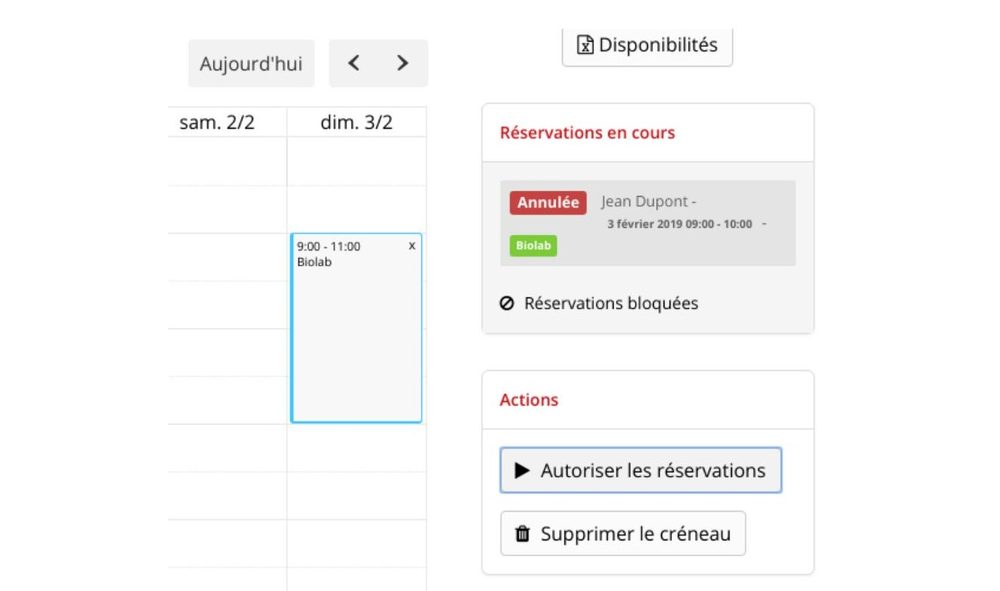
*Figura 49 - In questo esempio, la prenotazione di Mario Rossi nello spazio Biolab è stata annullata e lo slot è stato bloccato per impedire altre prenotazioni.*

###  Convalida del corso - modalità manager

Un membro del team del Fab Lab può anche convalidare la formazione degli utenti.
 A tal fine, si accede al menu di gestione "Formazione" e poi alla scheda "Seguito della formazione".

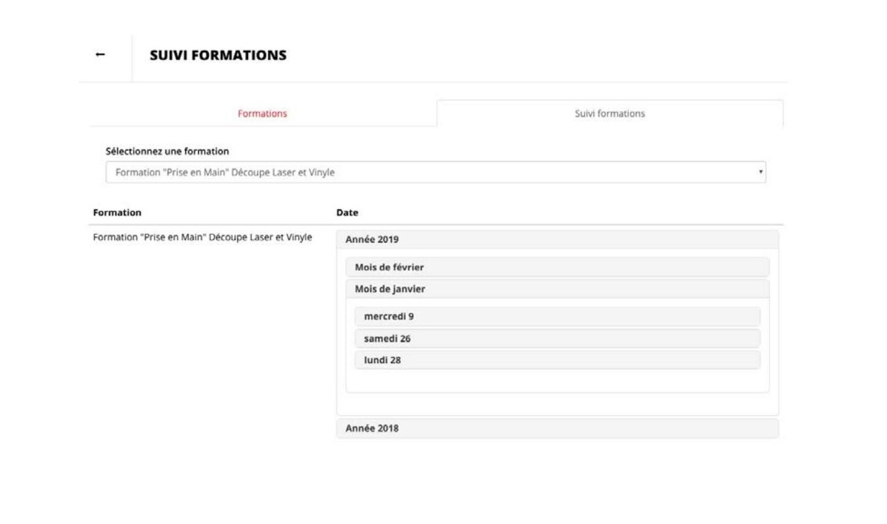
*Figura 50 - Interfaccia di monitoraggio dei corsi*

Questa schermata elenca le diverse sessioni di formazione pianificate nel sistema. Cliccando su una delle date dei corsi fa apparire i partecipanti al corso. L'amministratore clicca sui partecipanti che hanno completato e convalidato la loro formazione. Una volta fatto questo, gli utenti possono effettuare prenotazioni sulle macchine per le quali la loro formazione è stata convalidata:

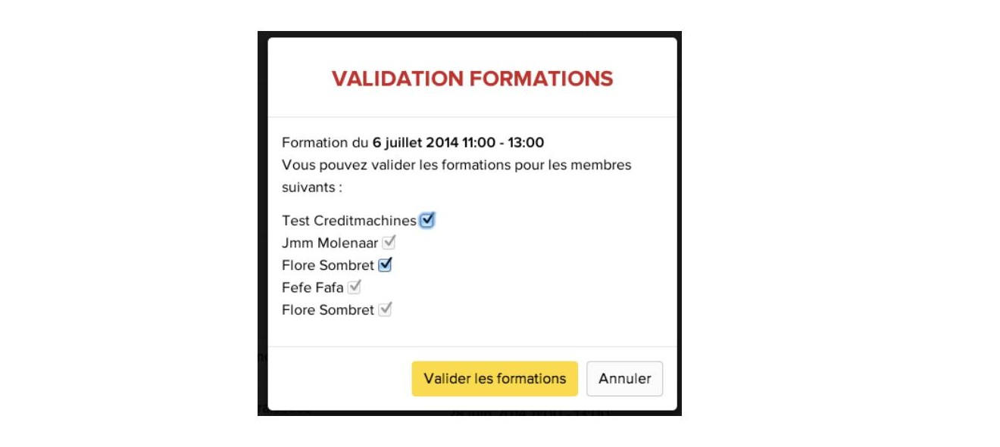
*Figura 51 - Convalida degli utenti che hanno effettivamente partecipato alla formazione*

### Creazione di eventi - modalità manager

Un membro del team Fab Lab può creare o modificare un evento.

A tal fine, si accede alla scheda di gestione "Eventi" e si sceglie di creare un nuovo evento o di selezionare un evento esistente da modificare.

Quando si crea o si modifica un evento, il collaboratore arriva a una pagina, composta da due parti principali.

Una sezione dedicata all'evento e alla sua descrizione:

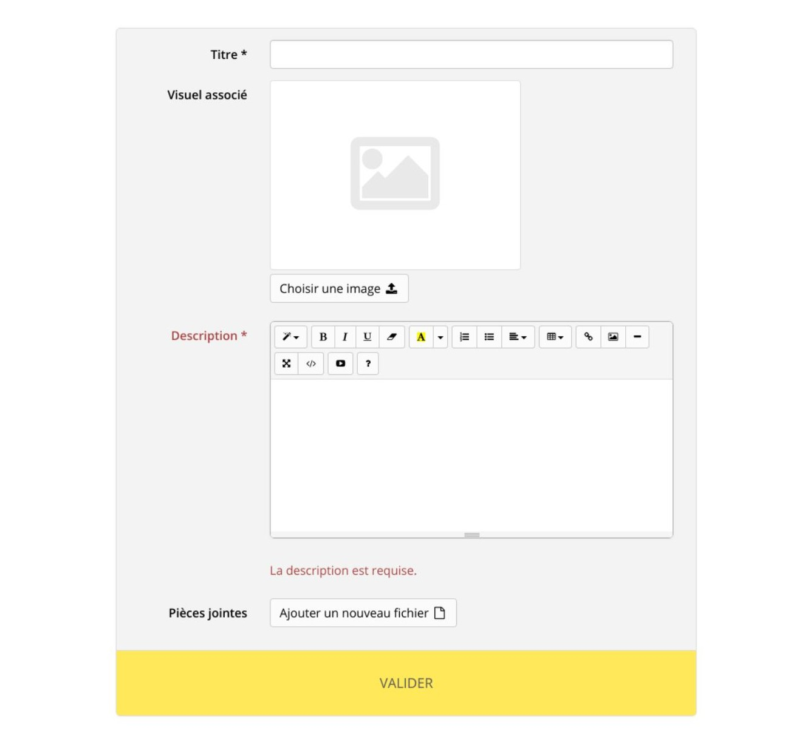
*Figura 52 - Creazione/modifica dei dettagli dell'evento*

Lo scopo di questa parte è di fornire dettagli sul contenuto dell'evento, sul suo scopo, sulle potenziali restrizioni, come ad esempio le istruzioni di sicurezza.

La seconda parte da completare è dedicata agli orari e ai prezzi dell'evento:

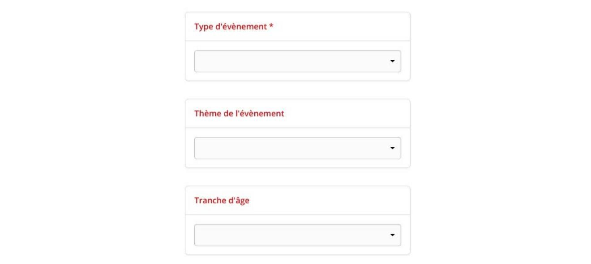
*Figura 53 - Filtri degli eventi. Solo il tipo è obbligatorio. "Tema" e "Fascia d'età" appaiono solo se sono stati creati dei valori.* `(vedere Gestione eventi)`


*Figura 54 - Date e prezzi di un evento.*

**Nota:** una volta scelto e registrato il numero di posti disponibili, non è più possibile modificarlo.

Il tipo di evento permette di definire se si tratta di un corso, di un workshop o di altro (i tipi possibili sono personalizzabili, `vedere Gestione degli eventi`), e la ricorrenza permette di creare un evento ricorrente. Per gli utenti, lo spostamento di una prenotazione su un evento può essere fatto solo verso un evento gemello, creato quindi dall'opzione "ricorrenza".

Una volta inserito, il manager convalida il suo evento, e un altro membro del manager o lui stesso può venire a modificarlo in qualsiasi momento.

#### Prenotazione di un evento per un utente - modalità manager

Il team degli amministratori potrà inoltre effettuare prenotazioni per corsi e workshop a nome degli utenti registrati sul sito.

Per farlo, il manager dovrà accedere tramite il menu alla scheda "Registrazione evento", che porta alla seguente sezione:


*Figura 55 - Elenco degli eventi visti da un manager; gli eventi sono presentati dal più lontano al più prossimo. L'ordine di visualizzazione per gli utenti è inverso, poiché i manager possono vedere anche gli eventi completati.*

Selezionando l'evento desiderato, l'utente viene indirizzato alla pagina di descrizione dell'evento:


*Figura 56 - Pagina di prenotazione dell'evento da parte di un manager*

Per effettuare una prenotazione a nome di un utente, è sufficiente selezionare il nome dell'utente dall'elenco a discesa dei soci registrati, selezionare il numero di posti e la tariffa da applicare e confermare.

Il sistema genererà una fattura per l'importo dell'ordine effettuato per l'utente.

### Fatture

#### Accesso alle fatture dalla vista "Fatture" - modalità manager

Questa vista raccoglie, in ordine cronologico, tutte le fatture e le note di credito emesse da quando il servizio è attivo.

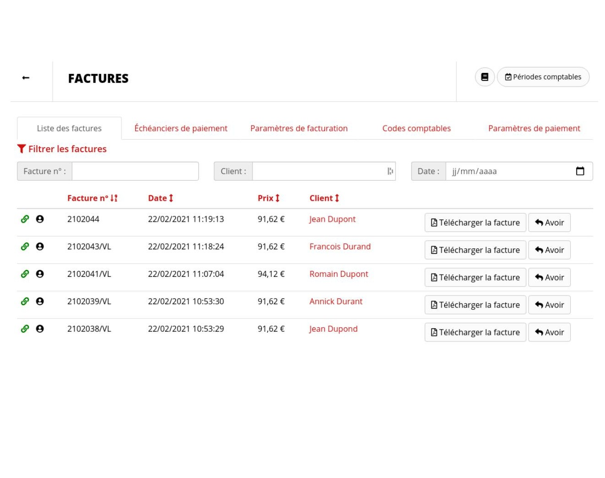
*Figura 57 - Elenco dei gestori di fatture e note di credito*

Da questa vista è possibile scaricare ogni fattura in formato PDF o emettere una nota di credito su una fattura.

È anche possibile filtrare le fatture, su :
* Un numero
* Una data
* Un nome utente (client)

Passando con il mouse sul logo dell'utente a sinistra, viene visualizzato il nome dell'operatore che ha attivato la generazione della fattura sulla riga evidenziata.

#### Note sulla nomenclatura delle fatture

Per impostazione predefinita, il numero di fattura è formato dai seguenti dati:
* Anno (2 cifre)
* Mese (2 cifre)
* Ordine di generazione della fattura per il mese (3 cifre, ad esempio 001 per la prima fattura generata nel mese)

Per conoscere la natura della fattura, si usa un suffisso:
* VL per le vendite online
* A per avere
* Nulla se la fattura è stata emessa alla reception

Ex:
* 1504102/VL: fattura generata a seguito di una transazione online nell'aprile 2015. Questa è la 102a fattura generata per il mese di aprile 2015.
* 1503045: Fattura generata dopo una vendita alla reception nel marzo 2015. Questa è la 45a fattura generata per il mese di marzo 2015

Questa nomenclatura è personalizzabile `(vedere Personalizzazione delle fatture - modalità amministratore)`.

### Schede di pagamento - modalità manager

La visualizzazione dei piani di pagamento consente di visualizzare un elenco di tutti i piani di pagamento emessi dal sistema per gli abbonamenti che sono stati precedentemente autorizzati a questo tipo di pagamento.

È possibile filtrare l'elenco per riferimento, per nome del cliente o per data.

Quest'ultimo filtro si applica alla data di emissione della pianificazione e alla data di scadenza all'interno di una pianificazione.

Per impostazione predefinita, i programmi vengono visualizzati in modalità compatta: un programma per riga della tabella.

Tuttavia, facendo clic sul "+" all'inizio della riga, è possibile passare alla modalità di visualizzazione estesa per avere i dettagli di tutte le scadenze per un determinato programma.

In modalità estesa, prima di ogni scadenza è possibile scaricare la fattura associata, quando il pagamento è stato convalidato.

Nel caso in cui la scadenza sia posticipata ma il pagamento non sia ancora stato effettuato,  possono essere proposte diverse azioni:
* Confermare che l'assegno è stato incassato, il che convaliderà la data di scadenza e genererà la fattura. Solo i manager e i dirigenti e amministratori possono eseguire questa azione
* Annullare l'abbonamento, nel caso in cui il pagamento sia errato e non sia possibile
  riavviare la procedura di pagamento. Solo i manager e gli amministratori possono eseguire questa azione
* Aggiornare la carta di credito, nel caso in cui sia scaduta o rifiutata. Il membro
  può eseguire questa azione da solo dal suo cruscotto.
* Confermare la carta di credito, nel caso in cui venga inviato all'utente un SMS di convalida. Il membro può eseguire questa azione da solo dal suo cruscotto.


*Figura 58 - Visualizzazione estesa degli orari. In questo caso, al gestore viene chiesto di confermare con un clic l'incasso dell'assegno.*

### Attività - modalità manager

Dalla vista della fattura, un manager può anche emettere una nota di credito. Questo è utile quando è necessario un rimborso

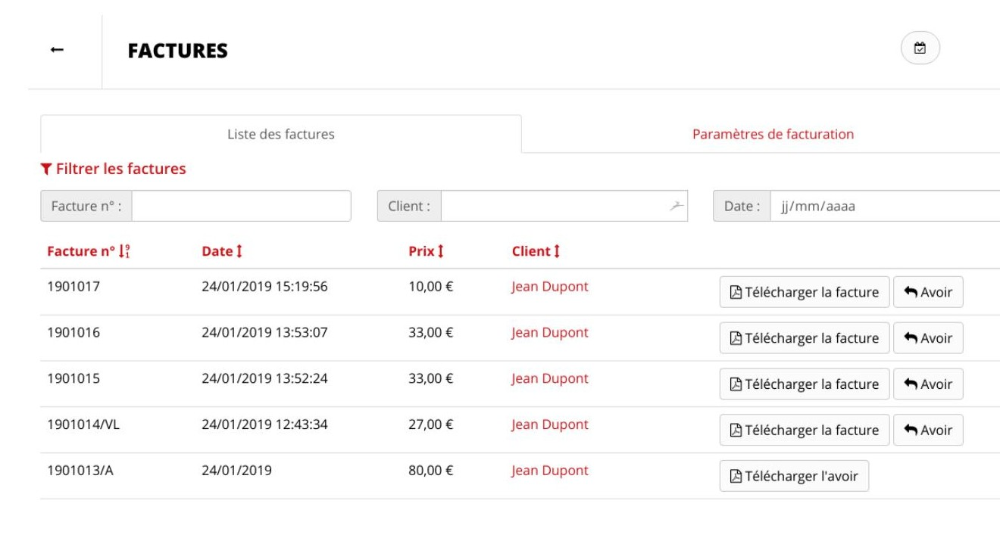
*Figura 59 - Elenco del gestore delle fatture*

Il responsabile fa clic sul pulsante "Nota di credito", di fronte a una fattura, e accede alla finestra seguente in cui stabilisce una data e un metodo di rimborso.


*Figura 60 - Finestra di dialogo per la generazione di note di credito*

La nota di credito viene quindi generata in formato PDF e accessibile dalla vista "Fatture". Viene aggiunta all'elenco delle fatture.

**Nota:** se la nota di credito riguarda un abbonamento attivo, il sistema chiede al gestore se desidera sospendere l'abbonamento o lasciarlo attivo:


*Figura 61 - Finestra di dialogo per la generazione di note di credito con abbonamento attivo*

#### Dettagli di una nota di credito - formato PDF

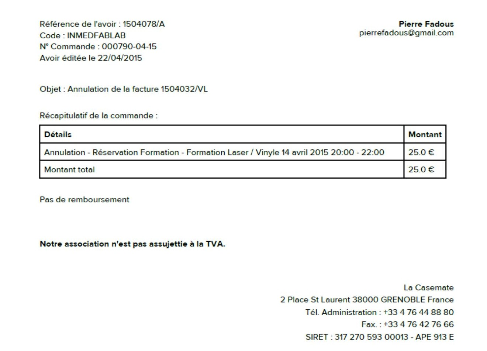
*Figura 62 - La nota di credito riporta il numero della fattura rimborsata e il nome del cliente interessato.*

### Generazione parziale di crediti - modalità manager

In alcuni casi, quando una fattura è suddivisa in più righe, il sistema consente di rimborsarne solo una parte. Questo è il caso, in particolare, di un utente che ha pagato per la prenotazione di diverse ore macchina:


*Figura 63 - Generazione di una nota di credito parziale*

Il gestore seleziona le voci che desidera rimborsare (sono tutte spuntate per impostazione predefinita). La nota di credito include solo le righe selezionate.

**Nota:** non è possibile generare una nota di credito parziale su una fattura con un abbonamento e una o più prenotazioni, poiché queste ultime possono essere collegate all'abbonamento.

### Statistiche - modalità admin

Il modulo delle statistiche, accessibile tramite un'icona nel menu di sinistra, consente di seguire l'evoluzione delle attività del Fab Lab sulla base delle seguenti voci:

* Abbonamenti
* Ore macchina
* Formazione
* Eventi
* Spazi (se il modulo spaziale è attivato)
* Registrazioni (creazione di un account sulla piattaforma)
* Progetti

Il modulo consente di definire una serie di filtri su ciascuna di queste voci per affinare le query.

Ad esempio, per gli abbonamenti, è possibile distinguere tra le durate o isolare una categoria di età.
L'amministratore può anche definire un intervallo di date per visualizzare i dati di un determinato periodo.

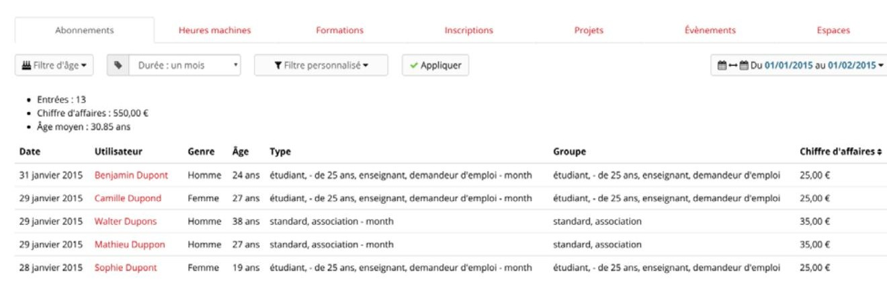
*Figura 64 - Visualizzazione degli abbonamenti mensili sottoscritti a gennaio 2015.*

L'opzione "filtro personalizzato" consente di filtrare i dati in base a criteri più complessi. È necessario cliccare sul pulsante "Convalida" per tenere conto dei criteri del filtro personalizzato.

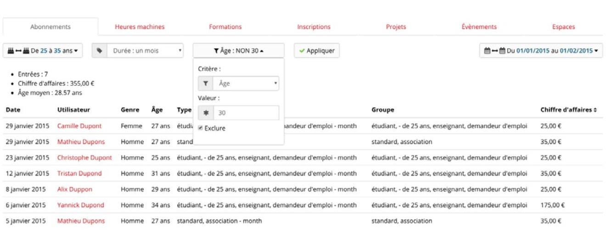
*Figura 65 - Visualizzazione degli abbonamenti mensili sottoscritti a gennaio 2015 da utenti di età compresa tra 25 e 35 anni, esclusi quelli di 30 anni. L'età dell'utente è quella in cui è stato sottoscritto l'abbonamento.*

Facendo clic su "Evoluzione" in alto a destra del modulo, l'amministratore può visualizzare le seguenti statistiche su un grafico:

* Abbonamenti
* Ore macchina
* Formazione
* Spazi (se il modulo spaziale è attivato)
* Registrazioni (creazione di un account sulla piattaforma)
* Eventi


*Figura 66 - Visualizzazione dell'andamento degli abbonamenti mensili a gennaio 2015. Le diverse opzioni di visualizzazione comprendono opzioni "Impilato", che visualizza il numero di abbonamenti sottoscritti, e "Espanso", che visualizza il rapporto percentuale tra i diversi pacchetti di abbonamenti mensili. È possibile filtrare i dati cliccando sui loro nomi in alto a destra del grafico.*

## Contabilità

A partire dalla versione 3.0.0, Fab-manager permette la gestione dei periodi contabili e fornisce un controllo di autenticità delle informazioni contabili, dalla vista "fatture" (modalità amministratore).

Le fatture e i loro sottoelementi sono protetti da un checksum SHA-3 a 256 bit e da un concatenamento crittografico per garantire che le informazioni originali non siano state alterate o corrotte.

Fab-manager controlla l'integrità degli elementi di fatturazione durante ogni accesso ai dati e  visualizza, in base al risultato del test, un indicatore :
* (catena integra verde) se l'integrità è garantita
* (catena rotta rossa) se l'elemento è corrotto o il concatenamento con il record precedente è interrotto

Se i record sono in errore, è necessario ripristinare un backup precedente del database prima che i dati siano danneggiati. A tal fine, contattare l'amministratore del sistema il prima possibile (se possibile prima di qualsiasi nuova operazione di fatturazione).

### Chiusura dei periodi

In alto a destra di questa vista, è presente un pulsante che permette di gestire i periodi contabili e degli archivi.


*Figura 67 - Finestra di gestione dei periodi contabili*

Da questa vista è possibile chiudere un periodo contabile, visualizzare i periodi contabili già chiusi e i loro dettagli (compresi i totali) e scaricare gli archivi dei periodi chiusi.

La chiusura di un periodo contabile consente di bloccare i dati del periodo definito e di generare un archivio sicuro che può essere memorizzato su un supporto esterno.

Questi archivi devono essere messi a disposizione delle autorità fiscali.

È possibile chiudere un periodo contabile in un arco di tempo che va da un giorno a un anno. È vostra responsabilità effettuare le chiusure regolarmente, almeno ogni anno, o per anno finanziario se l'anno finanziario non è basato sull'anno solare. Se non chiudete per più di un anno, vi verrà inviato un promemoria agli amministratori della piattaforma.

Quando si convalida la chiusura di un periodo contabile, il sistema verifica l'autenticità di tutte le registrazioni del periodo in questione.
Se uno di essi è danneggiato, la chiusura viene rifiutata e si dovrà contattare rapidamente l'amministratore di sistema per ripristinare il database. Potrebbe esservi chiesto di fornire una prova di ciò.

Una volta completata, una chiusura appare nell'elenco delle "chiusure precedenti". È quindi possibile visualizzare, facendo clic sul pulsante, le seguenti informazioni:
* La data di chiusura
* Il nome dell'utente che ha eseguito la chiusura
* Il totale del periodo, cioè la somma di tutte le fatture meno la somma di tutte le note di credito, nel periodo in questione.
* Il totale perpetuo, cioè il totale di tutte le fatture meno il totale di tutte le note di credito da quando fab-manager è stato messo in funzione.
* Verificare l'integrità del periodo contabile nel database, attraverso la presenza dell'icona della catena verde (link) o rossa (link spezzato).

### Archivi

L'interfaccia offre anche la possibilità di scaricare un archivio sicuro del periodo contabile appena chiuso.

Questo archivio è in formato ZIP. La maggior parte dei sistemi operativi recenti consente di aprire questo file in modo nativo.
Se il vostro sistema operativo non lo consente, potete utilizzare il software gratuito come 7-Zip (https://www.7-zip.org) per visualizzare il contenuto dell'archivio ed estrarre i dati.


*Figura 68 - Contenuto di un archivio*

L'archivio contiene tre file:

* **data inizio - data fine.json** Questi sono i dati dell'archivio. Tutti gli elementi di fatturazione per il periodo in questione sono inclusi in questo file, in formato JavaScript Object Notation (JSON). Il formato JSON è leggibile da qualsiasi editor di testo, ma per una migliore leggibilità è preferibile utilizzarne uno che supporti la formattazione JSON. Ad esempio, è possibile utilizzare [questa l'estensione jsonview per il browser Firefox](https://addons.mozilla.org/fr/firefox/addon/jsonview/) o [json-formatter per il browser Chrome](https://chrome.google.com/webstore/detail/json-formatter/bcjindcccaagfpapjjmafapmmgkkhgoa?hl=en).
* **checksum.sha256** Questo file contiene una tabella di hash SHA-3 a 256 bit del file di dati precedente. Viene utilizzato per verificare l'integrità dei dati nell'archivio confrontando l'impronta crittografica scritta in questo file e quella calcolata sul file JSON. È possibile utilizzare un'utilità come [sha3sum](https://github.com/maandree/sha3sum) per eseguire questa operazione. Ad esempio :

```
sha3-256sum -l 2015-01-01_2015-12-31.json`
cat checksum.sha256
```
* **chained.sha256** Questo file contiene un'impronta crittografica SHA-3 (256 bit) del file dati dell'archivio corrente, seguita dall'impronta del file ZIP dell'archivio, seguito dalla data di generazione dell'archivio in formato ISO-8601. Questo garantisce l'integrità dell'archivio precedente, che può essere verificata con un metodo simile a quello descritto nel paragrafo precedente.
```
CURRENT=`cat checksum.sha256 | awk '{print $1}'`
PREVIOUS=`sha3-256sum -l ../2014-01-01_2014-12-31.zip`
DATE=`cat chained.sha256 | awk '{print $2}'`
echo "$CURRENT$PREVIOUS$DATE" | sha3-256sum -l
cat chained.sha256
```
È vostra responsabilità conservare questi documenti su un supporto sicuro e metterli a disposizione delle autorità fiscali in caso di controllo.

### Personalizzazione delle fatture - modalità amministratore

Fab-manager consente di personalizzare la forma grafica e i campi di una fattura.
Questa personalizzazione può essere effettuata dalla vista "Fatture > Impostazioni della fattura"


*Figura 69 - Interfaccia di personalizzazione della fattura*

La personalizzazione grafica consente di modificare il logo associato alla fattura:


*Figura 70 - Passando il mouse sul logo, appare il pulsante per scegliere un altro logo.*

Gli altri campi che possono essere modificati direttamente dall'interfaccia sono :

* Riferimento della fattura
* Codice (può essere disabilitato)
* Numeri d'ordine
* Attivazione/disattivazione dell'IVA e dell'aliquota applicabile
* Nota di testo personalizzata
* Indirizzo e contatti

I campi non modificabili che vengono visualizzati automaticamente sono :

* Il nome e l'indirizzo e-mail del cliente, nonché l'indirizzo se si tratta di una struttura.
* Oggetto
* Sintesi dell'ordine
* Metodo di pagamento + data + importo

Si noti che qualsiasi modifica di questi parametri viene registrata nel database con la data e l'autore della modifica.

### Esportazione contabile

Fab-Manager consente di esportare i dati contabili in software compatibili. Attualmente solo [ACD](https://www.acd-groupe.fr/) è compatibile con l'esportazione generata da Fab-Manager.

L'esportazione deve avvenire in due fasi.

In primo luogo, una persona competente deve impostare i codici contabili e le etichette di conto associate nella scheda "Codici contabili". In seguito, un amministratore può regolarmente i dati contabili accedendo all'interfaccia corrispondente.


*Figura 71 - Configurazione dei codici contabili per l'esportazione*

L'interfaccia di esportazione è accessibile cliccando sul pulsante in alto a destra della sezione "Gestione fatture".

Facendo clic su questo pulsante si apre una finestra di dialogo che consente di selezionare il periodo da esportare (di default: dalla prima fattura registrata alla data corrente) e il software di destinazione.

La scelta del software di destinazione visualizza un promemoria dei parametri associati. Facendo clic su convalida avvia la generazione dell'esportazione desiderata.

A seconda del numero di fatture del periodo selezionato, l'esportazione può richiedere più o meno tempo. Una notifica e un'e-mail saranno inviate al termine dell'esportazione.


*Figura 72 - Esempio di esportazione della contabilità per il software ACD*

## Gestione delle notifiche

### Visualizzazione delle notifiche nella piattaforma

Il modulo dispone di un centro di notifiche. Accedendo (come utente o amministratore), è possibile accedere alle notifiche facendo clic sul pulsante della campanella.

Il sistema visualizza lo storico delle notifiche ricevute. È possibile tornare indietro nel tempo fino a alla messa in produzione del sistema:

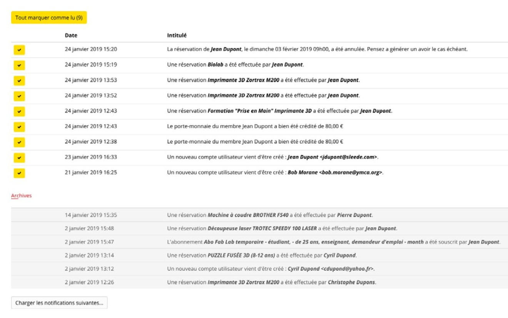
*Figura 73 - Vista del centro notifiche, dal punto di vista dell'amministratore*

### Notifiche inviate via e-mail

Le notifiche riguardano i due ruoli della piattaforma:

* Gli utenti
* Gli amministratori

#### Riepilogo delle notifiche degli utenti :

* Dopo la creazione di un account: promemoria del login e della password
* A seguito della creazione di un account: richiesta di convalida dell'indirizzo e-mail
* A seguito della richiesta di reimpostazione della password
* A seguito di un abbonamento - con fattura allegata
* A seguito di una prenotazione (macchine, evento, formazione, spazio) - con fattura allegata
* A seguito di una modifica/eliminazione di uno slot di prenotazione
* A seguito di un cambiamento di gruppo (ad esempio, studente che diventa lavoratore autonomo)
* A seguito dell'estensione dell'abbonamento da parte di un amministratore (gratuito o meno)
* A seguito dell'emissione di una fattura a suo nome
* A seguito dell'emissione di un titolo di credito a suo nome
* In caso di annullamento della sottoscrizione (con emissione di una nota di credito)
* Quando il suo abbonamento scade tra 7 giorni
* Quando l'abbonamento scade
* Quando una persona si è unita al progetto nel corso della documentazione
* Quando l'utente è invitato a partecipare a un progetto creato da un'altra persona
* Quando un amministratore gli invia un codice promozionale
* Quando un direttore convalida la propria partecipazione a un corso di formazione
* Quando un amministratore accredita il suo portafoglio
* 24 ore prima del verificarsi di una prenotazione, se il promemoria è attivato (il ritardo è configurabile da un amministratore)
* Quando la piattaforma migra il proprio sistema di autenticazione (implementazione di un SSO)
* Dopo aver completato correttamente il suo profilo (a seguito della migrazione del suo account a un SSO)
* Quando si aggiorna l'informativa sulla privacy
* Quando si viene promossi a un ruolo diverso (manager o amministratore)

#### Riepilogo delle notifiche del gestore - modalità gestore

* Quando il ruolo di un utente è stato modificato (ad esempio, un membro è diventato un manager).
* A seguito dell'emissione di una nota di credito
* Quando un progetto viene pubblicato
* A seguito di una prenotazione (macchine, evento, formazione, spazio)
* A seguito di una modifica/eliminazione di uno slot di prenotazione
* In seguito all'annullamento di una sottoscrizione (con emissione di una nota di credito)
* A seguito dell'estensione di un abbonamento (gratuito o meno)
* Dopo la creazione di un nuovo account utente
* Quando un utente cambia gruppo
* A seguito dell'accredito di un portafoglio
* 7 giorni prima della scadenza dell'abbonamento
* Quando un abbonamento scade

#### Riepilogo delle notifiche dell'amministratore - modalità admin

* Dopo la creazione di un account: promemoria del login e della password
* A seguito della creazione di un account: richiesta di convalida dell'indirizzo e-mail
* A seguito della richiesta di reimpostazione della password
* Dopo la creazione di un nuovo account utente
* A seguito di una prenotazione (macchine, evento, formazione, spazio)
* A seguito di una modifica/eliminazione di uno slot di prenotazione
* A seguito dell'accredito di un portafoglio
* A seguito di una sottoscrizione
* In seguito all'annullamento di una sottoscrizione (con emissione di una nota di credito)
* A seguito dell'estensione di un abbonamento (gratuito o meno)
* A seguito dell'emissione di una nota di credito
* 7 giorni prima della scadenza dell'abbonamento
* Quando un abbonamento scade
* Quando un progetto viene pubblicato
* Quando un visitatore segnala un abuso su un progetto
* Al termine dell'esportazione di dati in Excel
* Quando un utente cambia gruppo
* Quando un account utente viene importato da un SSO
* Quando un utente completa il proprio profilo (a seguito della migrazione del proprio account a un SSO)
* Quando un account utente importato tramite SSO viene unito a un account esistente
* Quando tutti gli utenti sono stati sincronizzati con Stripe, dopo l'aggiornamento della chiave.
* Quando il ruolo di un utente è stato modificato (ad esempio, un membro è diventato un manager).
* Al termine di un'importazione
* Quando si aggiorna l'informativa sulla privacy
* Al termine della generazione di un archivio contabile
* Ogni lunedì a mezzogiorno, se i conti non sono stati chiusi per più di un anno
* Quando lo spazio su disco è ridotto

## Impostazione e implementazione di Fab-manager

Questo capitolo è destinato principalmente ai team responsabili dell'implementazione di Fab-manager all'interno della loro struttura. Illustra i diversi input e le regole da impostare per garantire la corretta implementazione di Fab-manager.

### Gestione dei prezzi

Il sistema consente agli amministratori di impostare tutte le tariffe per le ore macchina, la formazione, lo spazio, gli abbonamenti e l'assegnazione dei crediti (ad esempio 10 ore di stampante 3D per gli utenti con abbonamento annuale). Tutti questi dati possono essere configurati nella sezione "Abbonamenti e tariffe".
Tutti questi dati possono essere configurati tramite la vista "Abbonamenti e tariffe".

Questa vista può contenere fino a 6 schede:


*Figura 74 - Schede di gestione dei prezzi*

#### Abbonamenti

Questa scheda consente di creare / modificare / eliminare le formule di abbonamento in vigore in un Fab Lab.


*Figura 75 - Modulo di creazione dell'abbonamento*

**Il tipo di abbonamento** può assumere 2 valori:

- **Standard:** per i pacchetti di abbonamento specifici per il Fab Lab

- **Partner:** nel contesto di abbonamenti incrociati tra un Fab Lab e un'altra struttura. Ad esempio, un Fab Lab offre una formula di abbonamento in partnership con uno spazio di coworking.

**Gruppo:** consente di assegnare un abbonamento a una particolare popolazione:


*Figura 76 - Selezione di un gruppo. L'opzione "trasversale" crea tante formule quanti sono i gruppi, ognuno dei quali può essere configurato in modo indipendente.*

**Categoria:** le categorie sono utilizzate per organizzare la visualizzazione delle iscrizioni nella pagina pubblica presentando le diverse formule ai membri e ai visitatori. L'uso delle categorie non è obbligatorio. Per configurarli, fare clic sul pulsante in alto a destra della pagina "Gestione dei prezzi".

**Periodi e numero di periodi:** consente di definire i periodi di tempo in cui si applica l'abbonamento.

*Ad esempio, per creare un abbonamento trimestrale, scegliere un numero di periodi pari a "3" e il periodo "mese".*
*Per creare un abbonamento annuale, scegliere un numero di periodi pari a "1" e il periodo "anno".*

**Costo dell'abbonamento:** è il prezzo che un utente dovrà pagare per sottoscrivere questo abbonamento.
**Importanza visiva dell'abbonamento:** questa impostazione consente di scegliere l'ordine di presentazione degli abbonamenti al pubblico. La pagina pubblica che presenta gli abbonamenti mostrerà solo le sottoscrizioni accessibili al membro che le sta consultando, in base al suo gruppo. Se il visitatore non ha effettuato il login, le sottoscrizioni appariranno tutte, ma organizzate per gruppo.

Questa impostazione consente di scegliere l'ordine di visualizzazione all'interno del gruppo per dare priorità agli abbonamenti che si desidera mettere in evidenza.

**Abbonamento continuo:** consente di stabilire quando l'abbonamento diventa attivo: non appena l'utente paga ("No") o dopo la sua prima formazione convalidata da un manager ("Sì").

**Pagamento mensile:** se questa impostazione è attivata, date ai vostri utenti la possibilità di pagare l'importo totale dell'abbonamento in un'unica soluzione, oppure in più rate, ogni mese, per tutta la durata dell'abbonamento `(vedere Abbonamenti online)`. Si noti che i pagamenti mensili non è disponibile per gli abbonamenti la cui durata è definita in settimane.

**Scheda descrittiva:** è possibile allegare un PDF (ad esempio una brochure commerciale) che descriva l'abbonamento.

Dopo la registrazione, è possibile modificare le tariffe che verranno applicate alle ore macchina e allo spazio nell'ambito di questa formula di abbonamento.

Queste tariffe possono essere modificate anche in seguito, cliccando sul pulsante nell'elenco dei pacchetti di abbonamento.


*Figura 77 - Modifica delle tariffe di un pacchetto di abbonamento. È possibile riutilizzare i prezzi già definiti in un'altra formula utilizzando l'elenco a discesa "Copia prezzi da". Attenzione: questa operazione sovrascrive i prezzi attualmente definiti nel modulo.*

#### Formazione


*Figura 78 - Output delle tariffe dei corsi*

Questa scheda consente di assegnare le tariffe di formazione in base ai gruppi di utenti (standard, studente, artigiano...). Questi valori possono essere modificati in qualsiasi momento.

#### Ore macchina


*Figura 79 - Output della tariffazione delle ore macchina senza abbonamento*
Quando viene creata una macchina, tutte le tariffe sono impostate a zero. Esse corrispondono alle tariffe che si applicano ai diversi gruppi di utenti (standard, studenti, artigiani...) che non hanno un abbonamento.

##### Pacchetti temporali

Per ogni macchina e per ogni gruppo di utenti è possibile definire uno o più pacchetti di ore che i membri possono acquistare in anticipo e utilizzare man mano.

Per definire questi pacchetti di ore, fare clic sul pulsante di cartone adiacente al prezzo. Si apre una finestra che consente di aggiungere, eliminare o modificare un pacchetto di ore.

L'aggiunta di un pacchetto temporale si effettua definendo i seguenti parametri:

**Ore:** il numero di ore incluse nel pacchetto.

**Prezzo:** il prezzo di vendita dell'intero pacchetto, al quale i membri potranno iscriversi per ottenere un credito di ore corrispondente al numero precedentemente definito.

**Validità massima:** opzionalmente, è possibile definire la durata dopo la quale le ore acquistate non sono più valide.  Ad esempio, per una validità massima di 1 mese, le ore acquistate in un pacchetto il 1° gennaio non saranno più utilizzabili per una nuova prenotazione di macchine effettuata il 2 febbraio.

**Disattivato:** infine, è possibile attivare o disattivare un pacchetto. Si può usare per evitare la riscrizione di un pacchetto esistente o per preparare la configurazione di pacchetti che non saranno subito in vendita.
In **Personalizzazione > Prenotazioni > Impostazioni di prenotazione** è possibile impostare un'opzione facoltativa che consente di rendere obbligatorio il possesso di un abbonamento valido per l'acquisto o la vendita di un prodotto.

#### Spazi

Questa scheda è disponibile solo se il modulo "spazi" è abilitato nel Fab-manager.


*Figura 80 - Modifica della tariffazione degli spazi senza abbonamento*

Quando viene creato uno spazio, tutte le tariffe sono impostate a zero. Corrispondono alle tariffe che si applicano ai diversi gruppi di utenti (standard, studenti, artigiani...) che non hanno un abbonamento.

##### Prezzi estesi

Per ogni spazio e per ogni gruppo di utenti è possibile definire uno o più prezzi estesi. Questi prezzi estesi consentono di modulare il prezzo orario dello spazio in base alla durata totale della prenotazione.

Ad esempio, per un prezzo orario di base di 10 €, è possibile offrire le due ore a 15 € e le 4 ore a 20 €.

In **Personalizzazione > Prenotazioni > Impostazioni di prenotazione**, è presente un'impostazione che consente di scegliere se questi prezzi estesi si applicano solo alle prenotazioni di slot nell'arco della giornata o a tutte le prenotazioni, indipendentemente dalla data.

#### Crediti

Fab Manager consente di definire "crediti", ossia elementi (ore macchina, ore spazio, formazione) che vengono integrati in un abbonamento.
Ad esempio, presso il Casemate Fab Lab, un utente, indipendentemente dal gruppo di appartenenza, che sottoscrive un abbonamento annuale beneficia di 5 sessioni di formazione gratuite e di 10 ore di stampa 3D gratuite, come indicato di seguito.


*Figura 81 - Impostazione dei crediti*

È possibile cancellare / modificare / aggiungere tutti i valori in questa vista.
**Nota:** i crediti non utilizzati alla fine del periodo di abbonamento vengono persi.

#### Codici promozionali

Fab Manager consente la creazione di codici promozionali in valuta o in percentuale.

Per i codici promozionali in valuta (di tipo "Importo"), l'importo non utilizzato durante il pagamento viene perso.

Ad esempio, se un utente ha un codice promozionale di 50€ e lo usa per pagare una prenotazione di 30€, i 20€ rimanenti andranno persi e quindi non potranno essere utilizzati per un pagamento successivo.

Il pulsante (aeroplanino) invia una notifica (nel centro notifiche e via e-mail) a un utente con un account sulla piattaforma, contenente il codice promozionale in questione e il relativo sconto.

### Gestione degli utenti

La vista amministratore "Utenti" è suddivisa in 4 schede, la prima delle quali ("Utenti") è a sua volta suddivisa in 4 schede:


*Figura 82 - Schede di gestione degli utenti*

#### Membri

Permette di creare/modificare gli utenti di Fab Lab. È possibile esportare i dati di questa visualizzazione in Excel: l'elenco dei membri, le sottoscrizioni e l'elenco delle prenotazioni.


*Figura 83 - Elenco dei membri, ordinati per Nome*

##### Credito del portafoglio virtuale

Cliccando l'icona per l'edit, è possibile accreditare il portafoglio di un utente.


*Figura 84 - Accredito di un portafoglio virtuale*

L'accredito di un portafoglio consente all'utente di destinare una certa somma di denaro da spendere sulla piattaforma come meglio crede. Al momento dell'accredito, è possibile richiedere la generazione di una fattura che verrà inviata all'utente.
**Nota:** l'utente non può accreditare da solo il proprio portafoglio online, solo un amministratore o un manager possono farlo. Spetta quindi all'amministratore o al gestore recuperare i fondi, se necessario.


*Figura 85 - Riassunto delle borse*

Una volta accreditato il portafoglio, la riga corrispondente alla transazione si trova nella scheda del portafoglio dell'utente.

##### Importazione di utenti tramite un file CSV

È possibile eseguire un'importazione raggruppata di utenti utilizzando un file CSV come origine dati. L'interfaccia per questa importazione è accessibile facendo clic sul pulsante di importazione, situato in alto a destra nell'interfaccia di gestione dei membri.


*Figura 86 - Pulsante di accesso all'interfaccia di importazione CSV*

Questa interfaccia fornisce gli elementi importanti per la creazione del file CSV di origine.
A tal fine, è possibile scaricare da questa schermata un file di esempio che corrisponde allo scenario di aggiunta di un nuovo utente e dell'aggiornamento di un utente esistente.

La prima riga di questo file rappresenta un nuovo utente (Mario Rossi) che verrà aggiunto al database. La sua password sarà generata automaticamente da Fab Manager e gli sarà inviata via e-mail.

La seconda riga di questo file rappresenta un utente esistente, identificato dal suo ID (n°43), la cui sola password sarà aggiornata con il valore "newpassword", gli altri parametri rimarranno invariati

Quando si scrive il file CSV, bisogna fare attenzione a utilizzare gli identificatori forniti nell'interfaccia per il gruppo, i corsi e le etichette che si vogliono associare all'utente. I campi a valore multiplo sono separati da virgole.

Quando si desidera aggiornare gli utenti in questo modo, è necessario che siano tutti identificati allo stesso modo, cioè che abbiano tutti le informazioni di posta elettronica nella colonna appropriata. Dopo l'importazione, un'interfaccia di monitoraggio consente di visualizzare i risultati dell'importazione. L'interfaccia mostra ogni riga del file CSV e il risultato dell'importazione o dell'aggiornamento. Se si è verificato un errore, un messaggio fornirà dettagli sul tipo di errore riscontrato e su come risolverlo.

Se il messaggio di errore non consente di risolvere il problema, contattare l'amministratore di sistema.

L'amministratore di sistema potrà accedere ai registri tecnici dell'applicazione e fornire ulteriori dettagli o segnalare un bug, se necessario.

#### Amministratori

Consente di creare o rimuovere amministratori dal Fab-manager.


*Figura 87 - Elenco degli amministratori*

**Nota:** l'amministratore attualmente connesso non può eliminare il proprio account, quindi c'è sempre almeno un amministratore sulla piattaforma.

#### Manager

Un manager è un amministratore limitato che non può modificare le impostazioni dell'applicazione.
Tuttavia, potrà effettuare prenotazioni per tutti i membri e per tutti i manager, compreso lui stesso, ed elaborare pagamenti e rimborsi.
Tuttavia, potrà effettuare prenotazioni per tutti i membri e per tutti i gestori, compreso lui stesso, ed elaborare pagamenti e rimborsi.
È consigliabile creare account manager per la squadra degli amministratori.

Se il vostro Fab Lab è gestito da volontari, può valere la pena di nominarli come editor per consentire loro di prendere le prenotazioni per gli altri membri, pur potendo prenotare anche per conto proprio.


*Figura 88 - Elenco dei gestori*

#### Partner

I partner sono associati a pacchetti di abbonamento con lo stesso nome `(vedere Abbonamenti)`.

È possibile gestire questi utenti speciali da questa schermata.


*Figura 89 - Gestione dei partner*

#### Gruppi

Permette di definire categorie (gruppi) di utenti. Sarà quindi possibile creare formule di abbonamento e definire tariffe (ore macchina, formazione) applicabili a tutti o solo ad alcuni dei gruppi.


*Figura 90 - Elenco dei gruppi*

I gruppi sono modificabili/eliminabili, ad eccezione del gruppo "Amministratori" che è interno al sistema e non compare in nessun altro punto della piattaforma.

È anche possibile disattivare temporaneamente un gruppo che non contiene utenti, per impedire l'ingresso di nuovi utenti. Per impostazione predefinita, vengono visualizzati solo i gruppi attivi.
**Nota:** non è possibile eliminare un gruppo se almeno un utente vi appartiene.

#### Etichette

Questa funzione consente di gestire i tag che possono essere assegnati a un utente.


*Figura 91 - Elenco delle etichette*

In qualità di amministratore o manager, posso quindi indicare nella scheda del profilo di un utente che è un "esperto":


*Figura 92 - Assegnazione dell'etichetta "Esperti" a un membro*

L'utilità di questa funzione risiede nel fatto che è poi possibile creare, nell'agenda slot che saranno riservati solo agli esperti, ad esempio.


*Figura 93 - Creazione di uno slot per esperti*

Gli utenti che non hanno questa etichetta non potranno effettuare una prenotazione in uno slot riservato ai soli "esperti".

#### Autenticazione

Fab Manager può essere collegato a un server di autenticazione centralizzato che fornisce un servizio di Single Sign-On.

Servizio di Single Sign-On (SSO) conforme al protocollo oAuth 2.0 o OpenID Connect.

Per impostazione predefinita, gli utenti della piattaforma provengono dal database di Fab Manager (tipo "Database locale"). Non è possibile creare altri provider di questo tipo.

L'impostazione di un servizio SSO è un processo complesso che dovrebbe essere affidato a un esperto. In particolare, per abilitare l'SSO e migrare gli utenti è necessario un accesso da terminale al server.

Per un aiuto nella configurazione, è possibile consultare la [guida tecnica disponibile su GitHub](https://github.com/sleede/fab-manager/blob/master/doc/sso_with_github.md) che illustra l'implementazione di tale servizio attraverso un esempio concreto che utilizza il prototipo oAuth 2.0.

È disponibile anche un altro [documento dedicato a OpenID Connect](https://github.com/sleede/fab-manager/blob/master/doc/sso_open_id_connect.md).

#### Documenti di supporto

Fab Manager offre la possibilità di chiedere agli iscritti di fornire documenti di supporto al fine di convalidare la loro registrazione alla piattaforma.

A tal fine, l'amministratore deve prima andare su **Personalizza > Account > Aggiungi credenziali**. Da questa schermata, ha la possibilità di impostare le richieste di ricezione per ciascuno dei gruppi.

Se definisce richieste di prova, queste saranno indicate ai nuovi membri che creano  account sulla piattaforma. Spetta poi all'amministratore o ai gestori verificare i documenti presentati e quindi invalidarli se necessario.
È consigliabile, ma non obbligatorio, utilizzare questo modulo in parallelo con la funzionalità di convalida dei conti.

Si può attivare da **Personalizzazione > Conti > Creazione di conti**. È inoltre possibile definire le restrizioni precise applicabili ai conti non convalidati.

Se la convalida dell'account è abilitata, una volta verificate le credenziali, l'amministratore convaliderà l'account del socio per sbloccare le funzioni di prenotazione.

Se la funzione di convalida dell'account non è attivata, il mancato invio dei documenti richiesti o l'invio di documenti non validi non pregiudica le possibilità di accesso dell'utente al sistema, tuttavia l'amministratore potrà decidere di cancellare l'account o di prendere provvedimenti nei confronti dell'utente.


*Figura 94 - Pannello di gestione delle richieste di credenziali*


*Figura 95 - Quando un nuovo membro viene iscritto a un gruppo che richiede le credenziali, il membro viene avvisato*

### Gestione della macchina

È possibile modificare la descrizione di ogni macchina, eliminare o aggiungere nuove macchine tramite il menu "Gestione macchine".  Ogni macchina creata diventa potenzialmente disponibile per la prenotazione tramite l'agenda del Fab Lab.


*Figura 96 - Creazione di una nuova macchina*

Come indicato nella vista, l'amministratore deve assicurarsi che le tariffe di prenotazione della macchina siano inserite nella sezione "Abbonamenti e tariffe".
**Nota:** non è possibile eliminare una macchina se è in corso o è già stata effettuata una prenotazione. Tuttavia, è possibile disattivarla.

### Gestione dei progetti

È possibile aggiungere nuovi materiali e temi da utilizzare nei progetti documentati attraverso il menu dell'amministratore "Progetti". Questa vista consente anche di definire licenze relative ai diritti legati a un determinato progetto. È possibile aggiungerle, modificarle o eliminarle.

#### Parametri dei progetti

Dal menu dell'amministratore "Progetti" è inoltre possibile definire se consentire ai visitatori di commentare i progetti, i diversi tipi di file CAD che possono essere allegati ai progetti e se consentire l'uso del progetto come strumento per lo sviluppo del progetto stesso, nonché l'uso della galleria di progetti condivisi "OpenLab".

#### Gestione delle segnalazioni

Un pulsante in alto a destra di questa schermata consente di passare all'interfaccia di gestione delle segnalazioni di abuso.


*Figura 97 - Interfaccia per la gestione degli avvisi sui progetti*

Questa interfaccia consente agli amministratori di rimuovere gli avvisi dal sistema una volta elaborati. Questo in particolare per rispettare il Regolamento generale sulla protezione dei dati (GDPR).

### Gestione degli eventi


*Figura 98 - Gestione degli eventi*

Dalla scheda "Eventi" dell'amministratore o del gestore, è possibile consultare l'elenco degli eventi esistenti, modificarli e visualizzare i dettagli delle prenotazioni collegate a ciascuno di essi.
Gli amministratori hanno accesso alla scheda "Gestione filtri" per gestire gli elementi di categorizzazione degli eventi. Ci sono tre criteri: una categoria (per impostazione predefinita, "corso" o "workshop"), un tema e un gruppo di età.
I visitatori potranno quindi filtrare gli eventi proposti loro in base a questi criteri per trovare più facilmente quelli che li interessano.
Infine, la scheda dell'amministratore "Gestione delle categorie tariffarie" consente di definire tariffe aggiuntive alla "tariffa piena" per gli eventi. Per impostazione predefinita, è presente una "tariffa ridotta", ma è possibile eliminarla e/o crearne altre.

È possibile, ad esempio, offrire tariffe speciali per i bambini di età inferiore ai 10 anni, per le famiglie numerose, per gli studenti, ecc.

### Personalizzazione dell'applicazione

La vista Personalizzazione consente di modificare i testi informativi che appaiono sulla piattaforma. Questa è suddivisa in 5 schede:


*Figura 99 - Schede della sezione "personalizzazione*

#### Generalità

Questa scheda consente di personalizzare i messaggi informativi che si desidera mostrare all'utente  quando :
* Prenotare una macchina
* Prenota un corso
* Prenota uno spazio
* Sottoscrizione di un abbonamento
* Registrarsi ad un evento
* Può beneficiare di una tariffa ridotta per un workshop o un corso

È anche in questa parte che si dà un titolo al Fab Lab che sarà usato nel titolo della pagina HTML e nella firma delle e-mail di notifica.


*Figura 100 - Messaggi*

La scheda generale consente inoltre di definire i documenti legali (PDF) che si desidera visualizzare sulla piattaforma (Condizioni generali di vendita + Condizioni d'uso).


*Figura 101 - Messaggi*

È quindi possibile personalizzare graficamente la piattaforma. In questo modo, un amministratore può definire un logo, una favicon, nonché la scelta di un colore principale e di un colore secondario. Questa scelta viene effettuata da una tavolozza.


*Figura 102 - Tema*

**Nota:** i codici colore definiti vengono utilizzati nelle notifiche e-mail inviate agli utenti e agli amministratori, nonché in Excel.

L'immagine di sfondo del banner del profilo si trova nella pagina "Il mio profilo":


*Figura 103 - Banner di sfondo della pagina "Il mio profilo*

La scheda "generale" consente inoltre di definire l'ordine di visualizzazione delle macchine nella pagina "riserva una macchina", il modo in cui l'aiuto a bordo viene visualizzato dagli amministratori e dai manager, l'indirizzo a cui inviare le notifiche via e-mail, i parametri di creazione dell'account e i vari moduli opzionali.


*Figura 104 - Impostazioni per la creazione dell'account*

#### Account

Diversi parametri, disponibili qui, influenzano le informazioni necessarie per poter creare o modificare un account sulla piattaforma.

In particolare, è possibile :

* Limitare la creazione di nuovi account, in modo che solo gli amministratori e i manager esistenti possano crearne di nuovi.
* Inviare un'e-mail di conferma contenente un link da cliccare prima di accedere alla piattaforma.
* Consentire ai membri di cambiare gruppo da soli, dopo la loro dichiarazione iniziale di creazione dell'account.
* La prenotazione di macchine/spazi/ecc. è soggetta alla convalida preventiva degli account da parte di un amministratore o di un manager.
* Impostare un captcha per impedire la creazione di account da parte di robot.
* Definire se il numero di telefono o l'indirizzo sono informazioni obbligatorie o facoltative per la creazione di un account.
* Chiedere agli utenti che creano un nuovo account di fornire documenti di supporto, come ad esempio la carta dello studente.

#### Pagina iniziale

Questa scheda consente di definire un messaggio da visualizzare nella home page: può essere utile, ad esempio, per indicare la chiusura temporanea di un Fab Lab o per visualizzare un messaggio di servizio.

Questo può essere utile, ad esempio, per indicare la chiusura temporanea di un Fab Lab o per visualizzare un messaggio di servizio.

Questa scheda consente anche di impostare l'utente collegato al feed di Twitter che si desidera visualizzare nella home page.


*Figura 105 - Personalizzazione della pagina iniziale*

È anche possibile andare oltre, personalizzando completamente la homepage. Un editor visuale interattivopermette di modificare il codice HTML e i diversi moduli da visualizzare sulla home page.
In fondo alla pagina, un editor consente di definire un foglio di stile CSS personalizzato (o SASS, entrambe le sintassi sono possibili) per la home page.
Queste funzioni sono da riservare agli utenti avanzati che hanno familiarità con le tecnologie web. In ogni caso, è possibile  ripristinare la pagina iniziale predefinita facendo clic sul pulsante in alto a destra dell'editor HTML.

#### Informazioni su

Questa scheda consente di modificare la pagina di presentazione del Fab Lab, accessibile tramite il link "Informazioni" situato nell'intestazione.


*Figura 106 - Personalizzazione della pagina Informazioni*

#### Privacy

Questa scheda consente di definire e modificare gli elementi dell'informativa sulla privacy.

Sul lato sinistro, per impostazione predefinita, viene visualizzato il criterio corrente. Il contenuto di questa può essere modificato al volo. Facendo clic sul pulsante "Salva" nella parte inferiore della policy, si può scegliere se pubblicare le modifiche, in modo che abbiano effetto immediato, o di salvarle semplicemente come bozza che sarà visibile solo agli amministratori del sito.
Un elenco a discesa nella parte superiore del criterio da modificare consente di selezionare una delle bozze precedentemente salvate per la modifica.

Attenzione: è importante notare che la pubblicazione di una nuova informativa sulla privacy omporterà una notifica via e-mail a tutti gli utenti della piattaforma.

In fondo alla pagina sono presenti anche altre opzioni per la privacy:
* Partecipazione a Fab Analytics, che raccoglie in forma anonima i dati del vostro Fab M  manager, per aiutare il team di sviluppo
* La configurazione di Google Analytics, per ottenere statistiche sulle visite
* Tracciamento delle condivisioni sui social network Facebook e Twitter

#### Prenotazioni

Questa scheda consente di definire una serie di regole da impostare per le prenotazioni:


*Figura 107 - Regole di prenotazione*

È possibile :
* Definire gli orari di apertura e chiusura del Fab Lab.
* Definire l'intervallo massimo di visibilità degli slot di prenotazione
* Definire se l'utente ha il diritto di spostare i suoi slot di prenotazione. Se ne ha il diritto, definire un limite di tempo a partire dal quale non è più possibile spostare lo slot (ad esempio, 24 ore prima della prenotazione).
* Definire se l'utente ha il diritto di cancellare una prenotazione. Se ne ha il diritto, definire un limite di tempo a partire dal quale non è più possibile ancellare lo slot (ad esempio, 24 ore prima della prenotazione).
* Definire se gli utenti possono prenotare più slot contemporaneamente e di quali tipi.
* Imposta la durata predefinita degli slot macchina e spazio.


*Figura 108 - Richiamo delle prenotazioni*

Se questa impostazione è attivata, all'utente che ha effettuato una prenotazione verrà inviata un'e-mail di promemoria, 4 ore prima della data prevista per la prenotazione; il ritardo è personalizzabile.


*Figura 109 - Riservatezza delle prenotazioni*

Se è attivata la funzione "mostra nomi", i nomi delle persone che hanno prenotato uno slot della macchina appariranno nel calendario di disponibilità pubblica, come nell'esempio seguente.


*Figura 110 - Calendario con visualizzazione del nome*

È anche possibile configurare la visualizzazione in sola lettura degli eventi (workshop, corsi, ecc.) nell'agenda.

### Funzioni di esportazione

È possibile esportare in Excel dalla vista amministratore "Utenti":
* L'elenco dei membri (utenti)
* L'elenco degli abbonamenti (online e/o alla reception)
* L'elenco delle prenotazioni effettuate

Dalla vista amministratore "Statistiche" è anche possibile esportare la vista corrente o tutte le statistiche del Fab Lab per un determinato periodo.

### Informazioni sul pagamento con carta

Per riscuotere i pagamenti dei soci con carta di credito, Fab-manager offre la possibilità di scegliere tra due   soluzioni di pagamento ("gateway"):

* Stripe, un'azienda americana. È la porta d'accesso storica di Fab-manager, una soluzione potente e facile da usare.
* PayZen, una società francese. In Francia, questo gateway è stato approvato dalla DGFiP per la  per la riscossione da parte di enti pubblici.

Si tratta di soluzioni di terze parti, utilizzate in produzione su molti Fab Manager attualmente in linea.

Ogni transazione è soggetta a una commissione di transazione. I dettagli delle commissioni applicate sono disponibili sul sito web dei gateways:
* https://stripe.com/fr/pricing
* https://www.payzen.eu/tarif-payzen/

#### Configurazione del gateway di pagamento

Una volta decisa la soluzione di pagamento da utilizzare, accedete come amministratore e andate alla scheda **Fatture > Impostazioni di pagamento**.

Un pulsante vi permetterà di attivare i pagamenti online. Quando si fa clic su "Registra", si apre una finestra di dialogo che chiede di scegliere un gateway e di fornire i dettagli della sua configurazione.


*Figura 111 - Configurazione del gateway di pagamento.*

Dopo aver convalidato la configurazione, non dimenticate di configurare la valuta da utilizzare per i pagamenti nella schermata successiva.

Gli utenti potranno ora pagare le loro prenotazioni direttamente con carta di credito sul sito web.

#### Dati di prova per il pagamento online

Per effettuare pagamenti fittizi su istanze di Fab Manager in modalità "staging" o "development", è possibile utilizzare chiavi di prova abbinate a dati di carte di credito fittizie.

Per Stripe, nella dashboard è possibile selezionare una modalità "test". Utilizzando le chiavi API fornite, combinate con i seguenti dati, consentiranno di effettuare pagamenti di prova.

* Carta Visa: 4242424242424242
* HVAC: 123
* Data di validità > data corrente.

La seguente pagina del sito web di Stripe fornisce ulteriori informazioni sul test delle carte: https://stripe.com/docs/testing

Per PayZen, quando nella configurazione vengono utilizzate chiavi API di prova, viene aggiunta automaticamente una barra degli strumenti nella parte inferiore della schermata.

La barra degli strumenti viene aggiunta automaticamente nella parte inferiore della schermata. Questa barra consente, durante un pagamento, di selezionare una carta bancaria fittizia tra tutte quelle proposte da PayZen. La scelta di una carta  compilerà automaticamente i campi del modulo (numero, data e codice di sicurezza).

