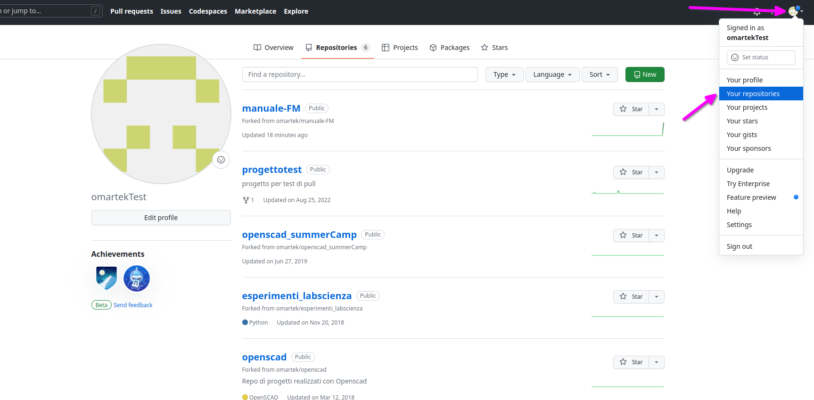
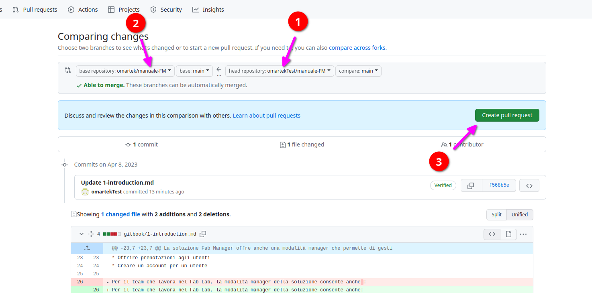
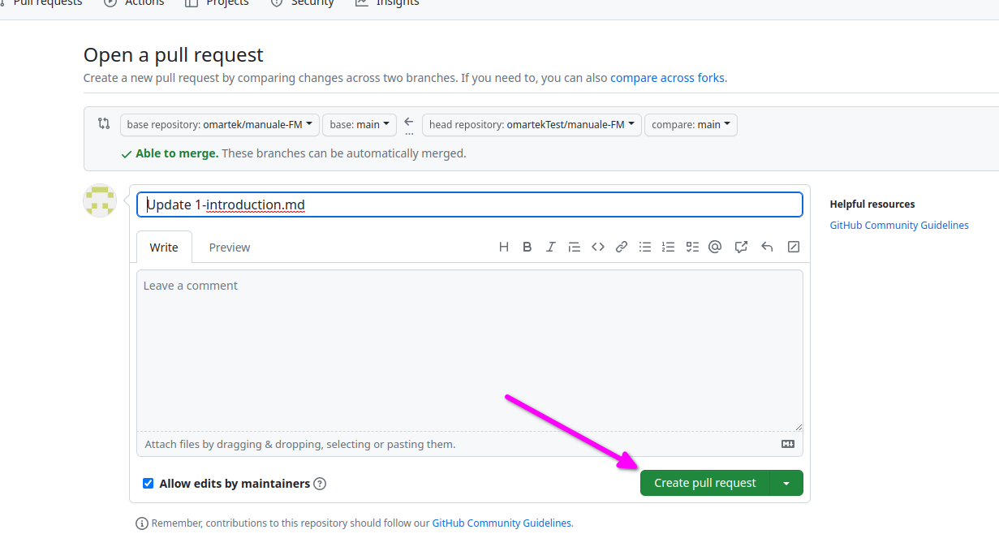
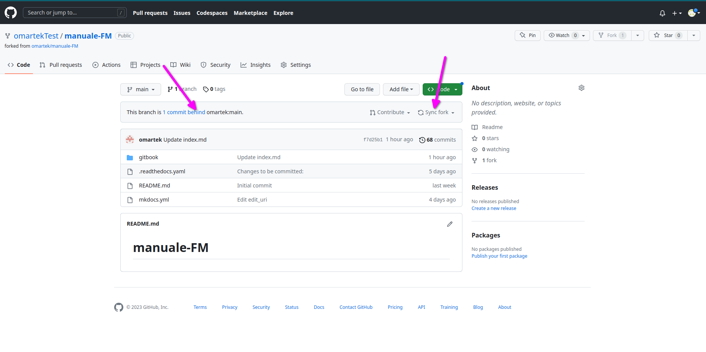
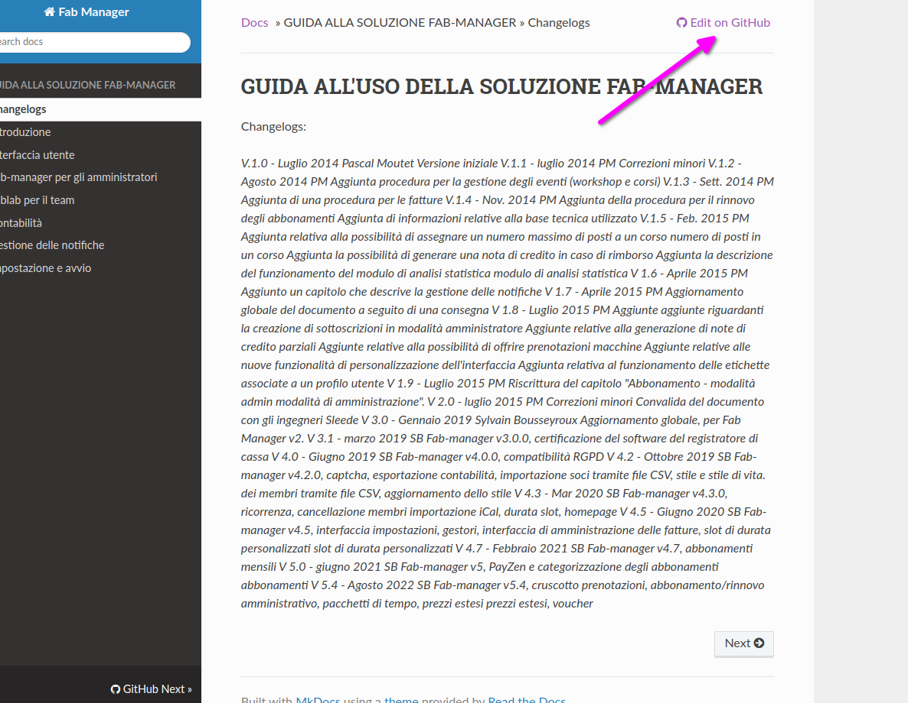
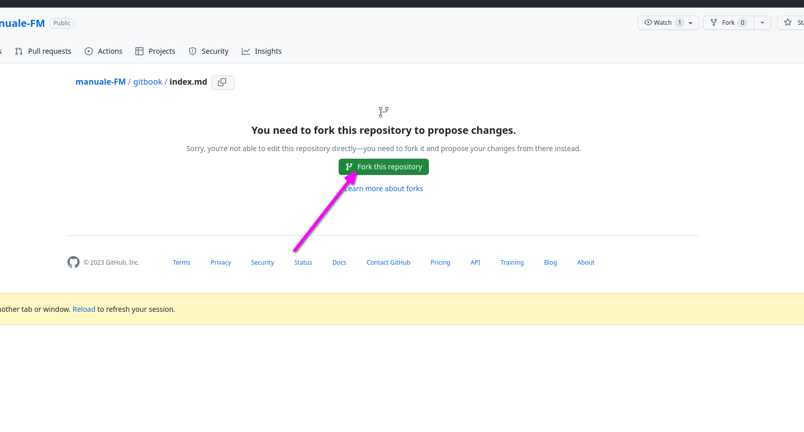
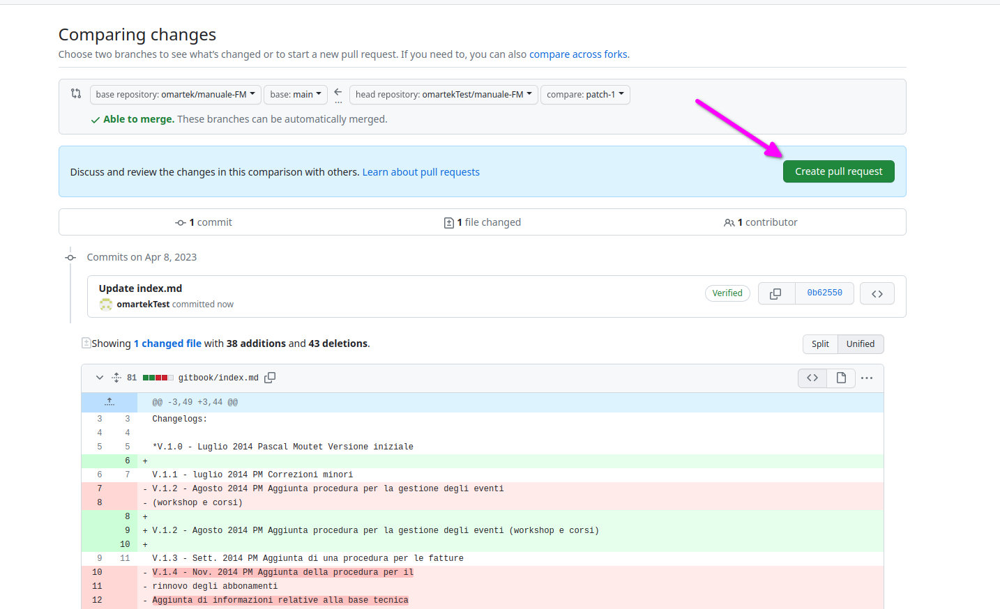

## Iscriversi a Github

## Scrivania dei propri repository

Per trovare i propri repository (i propri progetti e le copie dei progetti a cui si collabora) cliccare dove indicato. Si raggiungerà in questo modo **la propria scrivania** (dashboard).

## Creare il fork di un repository (progetto condiviso)

### Aprire il repo originale

Aprire il link del repository (progetto condiviso) di cui si vuole fare la copia ed eseguire il **Fork**.

---

### Confermare la creazione del fork.

---

### Controllare la copia effettuata

Controllare che la copia si trovi nel tuo account Github. Visitare la propria [scrivania](#scrivania-dei-propri-repository). È la propria copia se il proprio nome account compare alla sinistra del nome del progetto copiato.

---

### Eseguire modifiche

Navigare cliccando la cartella e il file che si vuole modificare. Cliccare (3) per iniziare le modifiche.

---

Il file in **Markdown** viene visualizzato come semplice testo.

Al termine eseguire il **commit** (salvataggio delle proprie modifiche nella propria copia). Ogni volta che si esegue una modifica si salva eseguendo un commit. Su ogni file può eseguire più di un commit.

---

### Inviare le modifiche

L'invio di tutte le modifiche effettuate possono essere inviate tutte insieme eseguendo **richiesta di pull** verso il progetto originale.

---

Cliccando **New pull request** invierai le tue modifiche (1) al repo originale (1) che potrà accettarle in tutto, in parte o rifiutarle. Clicca (3) per confermare.

Le evidenziature rosse/verdi mostrano le modifiche effettuate, utile per un ultimo controllo prima dell'invio.

---

Lascia un commento se necessario ed invia il tutto.

## Cancellare il proprio fork

Accedere alla propria copia del repo e cliccare **Settings**.

---

---

## Continuare a collaborare

Le proprie modifiche combinate con quelle di altri potrebbero aver aggiornato il progetto originale e quindi la propria copia potrebbe non essere aggiornata.

Bisogna fare attenzione perchè si potrebbero verificare due situazioni:

* se si **[cancella la propria copia del repo](#cancellare-il-proprio-fork)** non serve preoccuparsi di nulla poichè, ripetendo la creazione del fork, si lavorerà sempre sull'ultima versione.

* se **non si cancella la propria copia del repo**, prima di iniziare a proporre nuove modifiche, è necessario assicurarsi che questa sia aggiornata. Per farlo controllare il messaggio e se necessario questo cliccare **Sync fork** e quindi 

Il messaggio confermerà che il ramo **non è indietro (behind)** ma che **è aggiornato (up to date)**.

## Leggere e modificare il manuale da Read the docs

### Eseguire il fork alla richiesta

### Eseguire il commit delle modifiche

### Eseguire il pull verso il repo d'origine

### Cancellare il fork se necessario

Vedi paragrafo [Cancellare il proprio fork](#cancellare-il-proprio-fork).

